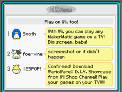
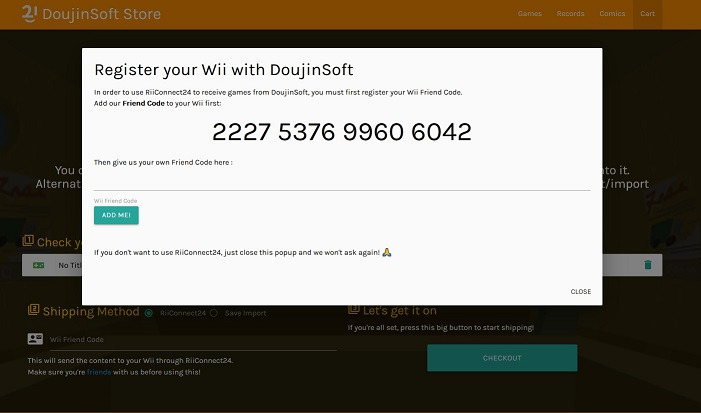

Title: DoujinSoft 2.0 - now with extra RiiConnecting  
Date: 2019-07-07 00:00
Category: Software
Tags: nintendo, wii, wiiconnect24, riiconnect24, warioware, doujinsoft, mio
Slug: doujinsoft-2
Authors: Difegue
HeroImage: images/wiimb_custom2.jpg
Summary: We have to go back... to WiiConnect24!

Remember [WarioWare D.I.Y](https://en.wikipedia.org/wiki/WarioWare_D.I.Y.)? The Nintendo DS game for making WarioWare-style microgames.  
It's turning 10 this year and stands as, in my opinion, the best in Nintendo's "_wacky user-generated content with that weird [baby face good lord what is that](https://www.youtube.com/watch?v=q_Yd2gn37AM)_" series.  (Alongside other grands like Mario Paint and both Mario Maker games)  

I launched [the DoujinSoft Store/Archiver](https://diy.tvc-16.science/) two years ago as a way to easily catalogue all the content created with the game. It's a pretty obvious rip-off of the [Mario Maker Bookmark Site](https://supermariomakerbookmark.nintendo.net), to stay in-theme.  

As-is, it's a good archive of all the stuff people made back in the day, but there wasn't an easy way to play the games, save from injecting them yourself into a savefile for the DS Game. Ditto for sharing newly made games with other people.  

  
DIY had a matching game on the Wii, WarioWare DIY Showcase, which acted as extra storage for your DS Games, alongside a few other things. Namely, the possibility to _send/receive games_ from Wii friends.  

I was approached recently by the good folks at [RiiConnect24](https://rc24.xyz/), who'd figured out how this part worked.  
Cue a bit of jolly co-operation, and I'm happy to present **DoujinSoft 2.0**, now featuring:  

* A complete dump of the content that was available on the Nintendo Wi-Fi Connection before its closure:  
That's around <h1>_185 233‬_</h1> Games/Music/Comics you can peruse! They're all pretty small so thankfully it compresses well 👀💦  
* **RiiConnect24** integration, allowing you to choose games on the storefront and get them **directly** shipped to your Wii system.  

You'll also get nice custom letters on your Wii Message Board if you use the feature!  
(Well technically they're the old ones from the Wii Shop Channel but personally I was only gifted a game once so it's not like I saw them that often)

  

## What's next for DoujinSoft 3.0 

I'm doing the giving, so I might as well start doing the receiving!  
DIY Showcase allows players to rate the games they receive, so there's a fun integration to be made here.  

  

Past that, it only makes sense that users would be able to send/upload their own games to DoujinSoft using their Wii consoles. It'd almost make us look like a proper online service!  

## The technical breakdown  

Since this is a tech blog, if you're interested in how WiiConnect24 ticks I've written [a fair bit about what I learned here.](./doujinsoft-rc24.html) Thanks for reading, and have fun using DoujinSoft!
