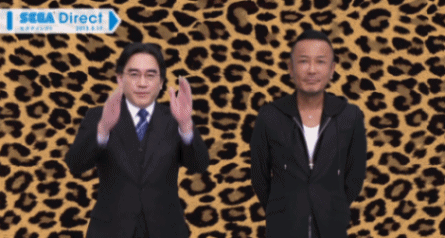
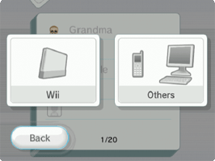
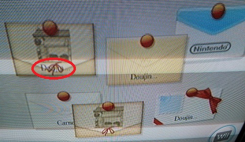

Title: DoujinSoft x RiiConnect24 - A technical breakdown
Date: 2019-07-08 00:00
Category: Software
Tags: java, nintendo, wii, wiiconnect24, riiconnect24, warioware, doujinsoft, mio
Slug: doujinsoft-rc24
Authors: Difegue
HeroImage: images/doujinsoft/rc24.png
Summary: Exploiting old Nintendo APIs for fun and profit.

I've recently dug out the old DoujinSoft codebase to [interop with RiiConnect24](/doujinsoft-2.html).  
It's made in Java because I [use a Swing GUI application as a dependency](https://github.com/Difegue/DoujinSoft/tree/master/libs-ext/diyedit/diyedit-jar/1.0) to handle all the WarioWare proprietary file-format decoding. You expecting me to learn reverse-engineering or something? 🐱‍👓  
  
Thanks to the RiiConnect24 guys giving me the keys to the castle (a fake Wii friend number and some debug tools), I set out to finally give people an easy way to get games from DoujinSoft **directly** to their console.  

  
papa iwata this one's for you  

## 📧 A quick primer on WiiConnect24 📧

```The flowing light on the Wii is timed with the bird call of the Japanese bush warbler.```

WiiConnect24 was the cool name given by Nintendo to half of the Wii's networking features. (The other half being Nintendo Wi-Fi Connection) According to marketing, all it does is download data when the Wii is in standby mode, but it actually handles a bit more than that, namely:

* The entire friend system  
* The [Wii Message Board](https://www.youtube.com/watch?v=afhwHfG0enY)
* Receiving data from games or channels
* Executing a weird variant of JavaScript to handle said data
* [And some more junk](https://wiibrew.org/wiki/WiiConnect24)  

The funny thing about WC24 is how it handles messaging: If you ever had a Wii back in 2006 you might have noticed you could add non-Wii devices as friends through their email address, and subsequently send and receive e-mail to/from them.  

  
PC users would see your Wii represented by a wxxxxxxxxxxxxxxxx@wii.com email address.  
I always thought it was really cool of Nintendo to implement this extra layer of communication to the console! I mean, they had to do some extra work for this whole email integration to work, right?  

<sup>Right?</sup>  

The truth is a bit more grounded and the opposite of my assumptions:  
All of WiiConnect24's messaging is handled by emails. **All of it.**

~~~~
Date: 02 Jul 2019 18:02:00 -0000
From: w7475328617225276@wii.com
To: w2227537699606042@wii.com
Message-Id: <0000A001A8EC592CF1C3C03BF08FA@wii.com>
X-Wii-AppId: 2-48414541-0001
X-Wii-Cmd: 00044001
MIME-Version: 1.0
Content-Type: text/plain; charset=utf-16be
Content-Transfer-Encoding: base64

AEIAYQB6AGkAbgBnAGE= (decodes to "Bazinga")
~~~~
A message between two Wiis really is just an email with a few custom headers, as seen above.  
The upside is that this makes it extremely easy to understand how a game sends data, and how to fake it.

## 🤜 Being friends 🤛
For DoujinSoft to be able to send emails/content to other Wiis, said consoles must add our Wii number as a friend.  
Surprisingly and (probably)unlike Nintendo's future implementations, the server doesn't track who's friend with who; All negotiation is done directly between the consoles.  

A Wii sending a friend request to another will send an email looking a bit like this:  

~~~~
From: w7475328617225276@wii.com
To: w2227537699606042@wii.com
Message-Id: <00066000A711EE8DEA72B03BEF879@wii.com> 
Subject: WC24 Cmd Message 
X-Wii-AppId: 0-00000001-0001 
X-Wii-Cmd: 80010001 
MIME-Version: 1.0 
Content-Type: multipart/mixed; 
 boundary="Boundary-NWC24-03BEF87900066" 

--Boundary-NWC24-03BEF87900066 

Content-Type: text/plain; charset=us-ascii 
Content-Transfer-Encoding: 7bit 

WC24 Cmd Message 

--Boundary-NWC24-03BEF87900066 

Content-Type: application/octet-stream; 
 name=a0000102.dat 
Content-Transfer-Encoding: base64 
Content-Disposition: attachment; 
 filename=a0000102.dat 

AAAAAAAAAAAAAAAAAAAAAAAAAAAAAAAAAAAAAAAAAAAAAAAAAAAAAAAAAAAAAAAAAAAAAAAAAAAA 
AAAAAAAAAAAAAAAAAAAAAAAAAAAAAAAAAAAAAAAAAAAAAAAAAAAAAAAAAAAAAAAAAAAAAAAAAAAA 
AAAAAAAAAAAAAAAAAAA= 

--Boundary-NWC24-03BEF87900066-- 
~~~~  

Here, Wii number 7475 3286 1722 5276 sent a friend request to Wii number 2227 5376 9960 6042.  
`X-Wii-AppId` and `X-Wii-Cmd` are changed from the defaults used in regular messages to inform WiiConnect24 this message is a Friend Request. (And therefore, it's not shown to the user on his console)  

If the other Wii sends a similar message the other way then presto! The consoles are friends.  
  
As a result, this is pretty easy to replicate for DoujinSoft: When the user gives us the Wii number to send content to, we send this mail beforehand to act as the friend request.  
This approach requires the user to add our number to their console beforehand, which isn't too bothersome.  

## 🚚 Sending the goods over 🚛

If you've read the other article, you know that our final objective is to send WarioWare DIY content to other Wiis through WiiConnect24.  
You've probably guessed then that when sending content to your friends from the game, it actually sends... emails.  

The example below is for a Record, the lightest content in DIY, weighing at 8KB. Makes for a shorter email here:  
~~~~
From: w7475328617225276@wii.com
To: w2227537699606042@wii.com
Message-Id: <00069000A711EE8DEA72B03BEF889@wii.com>
Subject: RR
X-Wii-AppId: 0-57413445-3031
X-Wii-IconNew: 57413445
MIME-Version: 1.0
Content-Type: multipart/mixed;
 boundary="Boundary-NWC24-03BEF88900069"

--Boundary-NWC24-03BEF88900069
Content-Type: text/plain; charset=us-ascii
Content-Transfer-Encoding: 7bit


--Boundary-NWC24-03BEF88900069
Content-Type: application/octet-stream;
 name=a0000105.dat
Content-Transfer-Encoding: base64
Content-Disposition: attachment;
 filename=a0000105.dat

EAAgAAQRABEAAAABRFMATUlPX1MABxcAAAAHVxIA61cAU3tOaWdodCAMV2FsayAicARBSwMgR2Ft
ZXOgEsAjBwAAd2904BPwEPAigOBIAQACBwEBABgAnxjwT7CZXGhpCHRuAFMgM6TA4QB2NuCREAAA
dRkvnPAwwfBBAAYA8AAAGBEQDgwKCSAHBVAHAAIEBwwDDhATGP//oAHwH/DAIPAP8CHwM/8C/wMw
/wBAA5ALAP//AT4AAQD8ICMwA5ALMBMD2fCFgLcB8KPgtQMCEAFCAgABDgAALjHuERj//wkQAjAH
Ef8QrAELDgEPDAETABj/BbrAAwTAAxAjkAMHwAMF3QBZkAMAAFmQAxETAUEP/5AHcSOxD5Ej8PPx
qPG6sewQBAMBQRMqDAwv7TMCAP8A9gURBwD+DiELuHIiCcGX8QPwZAkABAAJDBAVEAwJBLEB7AIB
YZADCf8VoAP/8RPxE/ET8RPytvLI8toRE10CYRMOQRMB1yACBwIufwoyGyI3EA0SKxATEBcSN/yQ
AxJLEk9S19I3Ul8H/38TIANSH3ELUSvyJ/In8ifz8ifzzPPe8/AEAvInAyf/IRYwB7M7ESNQ+wNj
IAPQH+PUVtA/URML/xcgA/M7//M7czt0T/M7FC/0T/Tm9PjpsztUT3InEiIKCv8wB1USIPsPBV8N
QiMGwAPr1F9SR1JPCMADBgBZkANvAQBZkAME9E/0T/RPZE//FX/17vYA9hL0T1RPAP8A9m0GEQcA
/g8hC3ZyCiXZ4JAD0QPmfgUKAQUKAQ0RFhENCgUF+GMDAWGQAwr/FqAD9WP/9WP1Y/Vj9wb3GPcq
9E8Yi9cB1yACCARNCzQ/IjcQDf8SKxATEBcSN5ADEksST1Ezx9I3Ul8I/xQgA1IfURP/USv2d/Z3
9nf2d/ga+Cz4Pv/0T0InIRYwB7M7ESNQ+wNj/yAD0B/YptA/URNXg9M794v/9E/3i/RP+S75QPlS
9E8as1sTIgoLBh0SJhMg+1ij/xI32G/UX1JHUk/4rzZ3Vn//15v0T/if+J/0T/pC+lT6Zvv4nxvH
CaMnjjAHECmvesJwC+mj0QPqzgYLAgYACw4SFxIOCwa/CoAECgWQA1Z/Vof5s/mz//mz+bP7Vvto
+3r4nxzbeI9/Cyq7IjQHORANWs+Yj1iX/xrvGvNa19I3Ws/Yj1eTUSv/+sf6x/rH+sf8avx8/I74
n/9CJyvbMAezOxvfUPsDYyAD/1RXVF/c9tA/Wrd0P7rX+9v/+9v72/vb/X79kP2i+J8fA+D5c3D7
HPsGAgYJDmEJAAQABhIOEhXc799SMxWDFf4X9D/DS4zvDfE/AQFYr/zvXi/8775T/pz//q75s7ET
EMk1W1qHFmMSF/wQ49mz3ePVY9wD1D8M/38YoAP+A/4D/gP+A/+m/7jv/8q8714DF8/zHOk0Wx8d
/xRl9lcfL94bn88f33FDtnf//O//F/8X/xf/F/8k/zb/SJfxEwAAFU0LDxUc5x96/xQ3nLtXfx3j
H7PyJ1dzPAf7URNRGx4DG981Tw78768XPwEB/xfzO/8X/6D/sv/E//InbO+v8dQT2G/Wf9+uFFP0
kAP1U/VjnxcJMAMACf8kXf4DHycfD19L9L9/qx+j6v86/gNfFwlPFxQv/gzfC4EfChQmX14HHxsA
H6ADfxaAA1AjlEP+EzvbW+Pc//996z8b3gOd6x3z3gMZP/+e/v+w/8L+A14DD/8s8jAHEd8vE3//
DC8nkANXkxebsCuAT7YHDAMHDA8TBRgTDwwHD8oFD2n/kAP1Y/8X/xf/F/4D/yD/Msv/RP4DAAB9
8wwvEyI0/wybEA1c953zXfvxKzjDUkf/Ul/d81Z3USv/F/8X/xf/F///ov+0/8YeA3zvgicvCjAH
/7M7HxeTK1MvHxNZw9+u0D//Xwdc59M7/xf/F/8X/xf/Iv7/NP9G/gNET/9xj4MPNP8/CAgQAv+Y
H6oUb/AfwEP/8D9v5SUzFnD/9z/L//////H/n/+x/8Mv1QMCBAABvy8XDlVj/+7///+Q/6L/tP//
xv/Y/+r//P//////HP8u7/9Au9s/EwE/GvAF8BfwKf/wO/BN8F/wcfCD8JXwp/C5//DL8N3w7/EB
8RPxJfE38Un/8VvxbfF/8ZHxo/G18cfx2f/x6/H98g/yIfIz8kXyV/Jp//J78o3yn/Kx8sPy1fLn
8vn/8wvzHfMv80HzU/Nl83fzif/zm/Ot87/z0fPj8/X0B/QZ//Qr9D30T/Rh9HP0hfSX9Kn89Lv0
zfTf9PH1Az/g


--Boundary-NWC24-03BEF88900069--
~~~~
You'll notice `X-Wii-AppId` changed once again alongside a new header called `X-Wii-IconNew`, this time to match the title ID of the Wii game, DIY Showcase.  

`X-Wii-IconNew` tells the Wii System Menu that the game's channel icon has to be updated. Here, this is used to show a small envelope when you have content incoming.  

The Game/Record/Comic itself is just added as an attachment to the mail. It's compressed using LZ10, a variant of the [LZSS compression algorithm](https://en.wikipedia.org/wiki/Lempel%E2%80%93Ziv%E2%80%93Storer%E2%80%93Szymanski) Nintendo likes to use in GBA/NDS games.  
Past that, it's base64-encoded, as specified in the mail's Content-Transfer-Encoding header. (base64 encoding is a classic when doing stuff with WC24)  

Once again, doing this from DoujinSoft is as easy as sending mail over to the Wii console.  
  
Man, that was a bit too easy in hindsight, wasn't it? Let's push this a bit further.  

## 🎁 Bonus Round: Custom Wii Message Board letters 🎁
  
Remember receiving cute customized letters from Nintendo or other games?  
  
Games or channels, when pushing email to the Message Board, had the option to add custom data to change the envelope, the stationery used, and add a sound effect when opening the message.  

This was a bit of an underused feature even back when the Wii was an active console, with most of Nintendo's own big games (Mario Galaxy, Smash Bros. Brawl) sending stuff with the default envelopes.  
Some games [did use it to great effect](http://www.studiousoctopus.com/?p=1229), and it always felt a bit special to receive a custom letter.  

There's little documentation about the custom stationery, but studying [message board exploits](https://github.com/giantpune/mailboxbomb/blob/master/source/main.cpp#L173) quickly shows they're just email attachments as well, similar to DIY's games. 🧐  

~~~~
From: w2227537699606042@rc24.xyz
To: w7475328617225276@rc24.xyz
Subject: =?UTF-16BE?B?AFkAbwB1AHIAIABnAGEAbQBlAHMAIABhAHIAZQAgAHIAZQBhAGQAeQAh?=
X-Wii-AppId: 2-354E4541-4142
X-Wii-Cmd: 00042019
X-Wii-AltName: AEQAbwB1AGoAaQBuAFMAbwBmAHQAIABTAHQAbwByAGU=
X-WiiFace: gBYAQwAuAE4AbwByAHIAaQBzAAAAAFtAgZX3KDb4KCzG7AuQaKuokFxM
 BmloSrjSAIr9DiUEAFcAbwBsAHYAZQByAGkAbgBlAAA=
X-Wii-MB-NoReply: -
MIME-Version: 1.0
Content-Type: multipart/mixed;
 boundary="Boundary-NWC24-03BF040F00005"

--Boundary-NWC24-03BF040F00005
Content-Type: text/plain; charset=utf-16be
Content-Transfer-Encoding: base64

AFQAaABhAG4AawAgAHkAbwB1ACAAZgBvAHI[...]ACAAIAB+AH4AfgB+AH4=

--Boundary-NWC24-03BF040F00005
Content-Type: application/x-wii-msgboard;
 name=a0000009.wii
Content-Transfer-Encoding: base64
Content-Disposition: attachment;
 filename=a0000009.wii

Vao4LQAAACAAAABxAAAAoAAAAAAAAAA[...]AAAAAAAAAAAAAAAAAAAA

--Boundary-NWC24-03BF040F00005--
~~~~  

I've cut the actual data here as this stuff is getting **real damn long**, but I've added a few fun extras to demonstrate what can be done with WiiConnect24 mail:

* Yet another `X-Wii-AppId/X-Wii-Cmd` combo: At this point I'll admit I have no idea what this one does and just wholelifted it from messages sent by the Wii.  
* `X-Wii-AltName` allows you to show a name of your choice on the envelope instead of the name the Wii gave your friend number; Useful for us as DoujinSoft is a _household name_, god dang it!
* `X-WiiFace` is a base64 encoded Mii, that appears on the upper-left side of the envelope. This works for regular and custom envelopes without a hitch: In fact the Wii gives exactly **zero fucks** what your custom graphics are and will draw on top of it relentlessly.  

* `X-Wii-MB-NoReply` disables the "Reply" button for this message.
* And the final piece, the custom stationery, is stored as an attachment with Content-Type `x-wii-msgboard`. The graphics themselves are wrapped in a [U8 archive](http://wiibrew.org/wiki/U8_archive)(crazy how many file formats you only ever encounter when dealing with Nintendo stuff), and base64-encoded as per the norm.  

The result looks like this!  
  
  

Really gives us that fun, almost-official flair.  

## Final spare thoughts

* The envelope notifications from `X-Wii-IconNew` take region into account, unlike(thankfully) everything else: DoujinSoft's emails are sent using the US title ID, so other regions sadly miss out on the envelope icon for their channel.  
Luckily, the bonus custom letters kinda mitigate that by acting as a notification.  

* LZ10 compression turned out to be a bitch to find proper implementations for; I used [a C library](http://www.romhacking.net/utilities/826/) which I compiled and bound to the Java code using JNA, turning the DoujinSoft server into an even bigger Frankenstein's monster. 👍  

I might write a second, clean server to collect emails from users when I get around to implementing survey box responses and games sent to the store from users' Wiis.  

## References  

[Wiibrew's breakdown of WC24 email](https://wiibrew.org/wiki//shared2/wc24/mbox)  
[More WC24 details from Wiibrew](https://wiibrew.org/wiki/WiiConnect24/WC24_Content)  
[Wii mail headers](https://bigredpimp.wordpress.com/2008/01/22/more-wii-message-header-fun/)  
[All the official stationery, ripped by RiiConnect24.](https://github.com/RiiConnect24/WMB-Letterhead)  
[Said stationery in decoded image form if you just want to take a look](https://drive.google.com/drive/folders/0B7vPmuZfN3sndnRVNmJ4amw5Mms)
