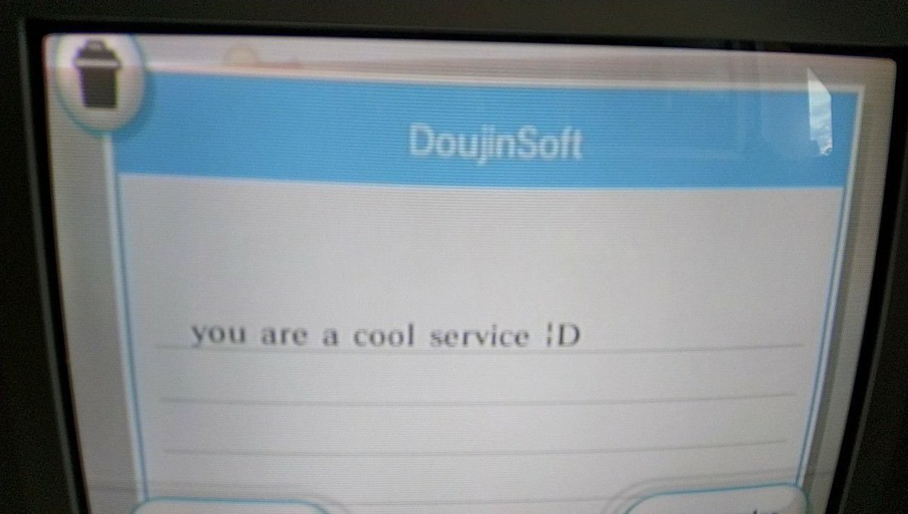

Title: More Wii Mail Madness
Date: 2019-07-27 00:00
Category: Software
Tags: nintendo, wii, wiiconnect24, riiconnect24, mail, mii
Slug: more-wii-mail
Authors: Difegue
HeroImage: images/fanmail.jpg
Summary: Exploring a few more weird usages of Wii Mail.

After launching [RiiConnect24 integration for DoujinSoft](./doujinsoft-2.html) last month, I started receiving **tons** of mail from Wii consoles over the world using the service. Some of it intended, some not at all!  



In order to better handle messages that don't map to what I've described in my [previous breakdown](./doujinsoft-rc24.html), I have set up DoujinSoft to automatically forward them to my own Wii. This is a quick fly-by of the most interesting messages I've encountered.  

# DIY Showcase Surveys

I briefly talked about the Surveys before. As they're related to WarioWare DIY, it makes sense that they'd be the messages I receive the most.  

  

Survey mail is dead simple(maybe even a bit too much):  

~~~~
From: w2939127336970027@wii.com
To: w5552226006146758@wii.com
Message-Id: <0006D000A711EE8DEA72B03BEF8CF@wii.com>
Subject: QUESTION
X-Wii-AppId: 0-57413445-3031
X-Wii-IconNew: 57413445
MIME-Version: 1.0
Content-Type: multipart/mixed;
 boundary="Boundary-NWC24-03BEF8CF0006D"

--Boundary-NWC24-03BEF8CF0006D
Content-Type: text/plain; charset=us-ascii
Content-Transfer-Encoding: 7bit


--Boundary-NWC24-03BEF8CF0006D
Content-Type: application/octet-stream;
 name=a0000109.dat
Content-Transfer-Encoding: base64
Content-Disposition: attachment;
 filename=a0000109.dat

TXVzdHkgTWVsb24AAAAAAAAAAAAAAAAAAAEDBQ==


--Boundary-NWC24-03BEF8CF0006D--
~~~~  

Once base64-decoded, the contents of the mail are as follow:  

~~~~
4d6f 6e73 7465 7220 4d61 7468 0000 0000  Monster Math....
0000 0000 0000 0000 0000 0507            ............```
~~~~  
The title of the game/manga/comic takes 25 bytes, followed by a byte for the type, a byte for the amount of stars it got, and a final byte for the id of the comment.  

Since all the info you get about the initial item is its name and type, that makes it rather hard to map back to DoujinSoft's database -- There are a **ton** of games named _Wario Quest_, for example.  
For the time being, I'm just storing and showing survey data [as is](https://diy.tvc-16.science/surveys) in DoujinSoft.  

  

# Mii Parade

Remember the X-WiiFace header I used last time to add a Chuck Norris face to my messages?  

~~~~
Date: 09 Jul 2019 00:09:20 -0000
From: w7720650706766587@wii.com
To: w1657786287988553@wii.com,
 w6330930957365086@wii.com,
 w1300677307397579@wii.com,
 w4440069290024607@wii.com,
 w7450179939585945@wii.com,
 w4358193120538293@wii.com,
 w7457852362831041@wii.com,
 w2227537699606042@wii.com
Message-Id: <000EB001B6DE412CFCAFB03BF2C29@wii.com>
X-Wii-AppId: 2-48414341-0001
X-WiiFace: gADwfPB68GIAUABvAGsAZQAAAAAAAH80gScGhVFr2gMAAGZgAb0qggyL
 ikAXIbSNAIoAiCzEAAAAAAAAAAAAAAAAAAAAAAAAAAA=
MIME-Version: 1.0
Content-Type: text/plain; charset=us-ascii
Content-Transfer-Encoding: 7bit
~~~~

I was receiving mails of the sort very often - sometimes moreso than DIY Surveys.  
I initially thought it was just one dude sending his Mii to a lot of his friends at once...Except that makes no sense! There's no way for users to send mails to multiple people within the Wii Message Board.  

So then, what could possibly prompt a Wii to broadcast Mii data like this to multiple consoles at once?  
My top-notch investigation skills led me to realize that it could only be the _Mii Parade_.  

  

Mii Parade was a feature of the Mii Channel which allowed you to automatically send your Miis to your friends, which in return would send you theirs.  
Miis received that way ended up in the Mii Parade, which allows up to apparently [**10000 Miis.**](https://youtube.com/watch?v=3iQi1LPntZg)  

...I certainly never got that many back in 2008. Right now, the pool from all DoujinSoft users got me to about 250 Miis.  

# Wii Speak Channel  

This is my favorite one. The Wii Speak microphone was a USB accessory for the Wii, enabling voice chat in select games such as Monster Hunter Tri, The Conduit, or UNO. (Seriously, is there anything the Wii version of UNO _couldn't_ do?)  


The accessory came bundled with a Wii Channel, appropriately dubbed... Wii Speak Channel.  
A feature of this channel I wasn't aware of was the possibility to send [_voice messages_](https://www.youtube.com/watch?v=VWC1xyJqrtA) to other Wiis. How cool is that? And more importantly, how does it abuse e-mails to make it happen?  


You might remember from the previous breakdown that Wii E-Mails can embed custom stationery as an attachment, which in turn is interpreted and displayed by the Message Board.  

This stationery can contain a custom envelope, a custom letterhead, and a custom **sound** that plays when you open the message.  


You've probably already guessed how this works.  
This sound is usually just used for quick SFX, but here the Wii Speak Channel just crams the **entire voice message** inside the stationery.  

~~~~
Date: 28 Jul 2019 12:27:15 -0000
From: w7475328617225276@wii.com
To: w2227537699606042@wii.com
Message-Id: <000A4001A8EC592CF1C3C03BF99EB@wii.com>
X-Wii-AppId: 2-48434650-3031
X-Wii-Cmd: 00042019
X-WiiFace: gAAASQB3AGEAdABhAAAAAAAAAAAAAGVUhl8KkW9KhAjlwFggSb0Kwlxu
 CGBzWUCuSowAiiUEAE0AYQB0AHkAegB1AHoAdQAAAAA=
MIME-Version: 1.0
Content-Type: multipart/mixed;
 boundary="Boundary-NWC24-03BF99EB000A4"

--Boundary-NWC24-03BF99EB000A4
Content-Type: text/plain; charset=utf-16be
Content-Transfer-Encoding: base64

AFYAbwB0AHIAZQAgAGEAbQBpACAAVwBpAGkAIABhACAAYwBvAG0AcABvAHMA6QAgAAoAYwBlACAA
bQBlAHMAcwBhAGcAZQAgAGQAZQBwAHUAaQBzAAoAbABhACAAQwBoAGEA7gBuAGUAIABXAGkAaQAg
AFMAcABlAGEAawAuAAoAUwBpACAAdgBvAHUAcwAgAHAAbwBzAHMA6QBkAGUAegAgAHYAbwB1AHMA
IABhAHUAcwBzAGkAIABjAGUAdAB0AGUACgBjAGgAYQDuAG4AZQAsACAAcwDpAGwAZQBjAHQAaQBv
AG4AbgBlAHoAIAAiAEQA6QBtAGEAcgByAGUAcgAiAAoAZQBuACAAYgBhAHMAIABkAGUAIABsACcA
6QBjAHIAYQBuACAAcABvAHUAcgAgAHIA6QBwAG8AbgBkAHIAZQAgAOAACgB2AG8AdAByAGUAIABh
AG0AaQAgAHAAYQByACAAdQBuACAAbQBlAHMAcwBhAGcAZQAgAGEAdQBkAGkAbwAuAAoAUwBpACAA
dgBvAHUAcwAgAG4AZQAgAHAAbwBzAHMA6QBkAGUAegAgAHAAYQBzAAoAbABhACAAYwBoAGEA7gBu
AGUAIABXAGkAaQAgAFMAcABlAGEAawAsAAoAcwDpAGwAZQBjAHQAaQBvAG4AbgBlAHoAIAAiAFIA
6QBwAG8AbgBkAHIAZQAiAAoAcABvAHUAcgAgAOkAYwByAGkAcgBlACAAdQBuAGUAIAByAOkAcABv
AG4AcwBlAAoA4AAgAHYAbwB0AHIAZQAgAGEAbQBpAC4=


--Boundary-NWC24-03BF99EB000A4
Content-Type: application/x-wii-msgboard;
 name=a0000164.wii
Content-Transfer-Encoding: base64
Content-Disposition: attachment;
 filename=a0000164.wii

Vao4LQAAACAAAABxAAAAoAAAAAAAAAAAAAAAAAAAAAABAAAAAAAAAAAAAAUAAAABAAAAoAAAAJgA
AAAMAAABQAAATbAAAAAaAABPAAAACMQAAAArAABX4AAATMAAY2hqdW1wLmJpbgBsZXR0ZXJfTFou
[... about 740 lines of stationery ]
U2XzPk/R9lROUs/k/k8fJTIAEPUQMBQ03H9eJKHicARD/grujgAAJGECDvTbmwFEBi4hLRrG8GQA
vc358RMxQwKuABDf8Cw0Y5RbL+XBMlQq1r1VHk8PJBDk/yQPDFJ01LQ78sIeMxMfcSDv3x4OIyTd
3cwO3u4S3c8OvSzR4AHv6Kzf/wAA


--Boundary-NWC24-03BF99EB000A4--
~~~~  

## 👀👀👀

[Lateral Thinking with Withered Technology](https://en.wikipedia.org/wiki/Gunpei_Yokoi#Lateral_Thinking_with_Withered_Technology) applies to Wii Mail as a whole, but this is taking it to the next level.  

The Wii Speak Channel allows a maximum of 10 seconds for voice messages, likely to prevent mails growing to outrageous sizes.  
I'm not sure if there's any limit on the Wii Message Board itself; Maybe I could update the DoujinSoft mail templates so that they play [sanic.mp3](https://www.youtube.com/watch?v=PX7zPlQjAr8) whenever users open them.  
