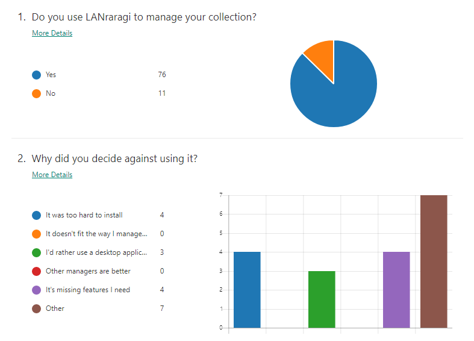
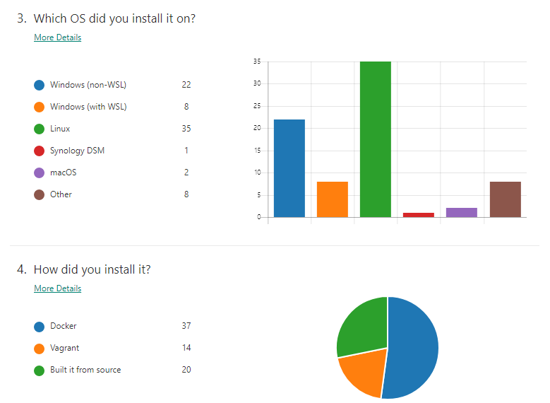
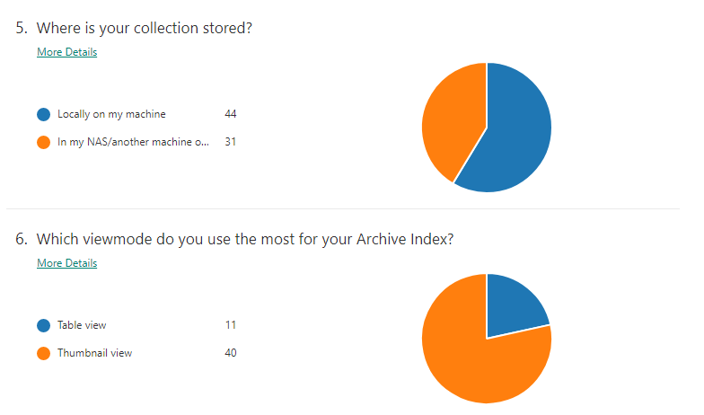
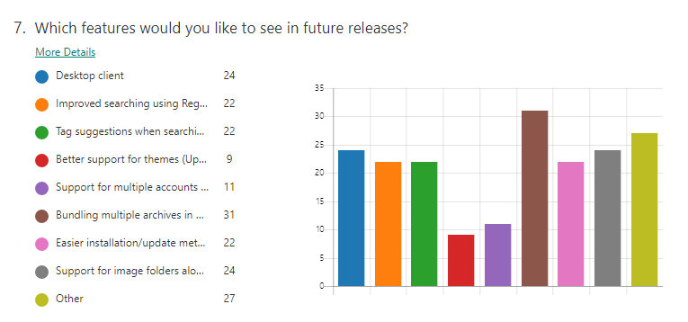

Title: LANraragi User Survey Results 
Date: 2019-08-02 00:00 
Category: LANraragi 
Tags: lanraragi, survey, rip sadpanda, philosophical software architecture ramblings 
Slug: lrr-survey 
Authors: Difegue 
HeroImage: images/karen.jpg 
Summary: I sure got a spike of new users from the death of Sadpanda. 
 
I opened a small user survey a few months ago to figure out what kind of features LANraragi users would want next.   
There's no "_telemetry but it's ok because you can turn it off and then everyone turns it off_" in the software, so it was interesting to figure out how many people use my ol' manager and what they get out of it.   
 
I planned to release the results alongside 0.6.0 but [got sidetracked](./doujinsoft-2.html) and other stuff happened and uhhh we've been on beta 2 for like two months 🙃   
 
So without further ado, the results! And my **hot takes and opinions** on some of the most frequent feature requests.   
 
# Total users and reasons to not install the software 
 
   
I still thought I was being kinda niche, so it's nice and super unexpected to see the number of concurrent users reach 70+.   
Github ⭐ count is at 130-something, which draws me ever closer to 4th place [in the mojolicious](https://github.com/topics/mojolicious) list for e-bragging rights.   
 
Users that tried and didn't stick with LANraragi did so for the reasons I expected:  
Ease of installation, and the fact it's not a desktop client.   
The survey was made before I introduced the [new Windows installer](./karen-1.html), which I hope alleviates the pain of installing the server for Windows users.   
 
As for the Desktop client, I could go the [HPX route](https://github.com/happypandax/desktop) and cram my front-end in Electron or something, but I hardly see the capital gain from doing that.   
In my opinion, a Desktop app should have the matching UX (right-click context menus, higher information density), and add features that aren't possible within a browser's sandbox. (External reader support, for instance.)   
Also the current JavaScript code powering the front-end is a _mess_ and I'd rather not twist it further to make it fit into a Desktop app 😶  
 
I toyed with building a proof-of-concept client on top of the current [API](https://sugoi.gitbook.io/lanraragi/extending-lanraragi/client-api) using [Avalonia](https://github.com/AvaloniaUI/Avalonia), but kinda stopped due to a lack of time. It's certainly possible, though.  
 
Among the "other" reasons people had, not being able to easily import metadata from the OG happypanda(not X) came up a few times.   
HP's original database is SQLite if I recall, it'd be possible to write a plugin that uses [a Perl SQLite client](https://metacpan.org/pod/DBD::SQLite) to pull the metadata from it on a file-to-file basis. Not trivial, however. HPX can consume the original HP's database as-is, so it's probably a better fit here.   
 
# Platforms   
 
   
Zero surprise here, the software is built with Linux+Docker in mind. There's been an uptick in Windows+WSL usage with the fall of the panda as well.   
 
The "other" platforms are fun stuff like QNAP QTS NASes, ASUSTOR, Ploxmox, etc.   
I'd like to apologize to Raspberry Pi users for not providing an ARM container image for the time being.  
Hopefully as [buildx](https://engineering.docker.com/2019/04/multi-arch-images/) becomes a thing, an easy way to build ARM containers on Github Actions will surface.   
 
# Storage   
 
   
 
I admittedly was expecting more NAS users as that's the primary use case for LRR in my opinion, but that is fine too.   
Thumbnail view is near-ubiquituous, so I'll probably make it the default view in a later release.   
 
# Feature Requests 
 
   
 
_oh boy here we go_   
 
Categories/Archive Sets is the clear winner here, which is great as I'll be able to ignore cries for image folders for a while longer. ✌   
It's a pain I really don't want to do it reeeeeee    
This feature is pretty generic and allows people to shape their collection however they want (chapters of a tank, favorites, etc.) 
 
Regex searching and Tag suggestions are both pretty high up here, and will probably be done when I revamp the current index to use server-side processing instead of loading a big clunky JSON cache. I got a request for adding search to the API too so it all fits!   
 
The "Other" category was full of suggestions as expected; I'll be listing the biggest ones below: 
 
### 👉 Mobile Client 
 
That's easy, that one [already exists.](https://github.com/Utazukin/Ichaival) [Next!](http://youtube.com/watch?v=39cZap0XcH8)   
 
### 👉 Sorting archives by Date Added 
 
This is a feature in Ichaival that isn't actually in the main client.   
I plan to modify the current list view to allow customizing the headers based on tag namespaces. So for example, you could replace the "Artist" column by "date_added", and sort that way. 
 
### 👉 Show reading progress and total page count 
 
This got a **ton** of requests! It'll probably show up alongside the New! icon. Not too hard to add. 
 
### 👉 Add a Favorites system 
 
For all the sadpanda expatriates out there. Categories will probably fit that need for most people.   
 
[Favorite tags](https://sugoi.gitbook.io/lanraragi/advanced-usage/favorite-tags) are already a thing and can probably replace Favorites if all you need is a one-click shortcut to your favorite artist or fetish. 
 
### 👉 Add a Ratings system 
 
I always felt like rating systems were bloat, so I won't implement this explicitly.   
Nothing's stopping you from making a `rating:⭐⭐⭐` tag, though. It might even look pretty cool once I implement customizing the list view as explained above.   

### 👉 External viewer support

This request comes up every now and then; Sadly I can't do anything about it without a Desktop client first.  
HPX offers this option, but it just opens up the viewer program on the server. I still keep to my mantra of LRR being designed for NAS and storage servers first, so I won't implement viewers that way.

### 👉 Downloaders 

This comes up very often as well! And I don't want to do it! (╯°□°）╯︵ ┻━┻  
Trying to have one program do everything by itself gets you something like Hydrus, which is incredibly impressive but also boasts a complex codebase as a result. This makes maintenance exponentially difficult.  

Adding downloader support is a huge time investment, and would probably yield a result inferior to what dedicated downloader programs can currently do. I'd rather spend time making sure what's already in place is fast and functional.

### 👉 Support for PDF archives

This is actually not that hard! If we're considering the PDFs only have images and no text of any kind.  
Maybe someday.

### 👉 Duplicate detection

Currently, exact duplicate files are detected and marked as such. I don't plan to go further for the time being.

### 👉 Auto-tag support for esoteric filenames from esoteric programs

I've had some requests for being able to get metadata from files named `[[EBA]_Dutch_Wife_Ooyasan__Landlady_Dutch_Wife_(Action_Pizazz_HB_2013-10)_[English]_TV] `, or archives downloaded using software like https://github.com/RicterZ/nhentai and https://github.com/seven332/EhViewer.

LRR tries to infer tags from archive filenames when they follow the E-H naming standard.  
Past that, support for other naming standards, or metadata embedded in archives falls under the plugin system.   
 
### 👉 HD Thumbnails 

This is coming from one of the only macOS users, with their fancy schmanzy retina screens. Makes sense.  
Currently thumbnails are indeed a bit too small for hi-res displays. I'm considering just doubling their resolution as-is.  
I don't think this will impact storage too much! Otherwise it'd probably have to be a togglable option.
  
### 👉 Rolling automatic backups

I got an issue in about adding an API for making/restoring backups, so I'll probably do that instead so people can automate their own backup strategy.  
It does remind me I still haven't implemented log rotation, though.
  
### 👉 Easier way to update the WSL/Karen installation

I initially planned to keep the bootloader/Karen installation static, and allow sideloading new LRR releases as they come(with an update button and everything). That was technically a bit harder so I gave up on it.  

PowerShell scripts for installing/uninstalling aren't convenient, and ideally I'd like to move to a proper Windows installer package further down the line.  
Making .msis is a pain in the ass though, so don't expect that soon. ¯\_(ツ)_/¯
  
### 👉 Miscellaneous reader UX woes

Everyone has their own favorite way to read, and as such it's really hard to make a one-size fits all reader.  
(Which is why desktop client + external reader would certainly alleviate that pain.)  

Here are most of the remarks I received. The [UX improvements](https://github.com/Difegue/LANraragi/issues/114) issue also keeps growing with everyone adding in their own remarks, which makes this all rather hard to track.  
* Automatic slideshow mode with configurable timer  
* "Long strip" view from Mangadex  
* Random next/previous page  
* Easier way to copy the current image from the reader  
* Display archive tags in reader  
* Proper full-size image link for two-page mode  

I'll tackle some of those every now and then, probably.  
The reader itself is in pretty good shape as far as JavaScript goes (unlike the archive index), so it's easy to work on. 
 
### 👉 Provide a better discussion place for support and plugin sharing

This is interesting so I'm keeping it for last: It's true that discussion is a bit hard to track in the non-specific management threads.  

There are a number of options available, like 8chan, gitter, discord(ew), IRC... I'm not sure what would be best so if you have any ideas it'd be cool to drop a comment below. 
