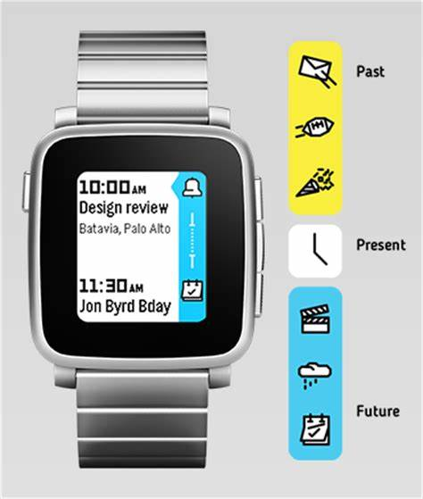
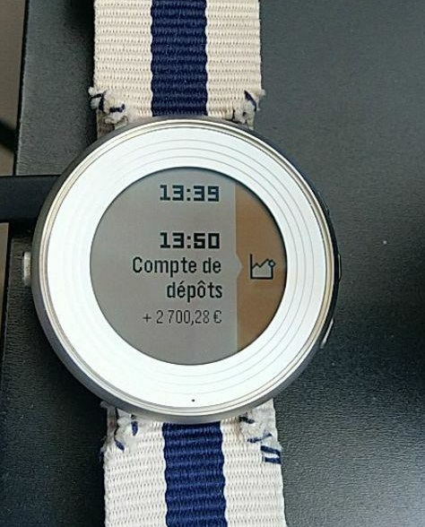
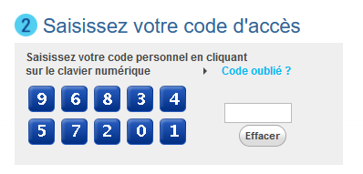
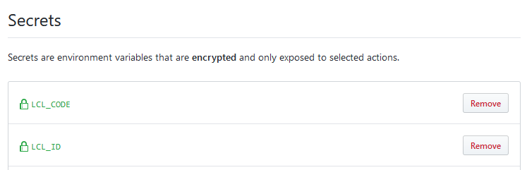

Title: Webscraping my bank with GitHub Actions and displaying it on a Pebble SmartWatch  
Date: 2019-08-31 00:00  
Category: Cool Tricks  
Tags: github actions, puppeteer, tesseract, pebble, rebble, timeline, epic bank hacks 
Slug: lcl-pebble  
Authors: Difegue  
HeroImage: images/karen.jpg  
Summary: Giving my bank account to GitHub so they can tell my watch how much money is in it? Sure!

I had some [old code](https://github.com/Difegue/Chaotic-Realm/tree/master/lcl-hack) laying around to scrape the [Crédit Lyonnais](https://www.lcl.fr/) account pages and convert my account balance/details to JSON.  

I used this for a few years to quickly have my account balance on my phone, then gave up on it once the bank's mobile app caught up.  
Recently though, [Rebble revived Timeline](http://rebble.io/2019/07/24/its-timeline-time.html) and I do love my Pebble Watches more than my phone, so I thought I'd put the ol' lcl.js scraper back on the saddle.  

# Wait! What the fuck even **is** Timeline ?  

  

Pebble smartwatches feature a scrollable timeline of events the user can reach/read in one button press. The events that end up in Timeline can come from the phone's calendar as well as third-party applications.  

If you want more details, I recommend looking up the [Pebble documentation archive](https://pebble-help-legacy.rebble.io/help.getpebble.com/customer/en/portal/articles/2541544-timelinee140.html?b_id=12263).  

What interests us here is the third-party application part, brought back from the ashes by [Rebble](http://rebble.io).  
By using a token generated by the watch, we can send data to the timeline through a webhook. And combined with the LCL bank account scraper, the results are pretty easy to figure out:  

Moneybills, right on the wrist!

# Unearthing the LCL scraper and making it work again  

The bad thing about online banking is that the web services that come with it are usually unpractical and severely outdated. The **good** thing in that though, is that when you're scraping a bank website for data, your implementation will last years without bugs caused by redesigns. ✌  

When I pulled out my old scraping code, the only thing I had to rework was the login sequence. (Alongside a quick port to [Puppeteer](https://github.com/GoogleChrome/puppeteer) since PhantomJS is basically dead now)  
I used the mobile version of the website to login back in 2015, but alas it is no more.  
Which means I'm stuck dealing with this abomination coming straight from every French banking website:  

The `"click on the jpegs to enter your keycode"` login page.  
I hate this thing for a myriad of reasons, and the implementation is actually quite solid here:  

* You can't just enter the keycode straight into the HTML input on the right: Clicks on the keyboard enter a _scrambled_ number into the input, which is then decoded later down the login sequence by some JavaScript bullshit dark magic.  

* The order of the numbers is _randomized_ on each load of the login page, so you can't just record clicks at a specific position either.  

* The keyboard is rendered as a single image, with the areas you have to click defined by a HTML [imagemap](https://www.w3schools.com/tags/tag_map.asp).

Since I'm already down the rabbit hole of webscraping/JavaScript automation, the solution I used here is a suitable waste of processing power: I load up the [Tesseract engine](https://github.com/tesseract-ocr) and **scan the keyboard image** to find out the order of the numbers in the page.  

~~~~javascript
await page.screenshot({path: "keyboard.png"});

// Just OCR the damn keyboard
ocrResult = await Tesseract.recognize('keyboard.png');
// Get something like 34980 15267
map = ocrResult.text.split(/ /)[0].replace(/[^\d]/g, '').trim(); 

// Click on the areas matching the numbers we received, according to the code in env
// DOM IDs are idImageClavier_01-10, going by column:
// 1 3 5 7 9
// 2 4 6 8 10
code = process.env.LCL_CODE.toString();

// Rearrange the keyboard map to match the DOM IDs:
map = map.charAt(0)+map.charAt(5)+map.charAt(1)+[...]+map.charAt(4)+map.charAt(9);

// Go through code character by character, find its location on the map and hit the matching area
while (code.length > 0) {
char = code.charAt(0);
code = code.slice(1);

posInMap = map.indexOf(char);
posInMap++; //DOM IDs start at 1

if (posInMap !== 10)
    posInMap = "0"+posInMap;

//console.log("Clicking on "+ char +" at #idImageClavier_"+posInMap);
await page.evaluate(selector=> { $(selector).click(); },
                    '#idImageClavier_'+posInMap);

}
~~~~

I hate this. But one click on the login button later and _hacker voice I'm in_  
The rest of the code consists on mangling the bank's internal API to get readable JSON.  

# Pushing the account balance to Timeline

Once I have recovered the data from the generated JSON, pushing it to the watch is much easier:  

~~~~curl
curl -X PUT https://timeline-api.rebble.io/v1/user/pins/cool-pin-id 
    --header "Content-Type: application/json" 
    --header "X-User-Token: watch_token" 
    -d '{ 
        "id": "cool-pin-id", 
        "time": "2019-08-30T22:43:56Z", 
        "layout": { 
                  "type": "genericPin", 
                  "title": "Account name", 
                  "body": "Account code", 
                  "subtitle": "+ 9 999,99 €", 
                  "tinyIcon": "system://images/STOCKS_EVENT" 
                  } 
        }' 
~~~~

The [Pebble developer documentation](https://developer.rebble.io/developer.pebble.com/guides/pebble-timeline/pin-structure/index.html) is a godsend here!

`cool-pin-id` must be a different ID for each new Timeline pin pushed. I just get my OS to generate UUIDs for that but you might want to do it another way.  

The watch token can be generated using this [handy Pebble app.](https://github.com/Willow-Systems/pebble-generate-token)  

# Jamming this whole thing in Github Actions

While this is all cool and good, I was wary of running this script on my server regularly.  
I mean, it **does** use your bank credentials and you can't be paranoid enough.  

Back in 2015, I was running it on a computer that didn't accept incoming connections; Said computer would just upload the JSON generated by the script every few hours to the server.  
But this is 2019 and caring about security is _so passé_, so I'm just gonna give my bank details to GitHub Actions.  

  

_Yeehaw!_ The Actions script itself isn't anything to write about, but hey, it's on [Actions v2](https://twitter.com/github/status/1159511691480260608)!  

~~~~yaml
name: Get bank details and push to Pebble

on:
  schedule:
  - cron: 0 9 * * *

jobs:
  build:

    runs-on: ubuntu-latest

    steps:
    - uses: actions/checkout@v1
    - name: Use Node.js
      uses: actions/setup-node@v1
      with:
        node-version: 12.x
    - name: NPM install
      run: |
        npm install
    - name: Epic lcl hack
      env:
        LCL_ID: ${{ secrets.LCL_ID }}
        LCL_CODE: ${{ secrets.LCL_CODE }}
      run: |
        node lclscraper.js  
    - name: Push pebble timeline pin
      env:
        TIMELINE_TOKEN: ${{ secrets.TIMELINE_TOKEN }}
      run: | 
        LAB1=$(cat lcl.json | jq -r '.[0].label')
        TOT1=$(cat lcl.json | jq -r '.[0].total')
        CODE1=$(cat lcl.json | jq -r '.[0].code')
        DATE=$(date +%s | jq 'todate')
        UUID=$(cat /proc/sys/kernel/random/uuid)
        TIMELINE_JSON="{\"id\": \"$UUID\",\"time\": $DATE,\"layout\": {\"type\": \"genericPin\",\"title\": \"$LAB1\",\"body\": \"$CODE1\",\"subtitle\": \"$TOT1 €\",\"tinyIcon\": \"system://images/STOCKS_EVENT\"}}"
        echo $TIMELINE_JSON
        curl -X PUT https://timeline-api.rebble.io/v1/user/pins/$UUID --header "Content-Type: application/json" --header "X-User-Token: $TIMELINE_TOKEN" -d "$TIMELINE_JSON"
~~~~

The job installs the required node.js dependencies (Tesseract and Puppeteer), runs the scraper, and pushes a timeline JSON to Rebble.  
Pretty easy, isn't it?

# Closing thoughts

The inspiration and info for this came from [WWill0's blog](https://willow.systems/integrate-pebble-with-ifttt-once-again/), although I couldn't use his IFTTT proxy as-is due to errors with non-ASCII characters. 😅  

I used [tmate](https://github.com/marketplace/actions/debugging-with-tmate) to debug on the GitHub Actions side this time around, and it was quite convenient! Would be better if the web terminal supported pasting, however.  

[Payment Services Directive 2](https://ec.europa.eu/info/law/payment-services-psd-2-directive-eu-2015-2366_en) will start being enforced in a few days: It forces European banks to add generic APIs for bank aggregators.  
Sadly that doesn't seem to mean proper APIs being made available for consumers as well. 🙃  

It also mandates strong authentication, which hopefully means those stupid image keyboards will go away and be replaced by proper 2FA.

I guess now that I wrote this article my bank will add a captcha or some shit to the login window.  
