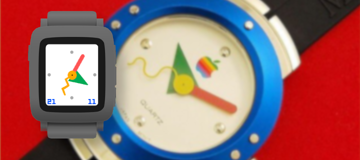
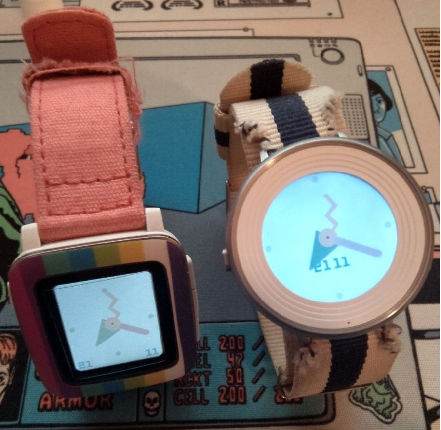

Title: I made a Pebble watchface
Date: 2022-11-21 00:00
Category: Software
Tags: pebble, rebble, watchface, apple, hackathon
Slug: pebble-copland
Authors: Difegue
HeroImage: images/copland-watchface.png
Summary: In 2008, PC World included Copland on a list of the biggest project failures in information technology history.

The [Rebble Hackathon #001](https://rebble.io/hackathon-001/) happened this weekend, so it was a nice opportunity to finally dig into the [Pebble SDK](https://developer.rebble.io/developer.pebble.com/index.html) and try and make something for my favorite dead smartwatch.  

I always wanted to make a watchface of some form, but design ideas are pretty tough to come by! I ended up going for a recreation of [this](https://www.hodinkee.com/articles/the-apple-watch-from-1995) 90's design for a promotional MacOS watch I find cool.  

  

It's called "Copland", after the 1995 [failed Apple OS](https://en.wikipedia.org/wiki/Copland_(operating_system)). (Thought it was funny to call a face for a dead watch after a dead OS, sue me) 
### You can grab it on the Rebble Appstore [here](https://apps.rebble.io/en_US/application/637abd01fdf3e30009f6399c)!

There aren't many watchfaces with a seconds hand since that drains battery quite a bit faster; I added it because it's **cool**, but being able to disable it will certainly come in a future update. 😅  

I also wanted to add a [PDC vector image](https://developer.rebble.io/developer.pebble.com/guides/graphics-and-animations/vector-graphics/index.html) to the top of the watchface and went with the C SDK as a result (The JS one didn't get to support them before Pebble died), so that'd also be a nice thing to add.  

And apart from that ehh, maybe being able to set custom colors for the hands and a custom font for that date at the bottom? We'll see about that next time.  

