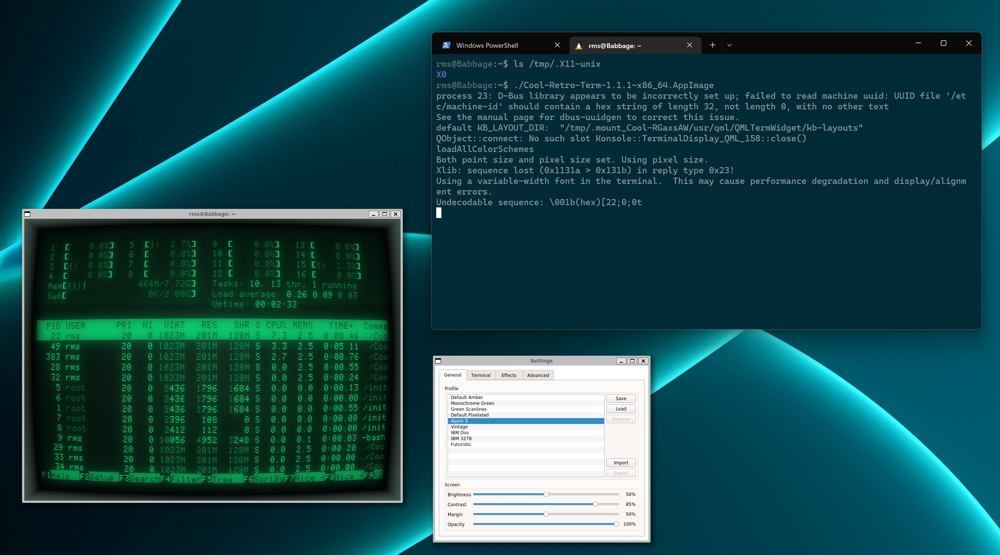
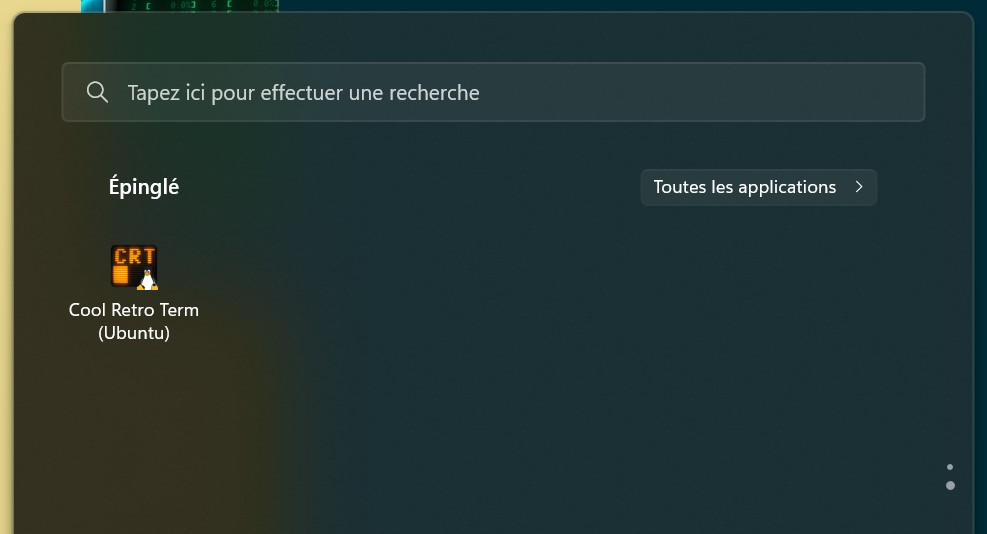

Title: Running cool-retro-term in Windows through WSL2 and WSLg
Date: 2022-11-27 20:00
Category: Cool Tricks
Tags: wsl, cool-retro-term, wslg, terminal, crt
Slug: cool-retro-term-wsl2
Authors: Difegue
HeroImage: images/crt-wsl2.jpg
Summary: Javascript terminal emulators *still* have nothing on this. 

The original [cool-retro-term on WSL](./cool-retro-term-wsl.html) blogpost is still one of the most-viewed ones on this website for some reason, but it's gotten quite a bit out of date now that WSL ships with a built-in X server. well achctually it's not X, wslg uses [wayland](https://devblogs.microsoft.com/commandline/wslg-architecture/) with Xwayland etc etc whatever  

WSLg + WSL2 was limited to Windows 11 for quite a while, but that [very recently](https://devblogs.microsoft.com/commandline/the-windows-subsystem-for-linux-in-the-microsoft-store-is-now-generally-available-on-windows-10-and-11/) changed, so I feel it's a nice time to re-try the whole cool-retro-term in Windows experience. Let's get rolling!  

# Install WSL2 and the required dependencies

WSL is much easier to install these days, you can just run: 

~~~~
wsl.exe --install
~~~~
to get WSL2, an Ubuntu default distro and the WSLg system distro.  

# Download the cool-retro-term AppImage and run it

cool-retro-term doesn't seem to have an AppImage up for their recent 1.2.0 due to [CI issues](https://github.com/Swordfish90/cool-retro-term/issues/698), so I'll just keep using the ol' reliable 1.1.1 for this.  

WSL2 supports AppImages much better than WSL1 used to do, so you just have to run the following:
~~~~
wget https://github.com/Swordfish90/cool-retro-term/releases/download/1.1.1/Cool-Retro-Term-1.1.1-x86_64.AppImage
chmod a+x Cool-Retro-Term-1.1.1-x86_64.AppImage
./Cool-Retro-Term-1.1.1-x86_64.AppImage 
~~~~

And that's it, you're done!  

  

Similarly, the .bat shortcut to start CRT becomes much, _much_ shorter:  

**cool-retro-term.bat**
~~~~
start /min wsl -d ubuntu [folder where you saved the appimage]/Cool-Retro-Term-1.1.1-x86_64.AppImage 
~~~~

# Potential issues and troubleshooting

If you get an error like `QXcbConnection: Could not connect to display`, it's likely the WSLg Wayland compositor is acting up for some reason.  
I recommend first trying a full restart of the WSL VM using `wsl.exe --shutdown` in a PowerShell window.  
If that doesn't help, you might have some luck following the instructions [here.](https://github.com/microsoft/wslg/wiki/Diagnosing-%22cannot-open-display%22-type-issues-with-WSLg)  

WSL2+WSLg fixes essentially all the [caveats](./cool-retro-term-wsl.html#caveats) from the previous article, so you now have GPU acceleration, working copy-paste, all the bells and whistles. 🎊  
My only gripe with WSLg is that it tries its best to apply Windows DPI settings but [doesn't always succeed](https://github.com/microsoft/wslg/issues/3), so if you're running at high DPI, you might have to tweak the CRT settings a bit to have it look nice for you.  

# Using apt instead of the AppImage  

I personally think the AppImage is the fastest way to setup CRT and have it up to date, but since the WSL2 default user distro is Ubuntu, you can easily just do `apt update && apt install cool-retro-term`.  

This approach has the advantage of bundling a `.desktop` file, so you can start CRT directly from the Windows Start Menu:  

