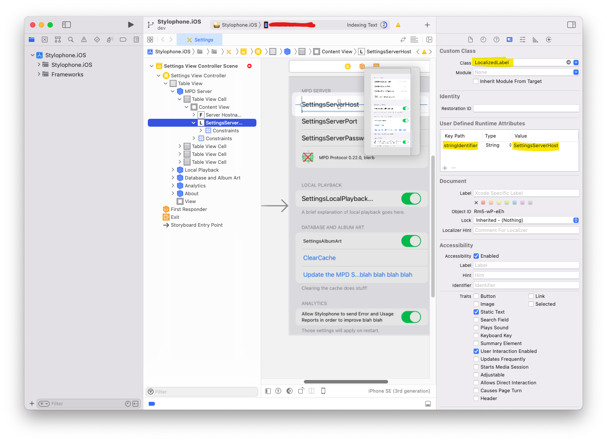

Title: Monkey Trick: Use ResX localization in a Xamarin Mac/iOS app with Interface Builder
Date: 2022-12-2 00:00  
Category: Cool Tricks  
Tags: interface builder, xamarin, dotnet, c#, macos, ios, resx, localization, monkey trick
Slug: xamarin-resx
Authors: Difegue  
HeroImage: images/stylophone/xam-localization.png  
Summary: I have to get those monkey puns out before Microsoft fully gets rid of the Xamarin name.

Apple recently removed their page about [Interface Builder](https://web.archive.org/web/20220406135312/https://developer.apple.com/xcode/interface-builder/) from the Xcode documentation, likely as part of their push to dogfood SwiftUI to as many people as possible.  
But I **like** [Interface Builder](https://medium.com/swlh/a-bit-about-interface-builder-ceffaf484580)! Hell I'll go one beyond and even say I like Auto-Layout! ...When it works.  

Keeping UI code separated from your main logic is always a sound architectural choice for me, and while I wish you could edit [nibs/storyboards](https://developer.apple.com/library/archive/documentation/General/Conceptual/Devpedia-CocoaApp/Storyboard.html) by hand like with XAML, I'll still take IB and its visual designer over writing `new UIButton()` a thousand times.  

[Stylophone](./stylophone-25.html)'s iOS port mostly uses Storyboards for its UI, but much of the logic code is written in .NET, and shared with its Windows/UWP brethren.  
That includes localized text! I use [.resx](https://learn.microsoft.com/en-us/dotnet/core/extensions/localization#resource-files) files to hold the localizations, which is very much a .NET concept.  

So, here's a fairly easy way to use the interop magic in Xamarin/Microsoft.iOS to **directly** reference your localization keys in Interface Builder and have it just work.  

# Subclassing UILabel 

What we're going to do is simply pull the localized text once the view is loaded and assign it to all the `UILabels` objects in the view, but:  
- in an automated fashion instead of having to write additional view code
- relying only on data from Interface Builder(IB).  

One of the nice things IB allows you to do is set [User Defined Runtime Attributes](https://sam.dods.co/blog/2014/04/08/user-defined-runtime-attributes-in-interface-builder.html) on any control you lay out, which are basically arbitary key/value pairs.  

If we rely on that, it becomes quite easy to write a `UILabel` subclass that looks in those attributes for a localization key, and then asks .NET about it:  

~~~csharp
using System;
using Foundation;
using Stylophone.Localization.Strings;
using UIKit;

namespace Stylophone.iOS.Helpers
{
    // Make this subclass visible from the UIKit side of things
    [Register(nameof(LocalizedLabel))]
    public class LocalizedLabel: UILabel
    {

        // This is our runtime attribute - name can be whatever you want!
        [Export(nameof(stringIdentifier))]
        public NSString stringIdentifier { get; set; }

        public LocalizedLabel(IntPtr handle) : base(handle)
        {
        }

        void ReleaseDesignerOutlets()
        {
        }

        public override void AwakeFromNib()
        {
            base.AwakeFromNib();

            // Use the text set in IB to find the matching property.
            // Set the identifier in "User Defined Runtime Attributes".
            var identifier = stringIdentifier ?? "AppDisplayName";

            // Get the property value to have the localized string.
            Text = Resources.ResourceManager.GetString(identifier);
        }
    }
}
~~~

The `Resources` class here is the classic static class generated by ResXGenerator, which you should normally have if you store your localizations that way.  

# Using the subclass in Interface Builder

Once your subclass is created, you should be able to define it as a "Custom class" for all the `UILabels` you want localized.    

From that point on, all that's left to do is add your localization key as a runtime attribute under the `stringIdentifier` key:  
  

And you're done!  

  

# Notes  

This approach obviously only works if your text is in a `UILabel` -- While that should cover 95% of your app, it's likely you'll still have to hodgepodge some view code for more esoteric text placement, like in `UITableView` headers:  

~~~csharp
// Localization not covered by LocalizedLabel
public override string TitleForHeader(UITableView tableView, nint section)
{
    return (int)section switch
    {
        0 => Resources.SettingsServer,
        1 => Resources.SettingsLocalPlaybackHeader,
        2 => Resources.SettingsDatabase,
        3 => Resources.SettingsAnalytics,
        4 => Resources.SettingsAbout,
        _ => "",
    };
}
~~~

As a final note, keep in mind that ResX lookup will use the .NET Culture system, which has [slightly different language combinations](https://learn.microsoft.com/en-us/xamarin/ios/app-fundamentals/localization/#locale) than iOS/macOS.  
See [this](https://learn.microsoft.com/en-us/xamarin/ios/app-fundamentals/localization/#specifying-default-and-supported-languages-in-infoplist) post for more information and how to declare languages in your Xamarin app.  

Thanks for reading!  
