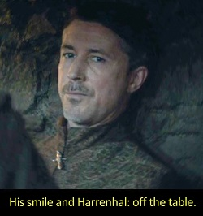
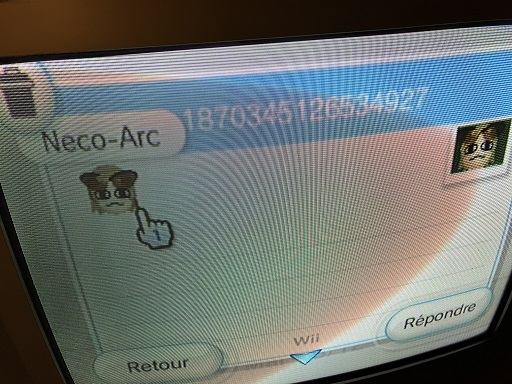
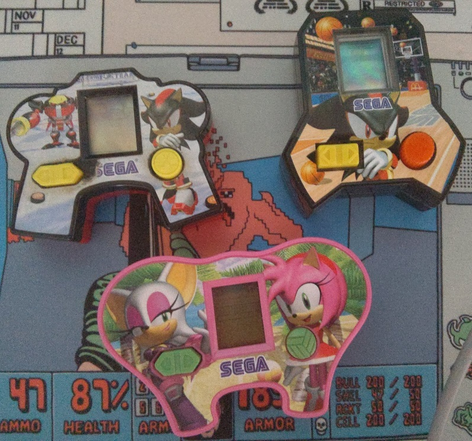
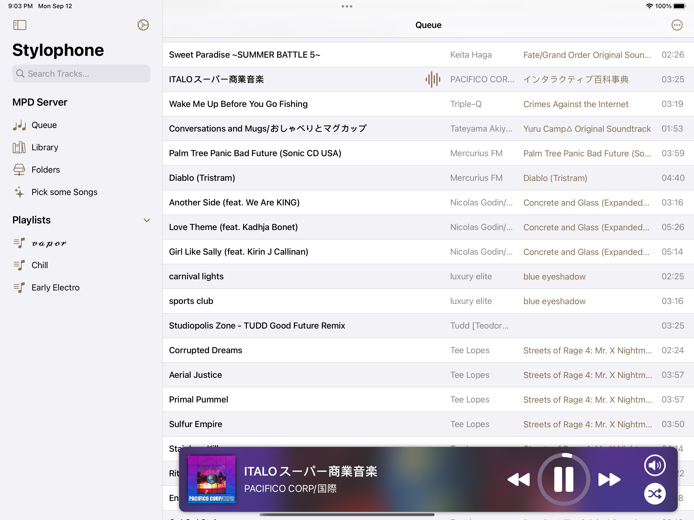
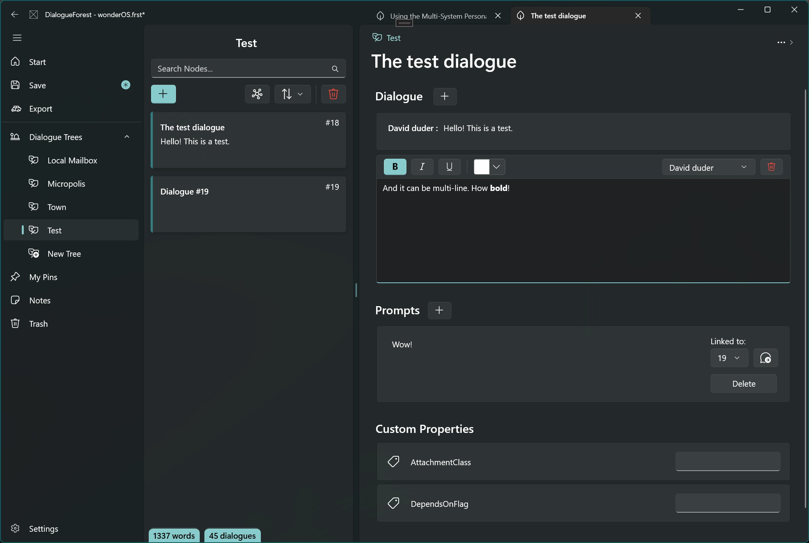

Title: The 2022 Recap
Date: 2022-12-30 00:00  
Category: Blogposting 
Tags: lanraragi, stylophone, doujinsoft, uwp, sonic, mcdonalds, gamedev
Slug: 2022-recap
Authors: Difegue  
HeroImage: images/2022-recap.png  
Summary: It's the most wonderful time of the year! 

I've been mostly winding down playing [Sonic games](https://kolektiva.social/@Difegue/109503827535767577), catching up on seasonal anime and trying to get through this box of Finnish sweets I received as part of a secret santa. (I have no idea how they eat [this stuff](https://fr.wikipedia.org/wiki/Salmiakki), it is an absolute ordeal)  

As far as social media goes, I've been enjoying reading my timeline on the [funny elephant website](https://kolektiva.social/@Difegue) much more than Twitter recently, but it's quite hard to drop the blue bird entirely considering I follow a bunch of artists on it...  
Mastodon is too tech-oriented to catch on with art twitter imo, maybe [Tumblr implementing ActivityPub](https://twitter.com/photomatt/status/1594577983028740096) will be the savior? Still feels quite unlikely.  

2022 was a thoroughly packed year for me on pretty much all levels, so when looking back for this end-of-year blogpost I kinda wonder how the fuck I made all this stuff -- Let's aim to be a better [⅒x rockstar dev](https://twitter.com/cassiecodes/status/1592974814352146432) in the coming year!

# LANraragi

I've put out 4 (and a half) LRR releases this year for a total of `+7838/-3539` LoC, ending at [0.8.8](https://github.com/Difegue/LANraragi/releases/tag/v.0.8.8).  
This year was mostly performance improvements on the thumbnail and search front -- I feel the codebase is in a pretty good shape atm, so maybe we'll land some nice features for 0.9.0 in 2023 if we get there.  

[Meta-archives/tankobon](https://github.com/Difegue/LANraragi/issues/519) support is a big one, but I'd also like to finally work on a better onboarding UI and an external plugin repository. 

I added [JPEGXL support](https://github.com/Difegue/LANraragi/issues/665) right before Google killed it by [removing it from Chromium](https://www.reddit.com/r/jpegxl/comments/zhbiy1/jpegxl_removed_from_chromium_source/)...  

# DoujinSoft 

I was planning to do...absolutely nothing with DoujinSoft this year?  
But of course [life found a way](./doujinsoft-3.html) and we got [an article](https://gonintendo.com/contents/10503-website-allows-you-to-play-fan-made-warioware-d-i-y-microgames-in-your-browser) on GoNintendo. What the fuck man  
  
We broke the `105 000` games uploaded mark this year I believe, and well, I'm still approving new DIY content and receiving weird shit via Wii Mail on a weekly basis. I also [got interviewed!](https://gamingreinvented.com/interview/lets-interview-doujinsoft-creator-difegue/) That was kinda fun.  

I'd like to eventually add missing features to the webplayer to make it a bit more like real WarioWare and allow users to share their own game mixes, but in the meantime, why not try out this [custom playlist](https://diy.tvc-16.science/collection?id=z_dfugselects) I put together?  

# SAGE 2022 and Sonic McOrigins

This year has been the best for Sonic in...quite a long time!  
I'm happy to have contributed to it in a small way by putting together that [LCD simulator archive](https://sonicfangameshq.com/forums/showcase/sonic-mcorigins.1352/).  

I got a lot of nice comments from people about how those games were parts of their childhood they'd forgotten about; One of the major reasons for building this was to make sure this stuff would be remembered (as cheap as the games are), so it's great to see others share that sentiment[*](#note-1).  
  
I do have the missing three games now, so you can probably expect a _McOrigins DX & Knuckles_ for SAGE 2023[**](#note-2).  

SAGE is always chock full of [incredible stuff](https://twitter.com/BrockCrocodile/status/1569030514224365573), so I was quite humbled to still receive some [coverage](https://segabits.com/blog/2022/09/04/playable-at-sage-2022-sonic-mcorigins-featuring-the-mcd-lcd-sonic-toys/) in the midst of all the heavy-hitters. It made for pretty good Twitch content as well, but most of the VODs for those are gone now. 😔  

Speaking of Sonic stuff, there's a recording of the [Re: Sonic the Hedgehog](https://www.youtube.com/watch?v=_-BDnNia11s) Sega CD pixel art/music album on YouTube now -- I recommend giving it a look/listen, it's `cool`!

# Stylophone 

[Stylophone 2.5](./stylophone-25.html) was mostly just polishing off and releasing work from 2021 because I hate letting work go to waste; Financially speaking it wasn't a particularly smart move considering the 100€ apple tax[***](#note-3), but I almost made back half of it, ain't that neat?  
  
I might release a 2.6 with some bugfixes and layout improvements (it's a bit messy on some iPhones...), but I don't think I'll pay the 100€ again next year?   

Considering the EU directives will likely force Apple to [allow side-loading in the next year](https://www.bloomberg.com/news/articles/2022-12-13/will-apple-allow-users-to-install-third-party-app-stores-sideload-in-europe), it'd certainly be nice if that yearly tax went away/was reduced as well; Probably just wishful thinking. 

# DialogueForest and Gamedev  

  
Keen followers might know I've been dabbling in [some gamedev](https://twitter.com/Difegue/status/1476936024752365569?s=20) for a little while now.  
The basic pitch for the game is "`Digital: A Love Story/Hypnospace Outlaw but in 1989/NeXtSTEP aesthetics`", so there's quite a bit of reading on BBSes and emails to do -- And consequently, quite a bit of dialogue for me to write...  

_DialogueForest_ is an UWP/WinUI 2.6 app I cooked at the beginning of the year to make writing those longer form mail/BBS dialogue pieces easier to organize and link to each other. It works pretty well! And I barely used it. 😤  
The app has some rough edges, but I should finish it up and make it a free download on itch.io or something.  
Adding a daily wordcount/notification system is one of the missing bits, and it would probably make me use the thing more too!

I didn't make much game progress this year, which makes sense considering basically _everything else_ took time instead; I also probably underestimated the workload of writing quite a bit! **It's hard!**  
Nevertheless, here's some footage of the faux-OS and the application system:   

<video width="800" autoplay="true" loop="true" src="images/gamedev/animationsucc.webm"></video>

# Misc 2023 thoughts

I've been looking at a bunch of [small](https://cinni.net/) [personal](https://maya.land/) [websites](http://tilde.town/) [recently](https://sadgrl.online/) - kinda like what this blog is!  
While Mastodon is fun, I think there's a lot of value in keeping your own little corner of the Internet for people to look at.  

Heck, you don't even need to know HTML like in the geocities days now, it's all [wysiwyg](https://mmm.page/)[#](#note-4) and shit!  
I'd like to use this blog more in the upcoming year to just write about whatever - I don't have a fancy newsletter[##](#note-5) button or anything but ol' reliable [RSS](https://tvc-16.science/feeds/all.atom.xml) is still a thing.  

It does feel like the winds of the Internet are shifting a bit in 2023(here's a [nice read](https://www.robinsloan.com/lab/new-avenues/)), so keeping the effortposting to the TVC-16 helps in case everyone moves to yet another platform[###](#note-6)!  
All the blue bird will get from me is shitposting and external links.    
  

So 'bout that dreaded year of 2023, what's in the cards? uhhh I dunno quick shit out some links   

- I've been looking at [Holopin](https://blog.holopin.io/posts/holobytes-and-holopals) since last Hacktoberfest - I find the concept amusing and hope they'll accept my application for the OSS plan so I can make virtual badges out of all the Spline 3D stuff I made this year. 😌  
- Windows 11 Widgets are opening up to [third-party](https://learn.microsoft.com/en-us/windows/apps/develop/widgets/implement-widget-provider-win32) app developers: That's a pretty good incentive for me to dig RSS Live Tiles from its grave!  
- The transitions made by [Kamikaze Douga](https://twitter.com/kamikazenosyain/status/1604159235507437568) for Pop Team Epic S2 are awesome and would make for a nice screensaver ala [Brooklyn](https://github.com/pedrommcarrasco/Brooklyn).  
- Obsidian has a cool new [graph view](https://obsidian.md/canvas) now - Sometimes I feel like I should give it a shot..  

On more generic terms, I read a post recently about "`art that is unabashedly sincere/only you can make`", and that's something I wish I was doing more - You could argue that some of the projects here are already very much personal expression/stuff that nobody else would make, but ehhhh I wouldn't really consider it art yknow?  

There's something awesome about being able to put a bit of yourself out there like that - Maybe I can do some more of that in the gamedev stuff.  
# 
Thanks for reading this far! (or skipping to the end)  
I don't do longer-form writing like this too often so I've been looking at the draft in the Firefox Reader View to make sure the estimated reading time doesn't go beyond 9 minutes. 😤 
### Happy New Year!  

[\*](#ref-1) Most of the other comments were memes about the pakistani commercials, of course.  
[\*\*](#ref-2) There are some scans I should upload to Sonic Retro as well...  
[\*\*\*](#ref-3) The dev certificate also allowed me to sign/notarize the macOS version of Sonic McOrigins, which is cool I guess  
[#](#ref-4) [Just a guy who loves adventure!](https://youtu.be/KCvW-2mZBlU?t=28)  
[##](#ref-5) I've been enjoying the resurgence of email newsletters as well - While Revue has already been murdered, thank god for Substack! Hope it stays.
[###](#ref-6) [Spring '83](https://github.com/robinsloan/spring-83) isn't really a platform per se, but I like the concept/thought experiment behind it. It kinda feels like everyone would have his lil' widget/card and you could just smash 'em all in one big page...
