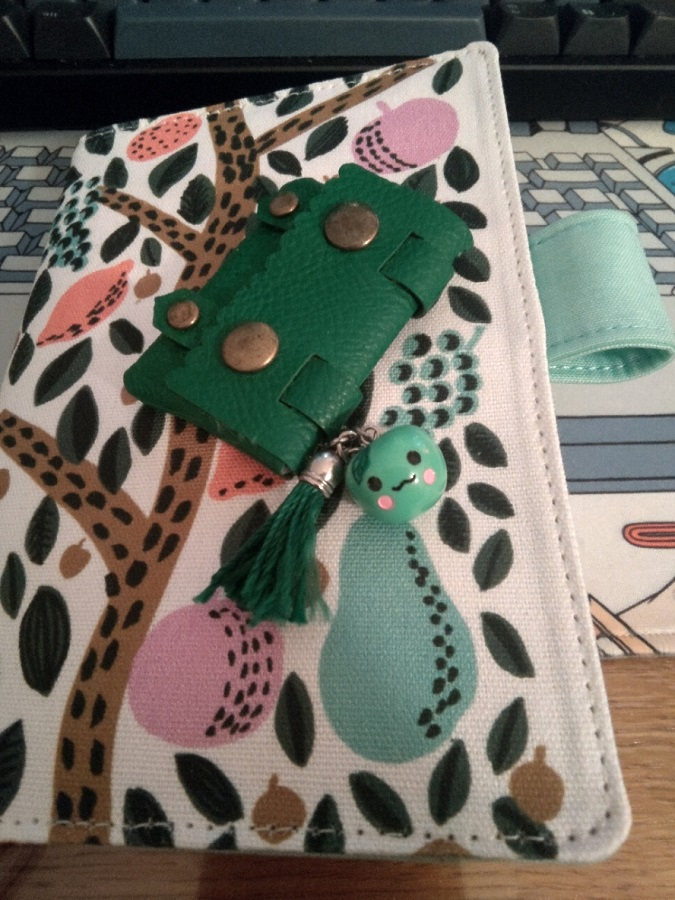
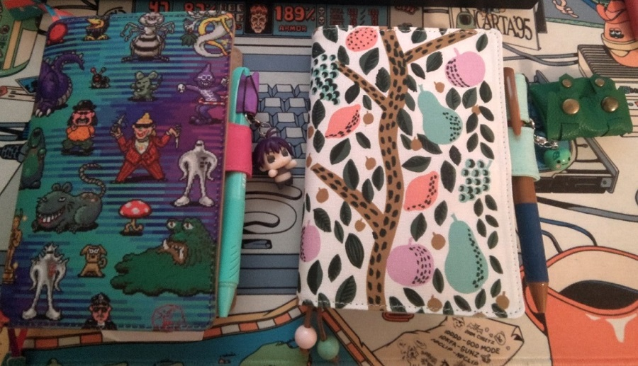
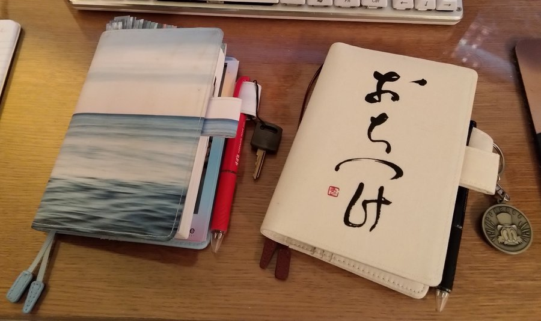
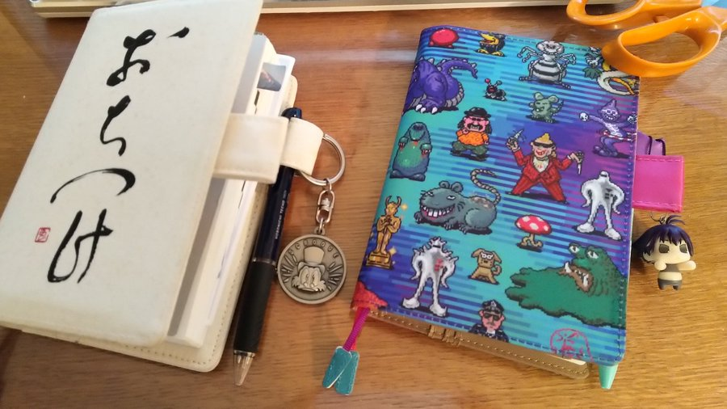

Title: My 2023 Hobonichi Techo picks
Date: 2023-1-1 00:00  
Category: Blogposting  
Tags: techo, hobonichi, stationery
Slug: 2023-techo
Authors: Difegue  
HeroImage: images/techo/2023.jpg 
Summary: The nice thing about buying a techo a year is that I never run out of 3-color ballpens now. 

New year, new [Hobonichi Techo](https://www.1101.com/store/techo/en/)!

This year's pick for my planner cover is the [Eri Shimatsuka](https://www.1101.com/store/techo/en/2023/pc/detail_cover/oc23_shimatsuka/) design. Feels nice going back to a textile cover again, and the ball-shaped bookmarks are particularly lovely.  

Every year I pick a random strap doodad from a box I have laying around and attach it to the pen holder;  
For this year I've picked this tiny green bag with a mascot character. Fun! I have no idea where it comes from, but the mascot has the same green hue as one of the bookmarks so it's a nice match.      

  
The bag can fit _one_ small roll of washi tape, so for once this is actually practical and not just extra decoration. I've put one roll of [Pavilio](https://www.1101.com/store/techo/en/2023/pc/detail_toolstoys/s_pavilio/) in there.  

This year's techo came with a sampler for the new Tomoe River paper variant that'll be used starting next year: It's noticeably...smoother? Both to the touch and when writing on, which feels nice.  
  
The bundled pen is brown for 2023, which fits the cover and its leather bookmarks nicely as well.  
I liked 2022's mint a lot (that's usually the color I pick for the [window theme](https://knowyourmeme.com/photos/1082668-earthbound-mother) in EarthBound too!), so I'm probably going to keep it around for random note writing.  

Gonna need to put something else in that pen holder to keep the 2022 techo closed though, it's noticeably bulgy this year. 😌  

I didn't get much in the way of new stationery this year -- I tried the new [Deco Rush](https://www.1101.com/store/techo/en/magazine/tt_report/202209/), and they're quite fun!  
They run out quickly, but I feel part of that is because I botched up quite a few times when using them, wasting some of the sticker tape...  

For kicks, here are the pictures for the previous years - had to dig a bit in the ol' twitter archives to find those again.  

  

