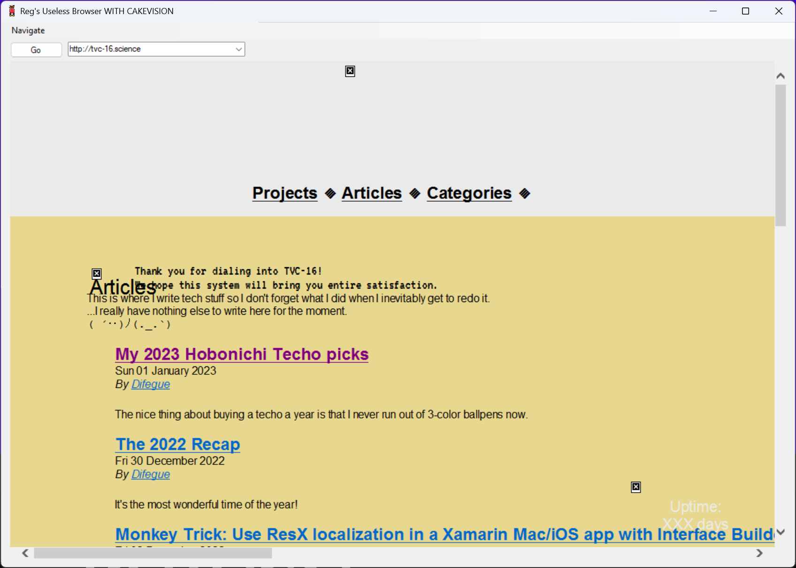
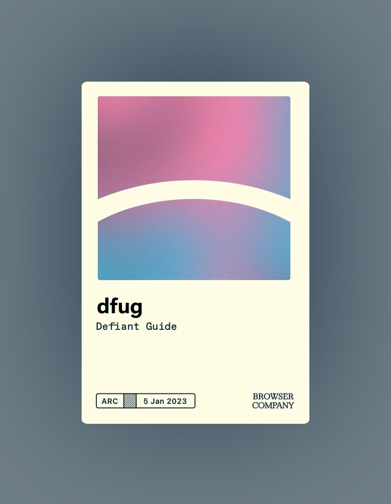
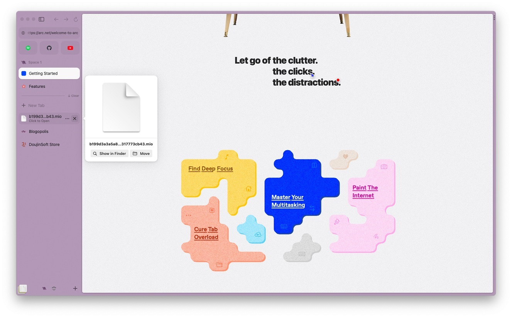
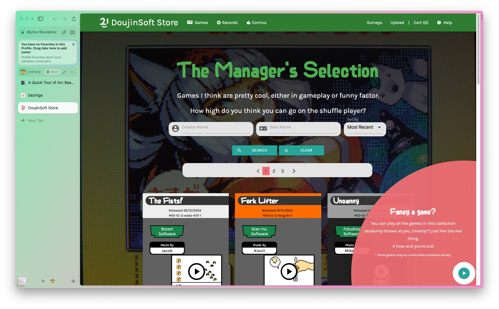
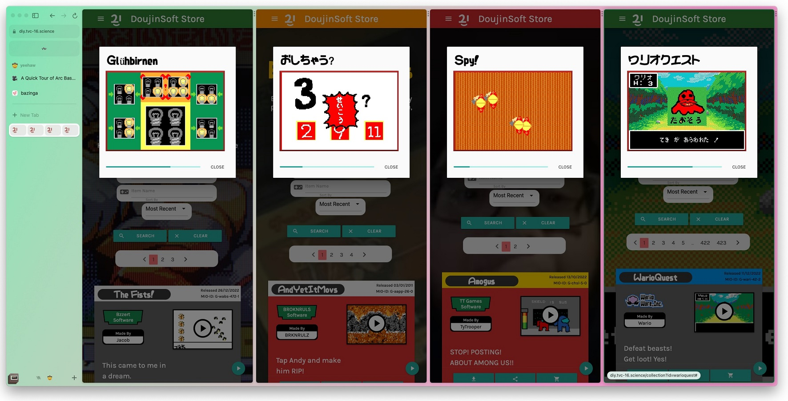
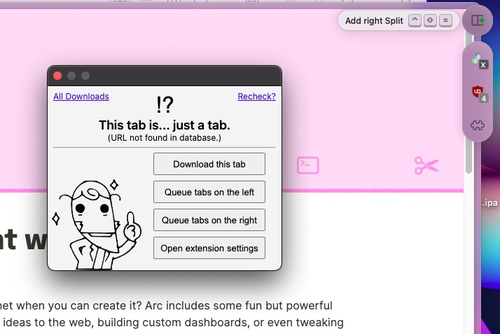
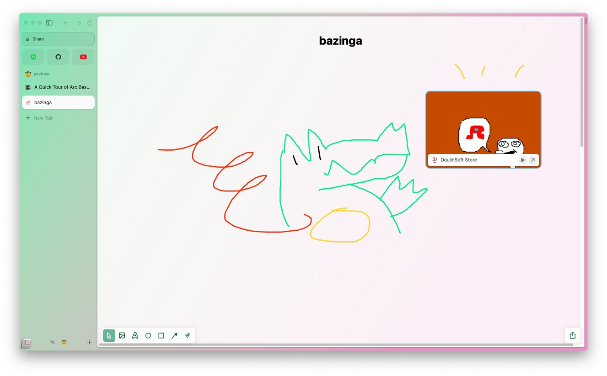

Title: Some thoughts on the Arc Browser
Date: 2023-1-8 00:00  
Category: Blogposting
Tags: macos, apple, internet browsers, startup stuff
Slug: arc-thoughts
Authors: Difegue  
HeroImage: images/arc/arc_4.jpg
Summary: Isn't 'The Browser Company' kind of a pretentious name?

Remember when the Internet Explorer browser engine was the most ubiquitous thing because it was forcibly integrated into Windows and everyone could use it?  
Heck, you could even make _your_ own web browser by just slapping some Win32 controls on top of a webview, look at this old Winforms app someone made eons ago and that I kept in my "old stuff" folder for some reason:    

  

I got the opportunity to try out [Arc](https://arc.net/), a new web browser setting to `"think as quickly as we do, take work off of our plates, and pull our creativity forward"` and `"let go of the old internet"`, yknow, tech startup stuff.  

Their brand/marketing is pretty good[*](#note-1), and since the browser was shrouded in secrecy for a while I got interested...  
Like all tech startup stuff, the beta is an invite-only cool club thing because we can't just have _everyone_ try our software I guess ¯\\\_(ツ)_/¯   
At least they **actually** give you a member card here so I can't really complain too much, look how pretty it is!    

  

# Interface and Browser organization

The Arc browser is a UI wrapper around Chromium like most new browsers these days, but unlike Vivaldi I quite like the interface here! It's Mac-only for now and is actually using native UI components, which helps a **lot**.  

There are tons of micro-interaction animations and other niceties peppered throughout the interface -- 
Since I'm more of a Windows user, I can only hope they manage to do the same [there.](https://www.theverge.com/2022/11/4/23438365/the-arc-browser-is-coming-to-windows)[**](#note-2)

The main idea behind Arc is to reduce on your browser clutter by automatically Marie Kondo-ing your tabs away after a few days, unless you specifically move them _above_ the New Tab button, where they'll never close.  

  

For "webapps" that you always keep open, you can also drag a tab all the way up, where it'll transform into a big fat toggle button. I personally prefer extracting webapps away from the browser when possible[***](#note-3) so I can use the OS to multitask instead, because it'll usually be miles ahead of what a single app can do 😤  

Having the area below New Tab be this ephemeral space allows for some interesting UI choices, like putting downloads alongside your tabs. I can appreciate the experiment, but as a dedicated Tab Hoarder™️ I'd probably end up pinning everything...  

As far as Tab organization itself goes, you've got folders, which give you one level of hierarchy only(meh). But if you want one more level, you can use **Spaces**, which I consider to be a very cool spin on web browsing compartmentalization.  

  

Spaces end up at the bottom of the sidebar with the icon/emoji you give them, and each space has its own set of tabs and folders. If you want, you can give a space a different **profile**, which is basically a separate cookie/data storage like what Firefox Containers do.  

This is quite powerful for Home/Work separation and other stuff like per-project tab bundles - But once you're on a space proper you'll still notice that the tab interface can't really hold a lot of tabs (even with folders), which is very much a deliberate choice by the browser.

# Split View 

Y'know how browsers all mostly embraced the "sidebar/side view" thing these days, either for extensions or additional lightweight multitasking? Arc just goes whole hog on the concept with a Split View feature that allows you to have up to 4 tabs side-by-side.  
The tabs merge in a single line on the sidebar, which is a nice touch.   

  
Playing DIY games on [DoujinSoft](http://diy.tvc-16.science) certainly gets more challenging when you have to play four of them simultaneously...  

While the interface of Arc is overall very spacious, for some reason the multitasking menu is this small set of three dots on the right side of each tab - What is this, the iPad?  

  
The multitasking menu is also where extensions live, and opening an extension shows it up in a little floating window -- Which is something I thought was **really** cool at first, because sometimes I do want my extension to stick around on screen while I'm doing browser stuff instead of being a quick overlay like all other browsers do.  
Except that the window autocloses as soon as you click outside it, so it's basically just an overlay anyways. 😩😩  

# Other features 

Each space can have a dedicated **theme**, which is a set of up to three accent colors you can choose. Although you can only really choose the primary colors, as the browser will "derive" the others for you so that the interface remains nice.  
no hot dog stand...  

The browser comes with uBlock Origin pre-installed as an adblocker, and comes with a "Boost" feature that's basically Stylish+Greasemonkey, allowing you to give any website custom CSS/JS. It's pretty good! The split view also makes working on custom styles and scripts a pleasant experience.

I didn't take a screenshot of it (ha), but the **screenshot** tool can always be quickly reached from the address bar, and it is _surprisingly_ powerful -- You can select DOM regions like other browsers, but there's also some basic editing tools on top of it.  
It ties into the "Easel" feature, which is some kind of collaborative whiteboard thing? This isn't really the kind of thing I'd do in a web browser, but it's there if you want it[#](#note-4). 

  

# Closing thoughts

It looks good and it tries to be your Internet swiss army knife... I appreciate some of the choices, but I'd probably end up only using a third of what Arc offers.  

Spaces are a really nice feature and I'd like to use those instead of juggling two Firefox windows like I do, but the tab management side of things is a bit too limiting for me I'd say? Firefox + [Tree Style Tabs](https://github.com/piroor/treestyletab) remains undefeated!  

Here's an [invite code](https://arc.net/gift/ac63e7b) for the Arc cool club in case you want to try it out.  

[\*](#ref-1)I am a sucker for serifs/renaissance art mixed with corporate aesthetics I guess  
[\*\*](#ref-2) Swift bindings to WinUI? they sure aren't making their lives easy on that one that's commendable  
[\*\*\*](#ref-3) Using PWAs, third party clients or *shudders* awful electron wrappers...   
[#](#ref-4) One nice feature of easels is that you can make your screenshots "live", which basically turns them into small webviews. This won't work everywhere, but it's nice for dashboard stuff!   