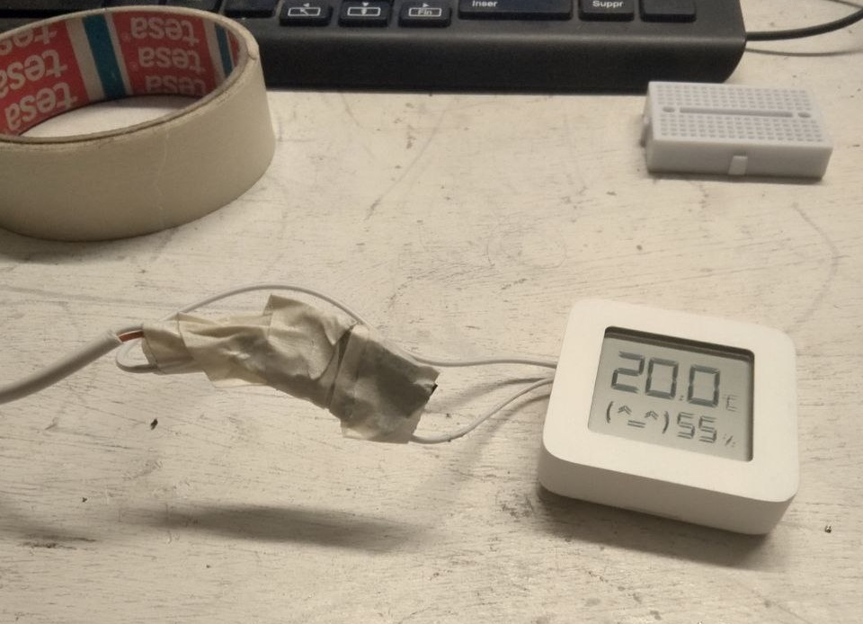
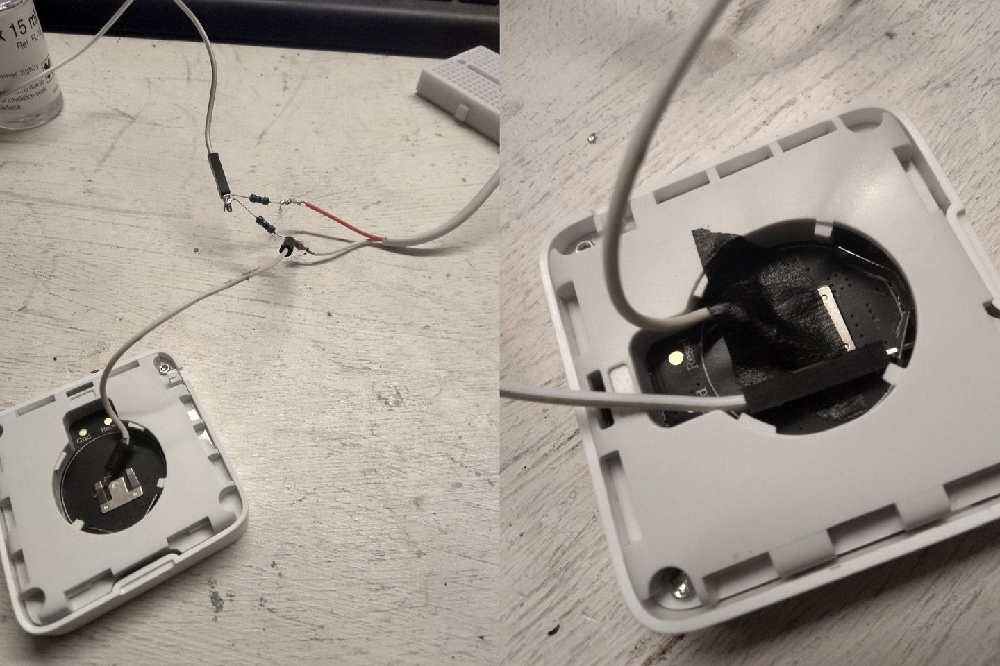

Title: Converting a Mi Temperature and Humidity Monitor 2 to run off USB
Date: 2023-1-20 00:00  
Category: Hardware  
Tags: xiaomi, jank, voltage dividers
Slug: usb-mi-sensor
Authors: Difegue  
HeroImage: images/midivider/divider-1.jpg  
Summary: It's all about balance.  

The recent [LTT video](https://www.youtube.com/watch?v=bTpKM43VhwA) about converting battery-powered smart appliances to run on wired power instead reminded me that I did something similar recently for my [Mi Humidity sensor](https://www.mi.com/pk/mi-temperature-and-humidity-monitor-2/) because I'm too cheap to buy a coin cell every year.  
  
Except that I don't care about going even _jankier_ than a usual LTT video would, so I just used my old pal the [voltage divider.](./mcorigins.html)  

Since the Mi monitor takes a classic CR2032, you should normally adjust to give it 3V -- But I noticed the monitor ran just fine on 2.5V, so it's easier to use the same resistor on both sides of the divider to slash the voltage by half.  
  
Using stronger resistors will reduce the current going through your divider, so you'll want to try various ohm values[*](#note-1) to get a current that'll still let that lil' appliance do its job.  

It's quite convenient if you have some of those newfangled wall plugs that have a USB port included! The first resistor does get a _tiny bit_ warm though. :^)   

[\*](#ref-1) I use [https://ohmslawcalculator.com/voltage-divider-calculator](https://ohmslawcalculator.com/voltage-divider-calculator) to calculate my voltage dividers, but that tool doesn't give you amperage calculations. I can't remember which resistor value I used I'm sorry  
