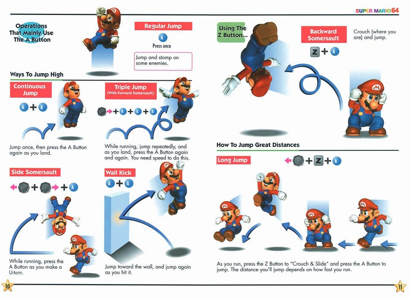
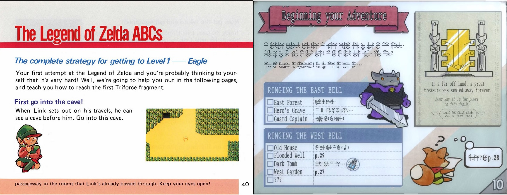
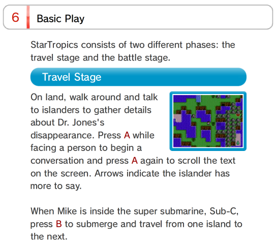
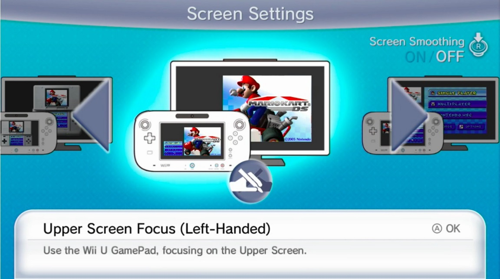

Title: Bring back game manuals
Date: 2023-1-25 00:00  
Category: Blogposting  
Tags: video games, xbox, game manuals, virtual console, preservation
Slug: game-manuals
Authors: Difegue  
HeroImage: images/games/tunic-1.jpg  
Summary: just for old games tho, I don't care about your SOULLESS modern drivel........😤

This was just going to be a post talking about Game Pass games I recently cleared in a hurry before my subscription[*](#note-1) ran out, but [Tunic](https://en.wikipedia.org/wiki/Tunic_(video_game)) was one of those games, and then I watched a video essay about [the first Zelda](https://www.youtube.com/watch?v=vs_HaPRm37A) so fuck it, I'm talking about game manuals!  
  
Game manuals faded away when video games started being offered as digital-only, since you couldn't really depend on paper anymore to explain how your game worked.  
That's perfectly fine since games are now designed to be played manual-less[**](#note-2), but in a lot of cases before the sixth gen, manuals were often a **necessary companion** to your video game experience.  

Without even getting into meta uses like the [StarTropics letter](https://www.youtube.com/watch?v=2-JKpL8bK_A) or the MGS Codec number[***](#note-3), manuals would often hold all the information the game couldn't carry itself. And the older the game, the worse it gets since 8-bit titles really didn't hold that much data!  

The manual would contain the story, controls, hints and basic tricks to get started -- The [first Zelda](https://archive.org/details/LegendOfZeldaTheNESHiResScans) is what got me thinking about this since it has all of the above, a map _and_ a tiny strategy guide. Without the manual, the game does feel cryptic even if you're a seasoned Zelda player...  
  
This is the part where I namedrop [Tunic again](https://www.rockpapershotgun.com/tunics-instruction-manual-and-the-zelda-art-that-inspired-it), since it reproduces this experience of playing a game where the manual is your companion and helps you travel through an otherwise completely alien land. Except that said manual is virtual now!  
I haven't felt that much joy reading a manual in quite a long time, so I can only recommand the game.  

Surely companies would leverage this synergy between instruction booklet and game when re-releasing their old classics on newer consoles, right? I mean they already made the manuals back then, it's basically free real estate to pack them in!  

 

Of course not.

# Electronic manuals suck 

Most emulator re-releases usually pack in a barebones e-manual with the bare minimum to get you started.  
No map, no illustrations, almost no flavor text.  
And in some cases you don't even **get** a manual anymore! Good luck finishing [StarTropics](https://www.reddit.com/r/NintendoSwitch/comments/b1qxg2/psa_the_nintendo_switch_online_version_of/) now[#](#note-4).  
  
It feels like an absolute waste for companies to not try and give the best experience possible to new players possibly going through these games for the first time. Of course it's easy to understand why:  

- It's probably more expensive to find and scan an old manual than the entire cost of just chucking a ROM on the Store and making people pay $10 for it (unless you're [Nintendo](https://en-americas-support.nintendo.com/app/answers/detail/a_id/16890/~/wii-manuals) and actually keep the originals)  
- For third-parties, you'd likely have to scrub the manual out of all information related to the console publisher, kinda like what WayForward did with the [Shantae](https://www.youtube.com/watch?v=eZRzaGFWoz8) rerelease for Switch by removing mentions to Nintendo and Capcom from the game.  

So when it comes to video game preservation, are we stuck in a hell of _capitalist mediocrity_  where our only salvation is unofficial efforts[##](#note-5) by the common folk?  
Well yes, but there's one surprising exception: The **Virtual Console** during the 3DS/Wii U era.  
  
While most releases there kept the crummy shorthand manuals, for some reason Nintendo saw the light and started including the original manuals for their N64/GBA/NDS/Wii Virtual Console releases and oh my god is that the [ChuChu Rocket Japanese GBA manual?](https://www.nintendo.co.jp/data/software/manual/man_pchj.pdf) Look how `delightfully Y2K` it is.   

The Virtual Console had those occasional strokes of genius when it came to repackaging those old games[###](#note-6) at times, but it really feels like this should be the norm.  
I'd rather have the original instruction booklet than a bunch of random promotional artwork thrown in a gallery in your re-release's menus, to be honest...  

So I say, if you re-release a game, put in the manual as a pdf dangit!  
And give it a nice pagefilp animation, like what Tunic does, and what iOS used to do before Apple [Jony Ive'd it.](https://www.theverge.com/2022/11/21/23471306/apple-books-ios-16-page-flip-animation-sucks)  
#

[\*](#ref-1) I pay for my Game Pass with Microsoft Rewards points only -- Since all search engines resell your data, might as well get some of it back 💰  
[\*\*](#ref-2) with copious amounts of tutorials in some cases i'm looking at you sonic frontiers  
[\*\*\*](#ref-3) Sony actually does include Meryl's frequency in the virtual manual for MGS1 on PSN, but just like Startropics it's pretty much devoid of everything else...   
[#](#ref-4) In a funny turn of events, there's a help page on Nintendo's website about this, with a link pointing to... [the Wii U version](https://www.nintendo.co.jp/clv/manuals/en/pdf/CLV-P-NAAZE_en.pdf) of the electronic manual for StarTropics.   
[##](#ref-5) While not manual-related, [EmuVR](https://www.emuvr.net/) allows you to see cartridge/game disc art for your ROMs in VR, which I find really cool.   
[###](#ref-6) Did you know Pokémon Snap on the Wii Virtual Console has a feature to [copy your Pokémon photos](https://www.serebii.net/snap/virtualconsole.shtml) to the Wii Message Board? Or that SMB3 GBA comes with all the e-Reader bonus levels unlocked?   

