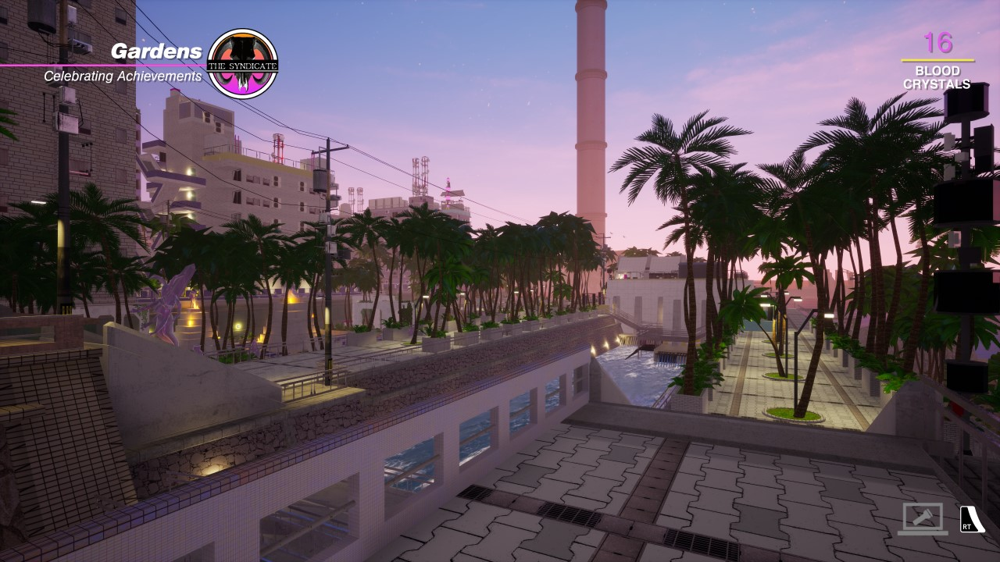
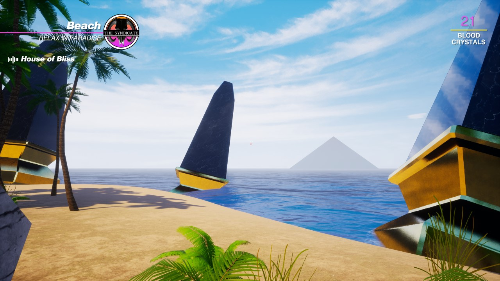
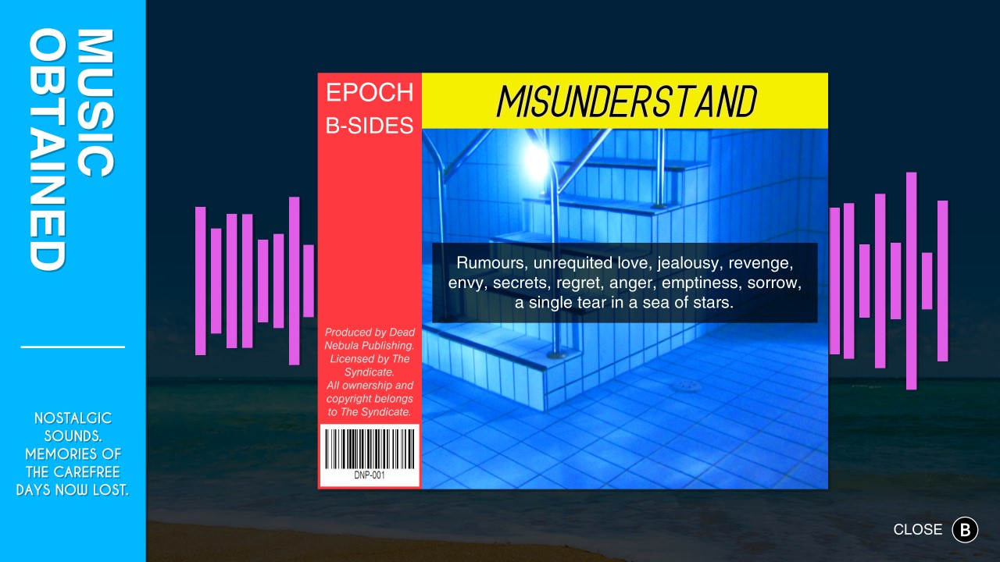
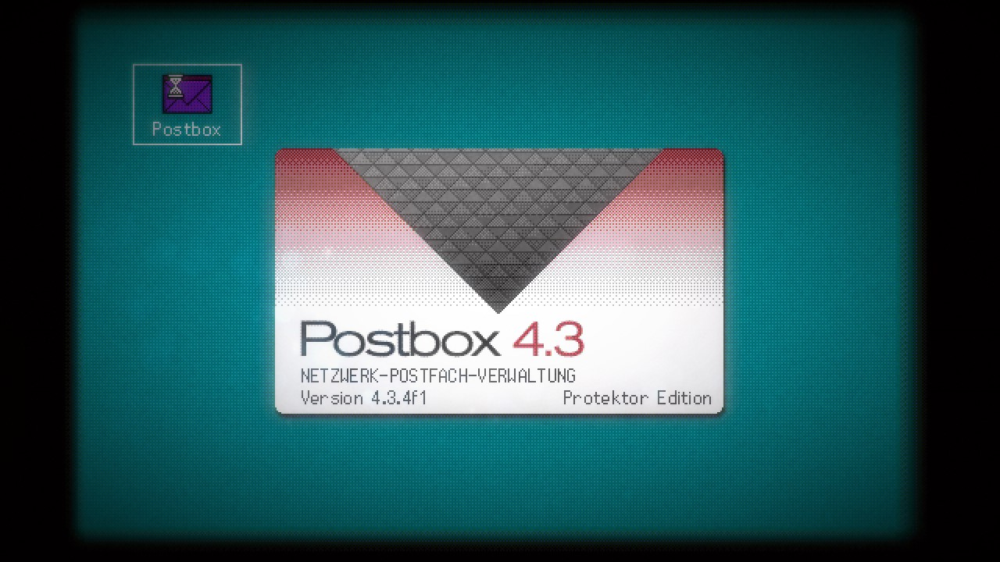
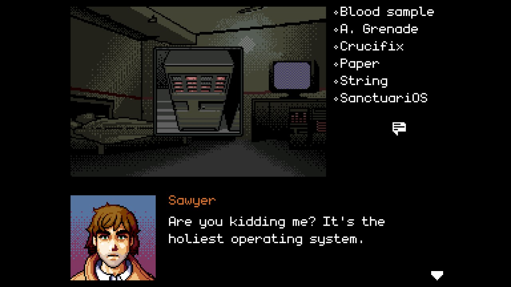
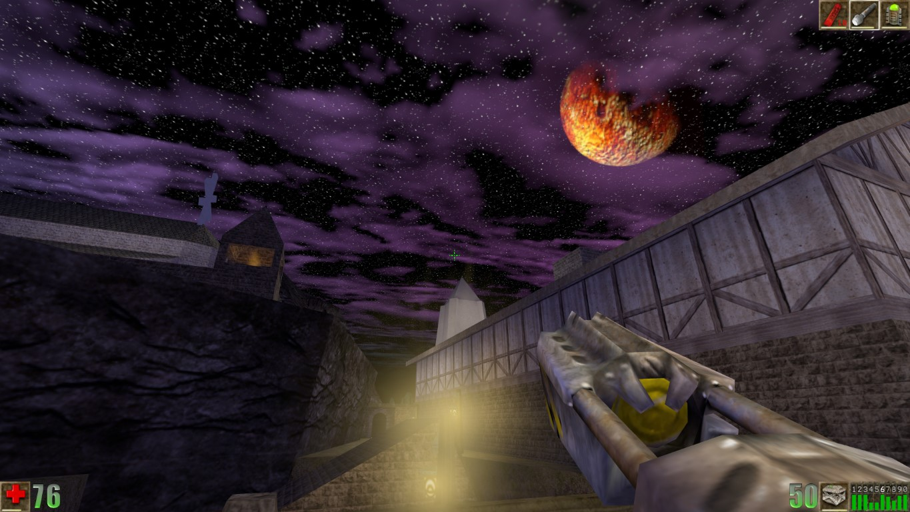

Title: January-February videogame grab bag
Date: 2023-2-19 00:00  
Category: Blogposting  
Tags: video games, game pass, unreal, pizza tower, signalis, paradise killer, digital exorcist, soundtracks
Slug: games-february
Authors: Difegue  
HeroImage: images/games/paradise-2.jpg  
Summary: if the pizza tower soundtrack doesn't end up pressed on pizza-colored vinyl records i will be sorely disappointed

Hey, here's that vidya james post I wanted to write before going off on a tangent about [manuals!](./game-manuals.html)  
I had it kinda shelved, but the wacky woohoo pizza game got me wanting to write again, so let's get to it:  

# Paradise Killer

This game was on my "clear it through game pass" list forever, but I'm glad I got to it.  
You could resume it as "vaporwave danganronpa" as far as gameplay goes I guess?  
  
It's very much a different experience though, just massive chill vibes for a good couple of hours while you comb the island over to piece together the local murder mystery[*](#note-1). It doesn't overstay its welcome, yet there's more than enough stuff to keep you entertained with minimal backtracking.  

Just...get the movement upgrades fast, and dial the voice clip frequency **way** down in the settings, lest you create your _own_ murder mystery after hearing _"The investigator is here!"_ for the tenth time in a conversation.  
  
The aesthetic is unparalleled in this and really contributes to the good vibes; This is one of those games I'd keep installed just to pop it in every now and then and walk around the environments.[**](#note-2)    

[Also, the soundtrack is fantastic.](https://www.youtube.com/watch?v=Xfgbb0uXH4s)

  

# SIGNALIS

I played this one a few months back already, but thought I'd still talk a bit about it.  
Survival horror with impeccable art direction, good gameplay and a story that feels like David Lynch wrote it after reading a bunch of Lovecraft books.  

Some **casuals** don't like the inventory management in this, but you can't really have a good horror game without the constant existential dread of not having enough space!

Also there's a small fake operating system you can find near the end:  
  
We got that nice Windows 3.1 aesthetic with touches of 95, _good shit_!  

[Also, the soundtrack is fantastic.](https://signalis-ost.bandcamp.com/track/safe-room)  

# Digital Exorcist

A short Snatcher-inspired game on [itch.io.](https://coolbeansproductions.itch.io/digital-exorcist)  
  
TERRY DAVIS LIVES  

I liked it a lot!  
Writing about demons crawling the internet tickles my Soul Hackers bone, so that always gets a thumbs up from me.  
It's only an hour or so, entirely worth the time -- wouldn't mind seeing more.  

[Also, the soundtrack is pretty cool.](https://djtakataka.bandcamp.com/track/battle-in-the-aethernet)  

# Unreal  

the game not the engine you dolts  

Having played Quake semi-recently through the remaster, I wanted to get back to Unreal and finally finish it!  
It was...kinda boring?  

The game looks stunning and really showcases the large environments you could do on UE1... yet most of the combat loop is oriented towards shoving you in cramped hallways with ninja aliens. I wasn't asking for Serious Sam tier open area fights, but it'd have been nice to get a bit more of a balance.  
  
Also some of the game design is fucking weird in this, what's the deal with the locked rooms with endless respawning enemies making you kill like 50 of them to proceed? The game didn't need padding, it's already 10 hours long![***](#note-3)  
I still think it was worth playing despite that, though. fuck you epic for delisting this   

[Also, the soundtrack is fantastic.](https://www.youtube.com/watch?v=9IISjIMpepo&t=9256s)  
You can never have enough Alex Brandon/Michiel van den Bos! It follows a similar structure to the Deus Ex soundtrack with dynamic pieces depending on what the level does, which is certainly one thing I'll give it over Quake.[#](#note-4)    

# Pizza Tower 

This is it, the [Wario Land where you go fast](https://store.steampowered.com/app/2231450/Pizza_Tower/)! I adore the artstyle of this game and can't imagine how many hours of work were poured into drawing all those unhinged italians. (Seriously, the amount of art assets in this 7h game? incredible)  
  
I've thought a few times before of a combo system where you could keep a combo from the beginning to the end of a stage without dropping it, but always wondered how you'd make it fit with non-score attack aspects like finding secrets.  
How do you make those fun to find for normal players, while weaving them into your score attack so that the secrets aren't a one-time fun thing you do for completionism? Pizza Tower just fucking does it, **and** nails it.  

The ending is teased throughout the entire game so it doesn't come as a surprise when it lands, but the execution is so good you'll still love the absolute crap out of it.  
fucking goty we didn't even make it to march, pack it up zelda you're done  

[Also, the soundtrack is **beyond** fantastic.](https://ronandecastel.bandcamp.com/track/pumpin-hot-stuff) It's got all my favorite samples in it!  
#

[\*](#ref-1) Which isn't very complex but then again I wanted to chill, not unwind a komaeda-tier madhouse murder with this one  
[\*\*](#ref-2) except you can't do that with gamepass god damn it phil fine i'll buy the game  
[\*\*\*](#ref-3) And they had to cut a ton of shit from the game that ended up in the expansion pack!   
[#](#ref-4) sorry trent i still love you, I certainly recommend the [signalis soundtrack](https://signalis-ost.bandcamp.com/track/mynah) again if you want some of that NiNcore   