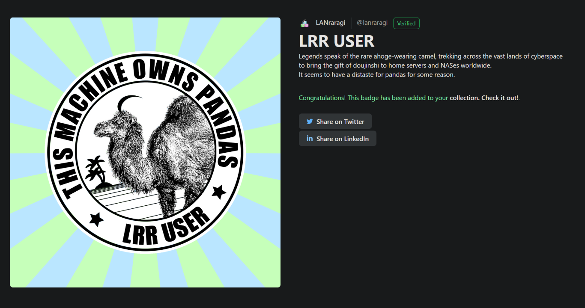
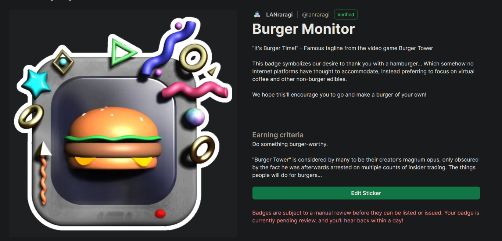
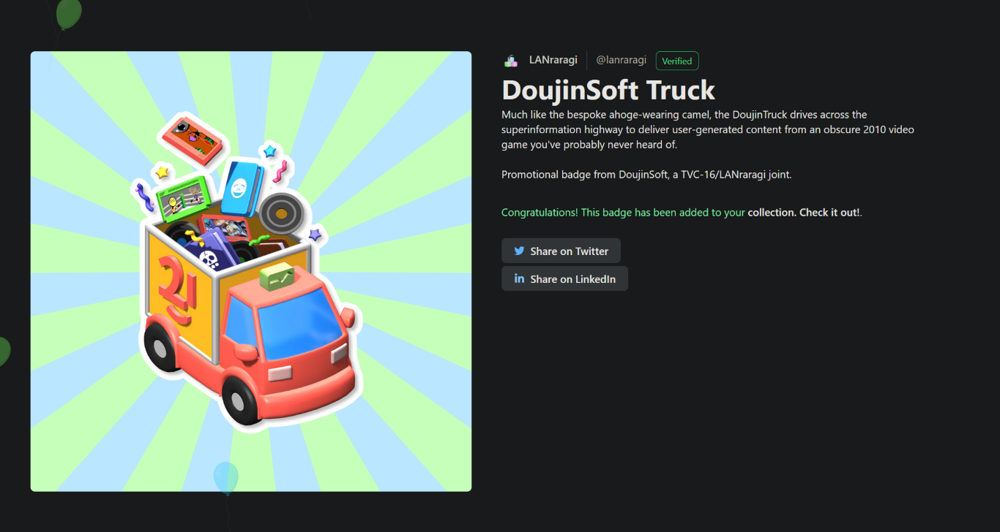
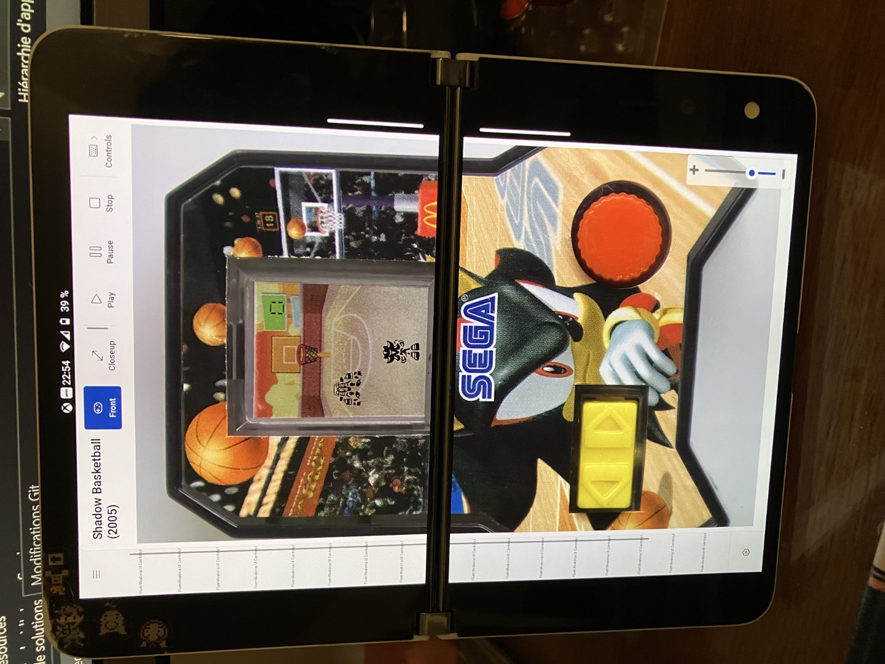

Title: LANraragi 0.8.9 ft. Holopin
Date: 2023-03-19 00:00  
Category: LANraragi  
Tags: lanraragi, holopin, steam trading cards, hell yeah pngs
Slug: lrr-holopin
Authors: Difegue  
HeroImage: images/holopin/pin_camel.png
Summary: It's just like gacha/steam trading cards, except you don't have to pay money!  

LANraragi v.0.8.9 just came out [today!](https://github.com/Difegue/LANraragi/releases/tag/v.0.8.90)  
It's a surprisingly packed release with **10** different people having worked on it, which is certainly a record as far as any OSS software I made goes.  
We finally have ComicInfo.xml support now! Alongside a few other nice improvements to search.  

It's uncommon for me to get that many PRs... The LRR [free sticker promo](https://github.com/Difegue/LANraragi#make-a-pr-get-stickers) has been a thing for a long time now, but most contributors don't take advantage of it.  
Since my sticker designs are objectively the coolest[*](#note-1), it can only be because people are too kind and don't want me to pay for all that postage! Such acts of kindness go straight to my kokoro...  
  
But I'd still like to thank/reward contributors if I can help it, so to get rid of any physical-related troubles, we're going full metaverse 'n shit with [Holopin](https://www.holopin.io/)! Wow! 

You can now get LANraragi stickers in virtual format and stick them on your GitHub profile...or everywhere! I'm just going to paste my badge board _here_ and you can't stop me from doing it[**](#note-2):  

  

While I don't actually want to turn my GH profile into social media, I do find the concept of a universal badge board for developers amusing, in the same way game achievements can be.  

The fact I can use a bunch of previous graphic assets I made and write all sorts of nonsense in the descriptions also helps! My gold standard is TF2 item descriptions.     
  
Stickers and other "swag" incentives ala Hacktoberfest are nice, but don't really feel very fun/indie anymore with all the corporation sponsorships going on in those.  
There are currently five LRR-related badges you can get as a Holopin user, either by snooping around a bit or by actively contributing to the LRR repository. I hope you'll consider giving [it a look!](https://www.holopin.io/@lanraragi)  
  
Now that I'm swimming in PRs thanks to those pngs, I can go back to working on personal [passion projects](https://github.com/Difegue/LCDonald) that truly speak to my tamashii[***](#note-3):  
  
yes ha ha ha **YES**  

#

[\*](#ref-1) graphic design is my passion   
[\*\*](#ref-2) Unless you use the internet with third-party JS turned off by default through ublock or some other extension, in which case yknow what? you're alright mate cheers  
[\*\*\*](#ref-3) (tl note: soul) also android development actually makes me utterly miserable, but the people wanted it..   