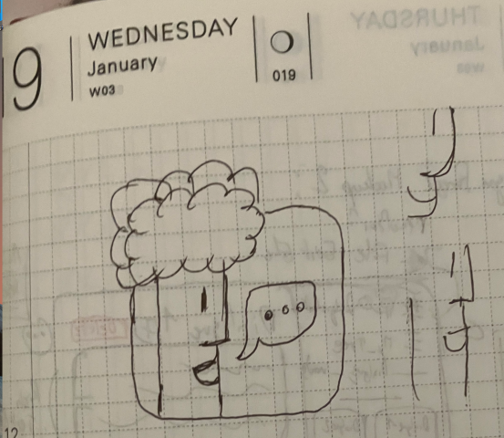
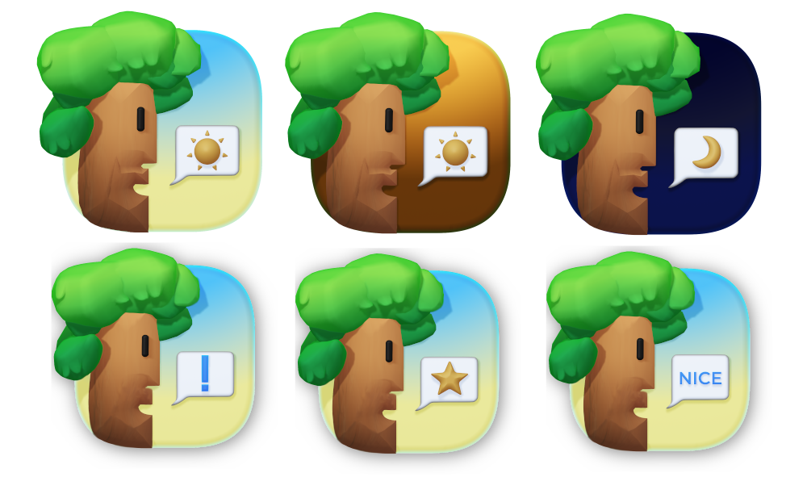
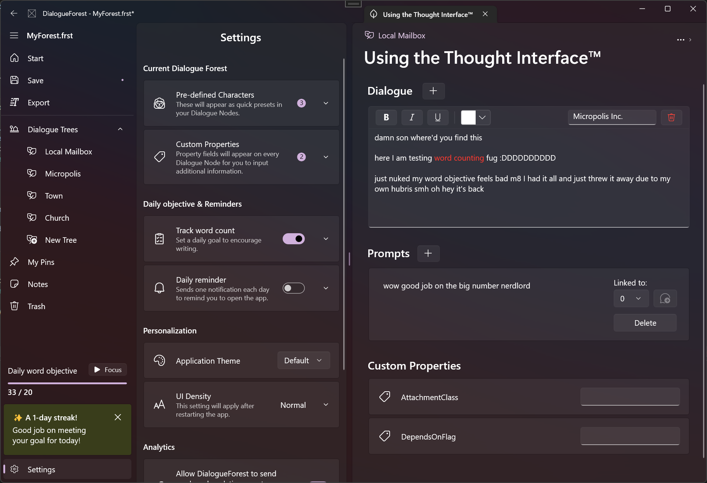
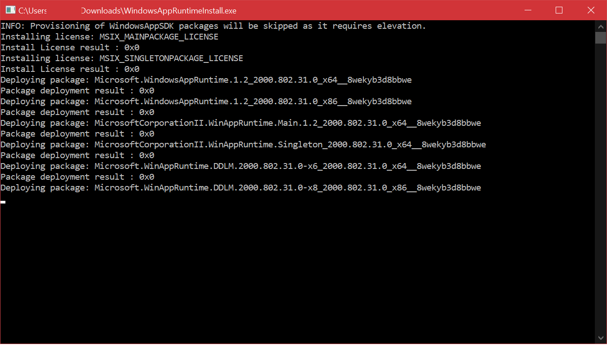

Title: Introducing DialogueForest
Date: 2023-04-12 00:00  
Category: Software 
Tags: dotnet, c#, gamedev, winui, windows, windows 11, winappsdk, outliner, dialogueforest
Slug: dialogueforest
Authors: Difegue  
HeroImage: images/dialogueforest/hero.jpg 
Summary: An opinionated Dialogue Writing tool for Games. 

Here's a new _certified dfugdrop_™️! Let's not talk about how I left it dead for [more than a year.](https://twitter.com/Difegue/status/1488666105115824132)  

  

**DialogueForest** is a (free!) Windows App built on WinUI 3 that allows you to write hierarchical rich text dialogue with custom characters and metadata, sprinkled with some basic productivity features like daily objectives/notifications. 

The reasoning behind this app is that I couldn't find a good tool to write medium-length branching dialogue for my burgeoning[*](#note-1) gamedev efforts.  
Most tools are based on node graphs, which very quickly become unmanageable[**](#note-2) if you're trying to write a lot of text.  

### Check it out on [itch.io!](https://difegue.itch.io/dialogueforest)  
You can also browse the source code [here](https://github.com/Difegue/DialogueForest).  

I found out that tools like these are called Outliners - I recommend the following [SE question](https://rpg.stackexchange.com/questions/34816/tree-based-tool-to-create-dialog) if you're looking for other tools like this one. I notably looked at [Scrivener](https://www.literatureandlatte.com/scrivener/overview) for inspiration, but there's no way I was going to remake all of that...  

You can read some more of my design/dev thoughts below, as always.  

# The Icon and UX 

I'm quite fond of the whole Dialogue Tree/Forest analogies, and wanted an icon that'd follow that kind of whimsy.    
This one is very obviously inspired by the classic Mac [Alert Icon](https://www.cnet.com/pictures/susan-kares-early-mac-icons-gave-computers-a-personality-photos/2/) with a dash of Whispy Woods -- I didn't think I had good enough 3D/Spline skills to make a "mascot" icon like all the cool guys do, but it turned out alright!  
  
Compare it to this jank mockup I scribbled on last year's Hobonichi Techo:  
  

Having a humanized icon makes the app fun, and the speech bubble makes it easy to re-use in a bunch of different scenarios as well:  
  
The evening/night variants were planned for the welcome page to go alongside the time-based greeting, but I ultimately cut them 🤷  

The app is laid out in a very personal way this time since I mostly built it for my own use.   

I did aim for a three-column layout voluntarily though -- Those layouts have gotten quite popular on macOS, but I've rarely seen them on Windows so far? Even though I think they totally work in WinUI.  

  
It's been a fun experiment to try and design a featureful/"crammed" WinUI app - You really can get a lot going in modern Windows apps now, even without the Compact controls.

# Technical Thoughts  

DialogueForest started life as an UWP app just like [Stylophone](./stylophone.html), but I moved it to [Windows App SDK](https://github.com/microsoft/WindowsAppSDK) this year to try the platform out and see if it was usable to ship something.  

Since you're reading this, I guess it was! It's still a bit rough[***](#note-3) around the edges though...  
The experience kinda sucks for end-users when you look at the WinAppSDK runtime installer:  
  
Now of course I couldve bothered to make a nice MSI/MSIX that'd install the runtimes on its own, but you're not gonna expect me to do this for a free app -- what's next, code signing?  

I might eventually upload a packaged version to the MS Store anyway, maybe as a `"plus"`[#](#note-4) paid kind of deal with some junk like GPT integration that writes the dialogue for you? _everyone loves them LLMs i am a business genius_  

Rich Text support was both very easy thanks to included controls and a massive pain because nobody really works with RTF anymore. 🫠  
I did do the whole netstandard Core/Viewmodel thing [again](./stylophone-25.html), so a macOS version is certainly possible later down the line. I doubt I'll make one for something this niche though..  

#

[\*](#ref-1) kindest word I can find for "not moving forward at all"  
[\*\*](#ref-2) my best/previous functioning setup was an excel sheet with macros, so you can guess how messy that was  
[\*\*\*](#ref-3) I'm very thankful for [WinUIEx](https://github.com/dotMorten/WinUIEx)!   
[#](#ref-4) would be about as worth it as sonic origins plus, thanks for the game gear games again sega   