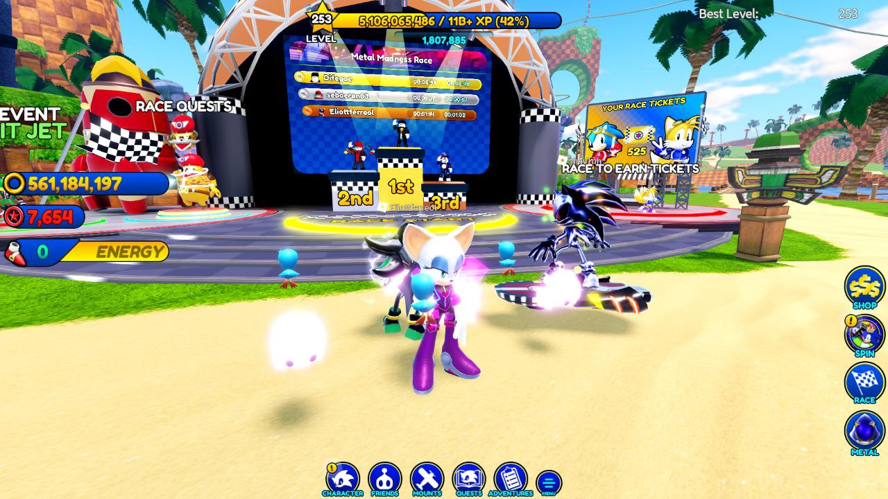
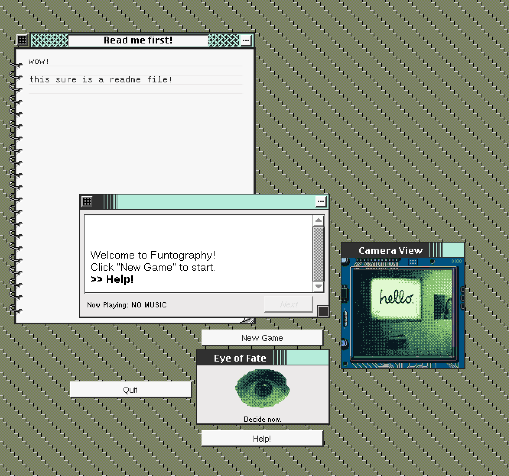

Title: Total Internet Hyperdeath
Date: 2023-07-02 00:00  
Category: Blogposting 
Tags: gamedev, faux-OS
Slug: total-internet-hyperdeath
Authors: Difegue  
HeroImage: images/speedsim.jpg
Summary: A piece where I, in fact, do not talk about the total internet hyperdeath whatsoever

Wow, it's been a hot minute! I'm writing this between farming race tickets in Sonic Speed Simulator[*](#note-2)  .  
While I'll never give money to anything touching Roblox, I do find some zen in repeatedly boosting away on a Sunday night...  
  
So Web 2.0 is having a normal one at the moment or something - A lot of people have waxed poetic about the collapse of the corporate internet already so I don't feel like I could add anything particularly snarky to it...  
So how about reading something else? Here are some nice links I've stumbled upon recently.  

- [No Vacancy - A Night at the Motel](https://www.bylinebyline.com/articles/no-vacancy-hotel)  
- [DocSeuss' 'I beat impostor syndrome (and here's how I did it)'](https://docseuss.medium.com/i-beat-impostor-syndrome-and-heres-how-i-did-it-b6879422af2b)  
- [Robin Sloan - Crossing the Sunshine Skyway](https://www.robinsloan.com/newsletters/sunshine-skyway/)  

I've also found this [soundtrack project](https://www.youtube.com/watch?v=6qJe3rf-VFs) for a fictional PS1 megaten game a few days ago - Give it a listen if you're a fellow Devil Summoner enjoyer.  

# A quick Devlog 

I've finished up work on Sonic McOrigins' ["Plus" update](https://elk.zone/kolektiva.social/@Difegue/110633333584428326) for SAGE a few months ago already, so I'm trying to go for a **Double Donk** and get another game out the door before that deadline hits.  

Well, I'm saying game but it's kinda like a demo as well?  
This fake OS I've been on-and-off building in Unity has a fair bit of meat to it already, including being able to run entire small applications/subgames.[**](#note-2)  
  
So I thought, why not take **another** old game concept I never finished, and put it _in_ this OS?  
  
And that's how I ended up with this Visual Novel in a multi-window UI like [old Mac OS games](https://macintoshgarden.org/games/pathways-darkness)... Except it only uses [Gameboy Camera](https://elk.zone/kolektiva.social/@Difegue/110018074118875940) pictures for its graphics and a terrible soundtrack I scrambled together years ago.  
I outlined most of the plot back in 2019, but as Doc said, filling out the blanks between all the setpieces your brain thought was cool... wow it's hard[***](#note-2)  

Even if I end up eventually trashing the bigger fake OS game because Unity 2019 falls out of support everywhere or something, it'd be nice to have at least shipped all this work in _some_ form.  

I'll catch y'all in another "games i played post" or something later -- I played quake 2 recently and wow it's almost as boring as bluesky  

#

[\*](#ref-1) 
Speaking of Sonic, I keep forgetting GSC is continuing the [Nendoroid series](http://whl4u.jp/wh36/gallery/en/#/images/181) with Tails & Knuckles after **years** -- Wonfes 36 was huge on non-animanga properties in general I wonder what 37 will bring  
[\*\*](#ref-2) I've always been mad at [Digital: A Love Story](https://en.wikipedia.org/wiki/Digital:_A_Love_Story) for showing you fake downloadable games and not having them actually do anything - That's probably one of my largest motivations with this thing. 🥸    
[\*\*\*](#ref-3) To go with the GBCam-piness(heh) of it all, the dialogue toggles different color palettes and borders for the gameboy photos as you progress through... Which makes the writing process take extra longer as I keep comparing color palettes.   

