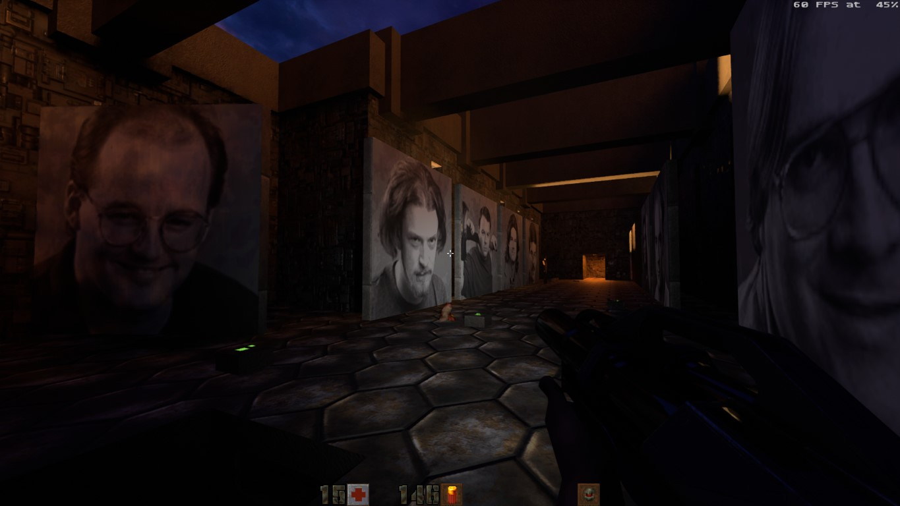
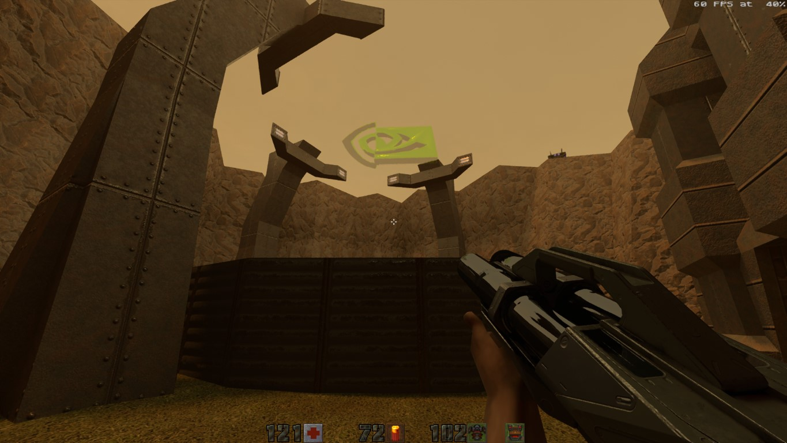

Title: March-July videogame grab bag
Date: 2023-7-31 00:00  
Category: Blogposting  
Tags: video games, game pass, playdate, quake 2, hrot, SLAYERS X TERMINAL REVERGEANSE, endless monday, soundtracks
Slug: games-july
Authors: Difegue  
HeroImage: images/games/playdate-1.gif  
Summary: you could say I haven't _cranked_ one of those out in a while.

...wow I totally meant to make more than [one of those](./games-february.html) in the last 5 months but didn't get to it  
I'm writing this mostly because I want to use vscode's new [paste-as-markdown feature](https://code.visualstudio.com/updates/v1_80#_markdown-format-pasted-urls-as-markdown-links), which makes writing those blogposts a cinch!  

Speaking of links, I've had the honor of Pixel [linking to DoujinSoft](https://twitter.com/pigadev/status/1685636317982650369?s=20) recently to showcase his old 2010 WarioWare DIY game[*](#note-1). As a cranky old nerd who played Cave Story back in its freeware days, it's great to see those small games keep living through the internet.  

And speaking of small games and cranks..... damn, double transition? showoff  

# Panic Playdate
  

Group 4 representing -- I've finally received my [Playdate](https://play.date/) console in the mail recently.  
It **is** a lovely device, as expected buttons are nice, you can crank the crank and all that -- But what I've been liking most has to be the **interface**.  

It's all 1-bit dither[**](#note-2) patterns like you're playing _[Hypercard](https://hypercard.org/): The Console_, but at a much smoother frame rate, and what the UI lacks in color, it more than makes up for in animation and style:  
🎁 New games show up in little present boxes like the 3DS/Wii U menus... Except the wrapping paper is customized for each game!  
🧶 The Settings menu has a breadcrumb navigation indicator, which each submenu having its own little icon when it shows up in the navigation.

As for the games, I'm still waiting to get all my season 1 stuff, but I've had a lot of fun with _[Casual Birder](https://play.date/games/casual-birder/)_.  
_[Crankin's Adventure](https://play.date/games/crankin/)_ is a game that could probably only exist on this device due to the fine analog control it requires...But the game itself hasn't grabbed me as much, it gets a bit too grindy and frustrating the further down the levels you go.  
  
There are some nice free games in the [Catalog/Store](https://play.date/games/)[***](#note-3) as well now -- _[Recommendation Dog](https://play.date/games/recommendation-dog/)_ and _[Reel Steal](https://play.date/games/reel-steal/)_ are nice arcadey romps you should try.  
In another _probably-inspired-by-Nintendo-handhelds_ moment, the Store has its own [music.](https://play.date/catalog/music) It's great[#](#note-4)!  

# Endless Monday: Dreams and Deadlines

A nice visual novel on Steam you should [consider buying](https://endlessmonday.com/monthly/).  
6 hours of reading, peppered with nice sub-games here and there, great pixel art, soundtrack is [good vibes](https://chancethrash.bandcamp.com/track/cubical-for-two). 👍  

I'm more biased than usual on this one considering I've been following the creator [on Twitter](https://twitter.com/hcnone) for a while, and you can totally see parallels between their real-life situation and the various plots in the game.   
  
It's also a very...current-feeling story at times? There's nothing super deep as things mostly remain comedic, but the game digs a bit into the consequences of AI[##](#note-5) for current workforces, and how capital will drain you of resources and eventually come for your head if you let it run unchecked.  
  
I've talked previously about ["art that is unabashedly sincere"](./2022-recap.html), and I feel that game matches this -- It's very much something that could only be made in 2023 with those gnawing doubts about the future of artists in mind.

# Quake 2

Full-on downgrade compared to Quake 1 holy hell  
Environments are worse, enemy design is boring, weapons are serviceable but that's it, and you can't break it in half by rocket/grenade launching 0/10  
  
I played the RTX port by toggling between the OpenGL and RTX renderers to see the differences.  
You could argue the RTX version breaks the mood of the game but it's not like it has much to begin with..Here are [some RTX off/on comparisons](./quake-rtx.html) if you're interested.  
My personal favorite has to be the nvidia logo slap-dashed in that one area you can rocketjump over to find a secret:  
  
I like the attempt at making interconnected maps with objectives that require you to move back and forth, but it's not really exploited all that well until the final level, which feels a bit more like an actual dungeon.  
Oh and the fucking [skewered dopefish](https://www.youtube.com/watch?v=YBQqDZwSUrA) easter egg which you can only find by backtracking?? This game has the cringiest easter eggs in all of id software history and I mean it    

The soundtrack is of course a [banger](https://www.youtube.com/watch?v=jY6yBTYxLko) everyone knows it, but I'm gonna have to go apologize to tim epic because Unreal was better than this mess

# HROT

Oh lookie here, it's the better Quake 2!  
  
Despite having an even blander palette (_it's all brown_), this game manages to have quite the variety of environments, accompanied by rock-solid level design.  
There's quite the variety of enemies and bosses too! And the super shotgun is A+, as shrimple as that.

Despite the advertised theme being "post-USSR horror freakshow gone wrong", the game actually gets _goofier_[###](#note-6) as the levels move on and you don't really get any kind of resolution out of the scraps of worldbuilding you're given...  
It's still a good time though!    

# Slayers X: Terminal Aftermath: Vengance of the Slayer  

Capping off with another FPS, spinoff of the excellent _Hypnospace Outlaw_.  
  
This one doesn't have as much fake operating system-ness, but it delivers in spades in being a magnificent shitpost homage to early 2000's culture.  

The game...looks bad, but only when it *wants to* -- There's real design and care here, and it walks that tightrope all the way to the end.  
There's something to be said about kamehameha-ing (literal)shit monsters with your sick `hacker powers`, watching a cutscene with uncanny valley 3D rendering, then right afterwards finding a secret where the (fictional) single dad level designer put drawings by his three-year old in the map.       
  
I really recommend this one, it's even on Game Pass right now if that's your thing.  

Soundtrack is [triple A fucking incredible](https://www.youtube.com/watch?v=ZGo-MLA6YfU), <s>Jay Tholen</s> _**BIG Z. CORP**_ has done it again!  
It's also a **dynamic** soundtrack with combat/stress/relaxed layers for some reason? I approve, even though the in-game mixing is sometimes a bit jank-**THE S-BLADE HAS A HACKBLOOD CHARGE**  

#

[\*](#ref-1) Thankfully sakurai didn't do the same when [he reposted](https://twitter.com/Sora_Sakurai/status/1589530503170109440?s=20) about his wwdiy game a few months ago, that'd have probably killed my bandwidth 🥲  
[\*\*](#ref-2) The Gameboy Camera is a 2-bit photo device -- I should look into building the [Playdate Camera](https://hackaday.com/2023/07/20/game-boy-style-camera-for-playdate/) addon.  
[\*\*\*](#ref-3) I've thought the Playdate should have a Hudson [Shooting Watch](https://www.ign.com/wikis/hudson-shooting-watch/)-inspired app due to the color scheme, and browsing the Catalog, someone apparently [had the same idea.](https://play.date/games/mash-gadget/) There's also a [fake OS game](https://play.date/games/stars-of-the-screen/) oh my god   
[#](#ref-4) The web version of the song has occasional advertisement cutoffs like a real store -- Except they're selling you other Panic software like [Nova](https://nova.app/) and [Transmit](https://panic.com/transmit/). I can't hate it, but it is a bit distracting...   
[##](#ref-5) I don't like saying AI as those machine learning algorithms are anything but intelligent, but that's what everyone is running with these days..  
[###](#ref-6) There's a whole level about beating up giant newts as a reference to [this old czech book.](https://en.wikipedia.org/wiki/War_with_the_Newts) I should read it.  