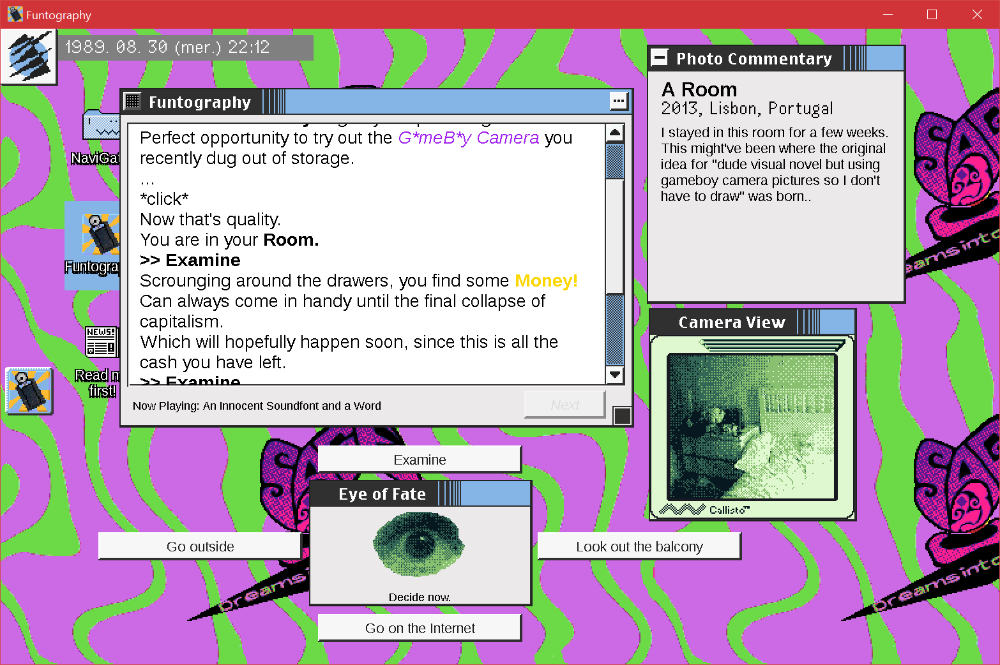
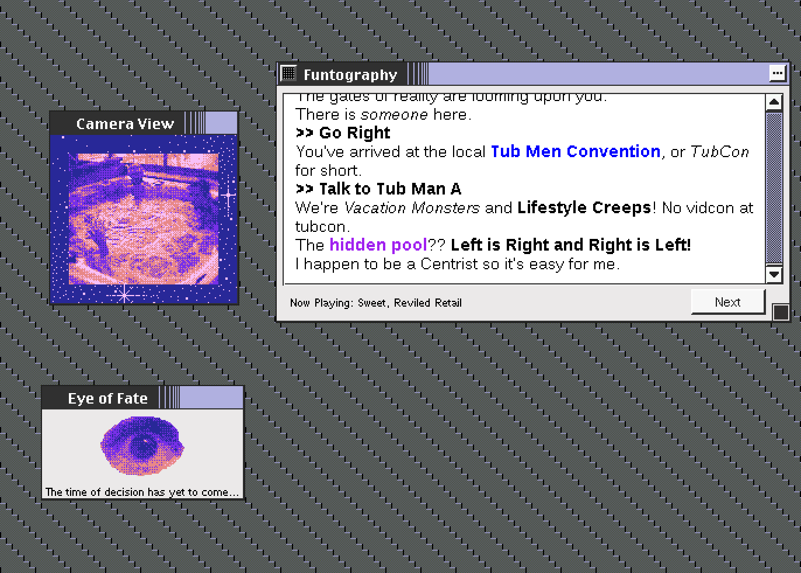
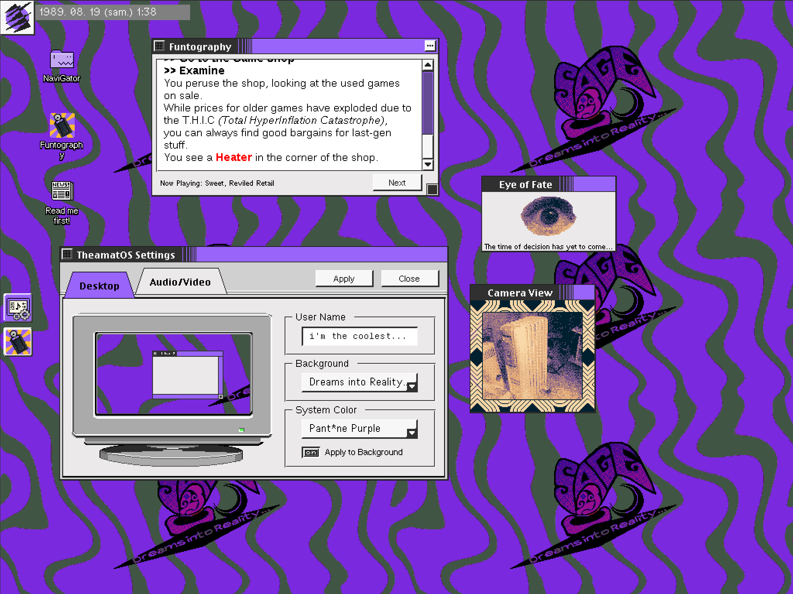
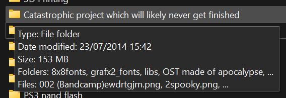
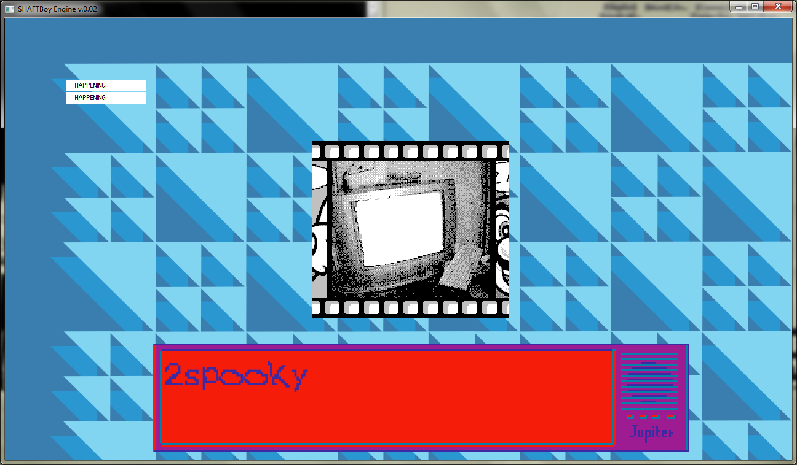
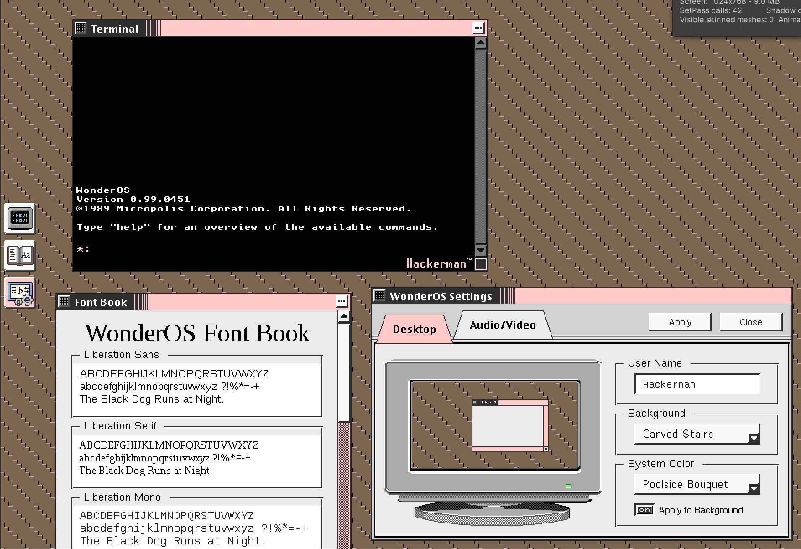
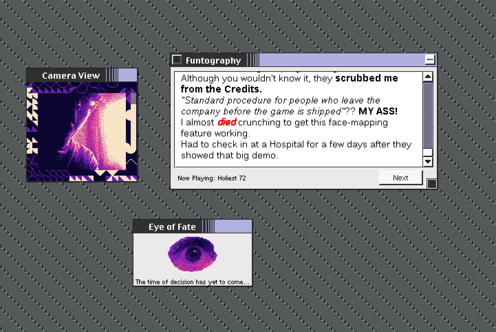

Title: Original Game Drop: Funtography
Date: 2023-09-01 00:00  
Category: Gamedev  
Tags: video games, gamedev, unity, c#, .net, gameboy, gameboy camera, faux-OS, sage
Slug: funtography
Authors: Difegue  
HeroImage: images/funtography/ft_hero.png   
Summary: Who are you running from?

As mentioned in that [previous post](./total-internet-hyperdeath.html), the SAGE Double Donk is **real**!  

I'm anxiously excited to release _Funtography: A Gameboy Cameradventure_, an actual \*gulp* _original_ video game.  
  

### Check it out at [SAGE 2023](https://sonicfangameshq.com/forums/showcase/funtography-a-gameboy-cameradventure.1861/)! ... Or itch.io if that's more your speed.  

<iframe frameborder="0" src="https://itch.io/embed/2243430" width="552" height="167"><a href="https://difegue.itch.io/funtography-a-gameboy-cameradventure">Funtography: A Gameboy Cameradventure by dfug</a></iframe>

In this 2h-long _(1h if ur quick...)_ adventure game, enjoy looking at **100+ Gameboy Camera pictures** as you explore various urban vistas to solve the mystery of a _missing video game prototype_.  
  
- Four endings!  
- Built-in **developer commentary**!  
- Unlockable soundtrack!  
- **Bonus fake operating system!**  
### It's got it all!  
  
I hope you will consider taking a look at it in the midst of all the good-ass games releasing at SAGE.  
# Backstory 

The concept behind this game, `Visual novel that uses Gameboy Camera photos with varying palette and borders for extra context` isn't really new[*](#note-1) - I tried building this thing close to [10 years ago](https://github.com/Difegue/shaftboy) already.  
  
I had a nice homegrown C++ engine with a barebones scripting system and all, ready to support the story... Then the _major blocker_ happened:  

**"what kind of story should I even write, what the shit?"**  

  

> Humans are natural story-tellers. Our brains are wired for storytelling, both in our enjoyment of experiencing stories, and our ability to create them. This fools us into thinking that storytelling is easy, which it’s not.   
[(Four Failures: 1996-2002)](https://dreamertalin.medium.com/four-failures-1996-2002-5611b955f14)  

So I shelved the whole thing, with a bunch of art assets, Gameboy photos and """music""" ready to go.  
  
As I was building out this fake operating system that could run self-contained small apps and games, the idea of reviving _Funtography_ kinda came up on its own.  

**"If a goal for this fake OS game is to have unlockable smaller games within it... Why shouldn't I just reuse all those old assets I already had?"**  

Then of course it ballooned out of control as I started writing -- The extra engine work and plot outline were made during the lockdowns after bingewatching _Twin Peaks_[**](#note-2), but most of the writing happened this year after work on [DialogueForest](./dialogueforest.html)[***](#note-3)  wrapped up.  

Considering the result actually stands out on its own length-wise, I wanted to ship it early, as both a **demo** of the existing fake OS[#](#note-4)...and hopefully something compelling enough on its own.  
  
Since I'm not really a pro writer, I thought the best I could do would be to make it as earnest/genuine as I could -- Even if it ends up being a bit corny, I hope it at least makes for something more engaging than a ebin ironic story would be.  

At least, I can pretty confidently say it's unique...Which is something I did [mention wanting to do](./2022-recap.html).  
And it does feel nice to have realized an old concept from years past! _I am cringe but I am free._  

#

[\*](#ref-1) Or original for that matter -- Check out [Pocket Puppet](https://pierrec.itch.io/pocket-puppet) if you want more Cameradventure! It even works on real hardware.  
[\*\*](#ref-2) You can certainly see the influences in the final product - Not as much as I was expecting tho  
[\*\*\*](#ref-3) Which of course, I did **not** use while writing Funtography... I relied on [VIDE Dialogues](https://videdialogues.wordpress.com) for Unity instead as that allowed me to integrate the SFX/palette/border changes better. Still ended up a mess  
[#](#ref-4) Slated for release 2035.. I want to keep working on the larger game but I feel some respite knowing that even if I give up on it now, at least some portion of it will have been used.   