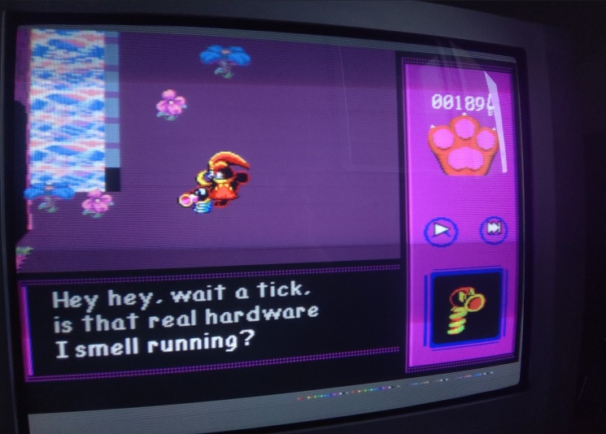
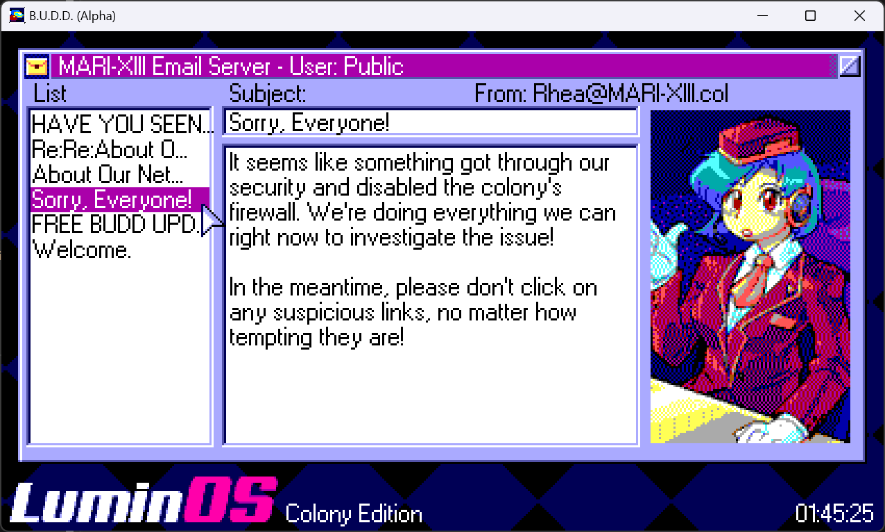
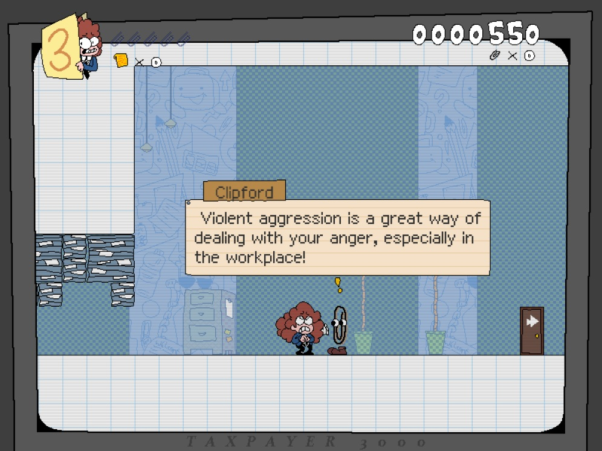
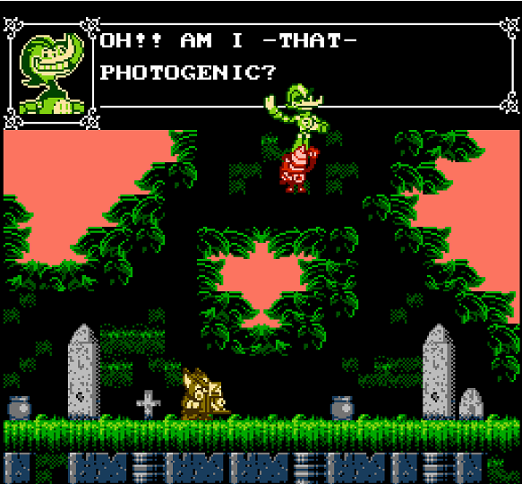
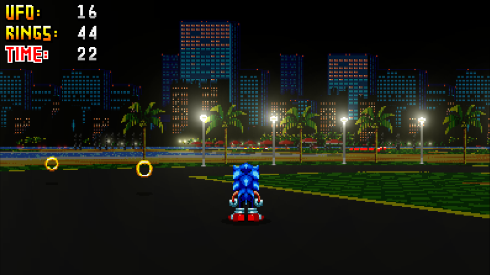
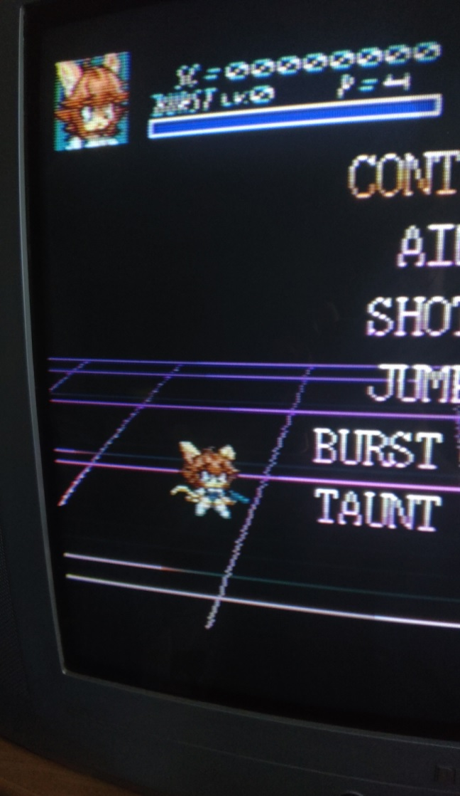
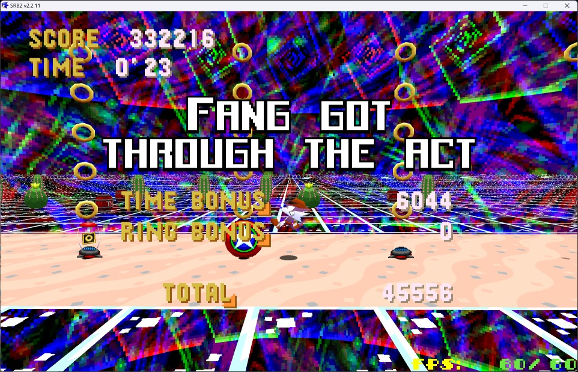
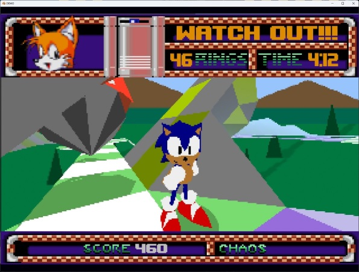

Title: SAGE videogame grab bag
Date: 2023-10-01 00:00  
Category: Blogposting  
Tags: video games, gamedev, sage, sonic, fangames, demo, faux-OS
Slug: sage-roundup
Authors: Difegue  
HeroImage: images/games/sage/susan.png  
Summary: local man compiles all his reviews into one megapost

[SAGE 2023](https://sagexpo.org/index.html) has ended, and I did good on my previous [promise](./mcorigins-plus) by playing a **heckuva lot** of games.  

Here are some notable ones I've played, in case you might be interested!  

## [Gatoslip](https://sonicfangameshq.com/forums/showcase/gatoslip-chapter-0.1703/)
  
I liked this a lot, topdown RPGs on megadrive always make me think about [Soleil/Centy](https://en.wikipedia.org/wiki/Crusader_of_Centy), although the Deltarune inspirations are much more obvious -- Having sonicy platformer sequences instead of shmup is really fun.  

## [B.U.D.D](https://sonicfangameshq.com/forums/showcase/b-u-d-d-sage-23-demo.1740/)
  
This game truly wears its influences on its sleeve and reminds me I should finish that playthrough of Popful Mail[*](#note-1) I started all those years ago.

Combat system is fun without being too overbearing as things stand, I think it'll be in a pretty good spot once the few missing moves are in the full game.  
The SA2-inspired combo meter made me smile but I usually don't get more than a 5 or 6x combo outside of the training room 🥲

Really great pixel art too! Look at this _blessed fake email client._ 🙏 The image loading effect is simple but effective.

## [Susan Taxpayer](https://sonicfangameshq.com/forums/showcase/susan-taxpayer-orientation-build.1887/)
  
I **really** dig the theming of this, 90's americana office settings are becoming a lost artform and I love how the soundtrack/SFX plays along. ([tada.wav](https://www.youtube.com/watch?v=NVLAPYx0dc8) playing when you get every golden paperclip is chefs kiss tier shit)

The [Pizza Tower](./games-february) comparisons are inevitable considering the artstyle and the WL4 inspiration, but this game is much closer to Wario Land speedwise.  

Input windows are a bit tight for some moves right now and the demo doesn't show all the planned powerups, so I'm interested to see what comes next.  

## [Sondro Gomez](https://sonicfangameshq.com/forums/showcase/sondro-gomez-sage-23.1676/)  
  
Art direction is A+, both with the ingame sprites and the cutscenes/outside art.  
This has 3 playable characters, each going through variants of the same levels with (heavily) tweaked music[**](#note-2)/level design.  

Despite looking like Castlevania it's nowhere near as stiff, the game ends up reminding me more of Ducktales due to the variety of moves available.  

## [Sonic USB Online](https://sonicfangameshq.com/forums/showcase/sonic-usb-online.1771/)
  
The Sonic CD design philosophy cranked up to the absolute maximum, how the hell does this have so much content packed in I'm never getting through all of this _WHY IS ECCO GETTING IN THE SPECIAL STAGE RING_  

I like the emphasis on badnik bounce combos to get extra XP, even though I'm not sure what the XP actually does...
Game is all [vibes](https://www.youtube.com/watch?v=_sv2g0eOzW0) though, I really dig the [soundtrack](https://www.youtube.com/watch?v=Sk-yGZu_Yy4) and aesthetics overall.

(the online features are ok? I guess? it's mostly people trying to figure out how to unlock characters)

## [Gunburst](https://sonicfangameshq.com/forums/showcase/gunburst.1894/)
  
Small 1-boss demo, played it on a real MegaDrive for kicks.  
Game looks great! I could **not** beat that boss.  

The bounce attacks are way too unpredictable for a game with 1-hit kills.. I hope this gets completed though!  

## [Sonic and the Gunslinger](https://sonicfangameshq.com/forums/showcase/sonic-and-the-gunslinger.1629/)
  
[**2023 YEAR OF FANG THE SNIPER YEAAAAAAAAAAAH**  ](https://www.youtube.com/watch?v=4wzSw2iuk_8)

I haven't played [SRB2](https://www.srb2.org/) in close to 20 years at this point and it's crazy to see the kind of stuff that can be built with it now...

I really like the attempt at making this feel like a storybook game with multiple characters, it worked really well imo.
Levels are fun[***](#note-3) to go through, and I appreciate the attempt at giving each sonic level its own small gimmick to keep things fresh.

## [Bun 'N Gun](https://sonicfangameshq.com/forums/showcase/bun-n-gun-23-demo.1734/) 
  
Large levels to speed in while scavenger hunting for objectives.  
It's incredibly fun to just zip around the physics-based playground knowing the grappling hook can always save you even if you dash straight into a pit.  

The objective-based gameplay? Not as good sadly, targets are too small and having to capture them is a bore -- I think making them a bit larger and just having the player shoot them would help a lot in keeping the pace going.  

## [Project 32X](https://sonicfangameshq.com/forums/showcase/project-32x.1785/)
  
An attempt at remaking [Sonic Mars.](http://info.sonicretro.org/Sonic_Mars)  
I appreciate the attempt in trying to make it look like a 32x game with the reduced draw distance and all, instead of reproducing chris' [mockup](http://info.sonicretro.org/File%3ASxc_sonicdemo1.gif) [movies](http://info.sonicretro.org/File%3ASxc_sonicdemo2.gif) 1:1.  
Not much going on for the moment, but might be cool if it gets finished.  

## [Swolemochao 1&2](https://sonicfangameshq.com/forums/showcase/swolemochao-1-2-gym-of-the-year-edition.1660)  
  
i have a mechanical keyboard and the constant clacking while playing this made my wife leave me  
9/10  

## [Game Cycle](https://sonicfangameshq.com/forums/showcase/game-cycle.1649)  
  
This has a fake operating system, so of course i'm checking it out! This is a selection of faux-shareware games to play.   

I really like the concept of playtesting/having different challenges for each game - It reminds me of the Game Center CX NDS games[#](#note-4) which had similar mini-challenges to keep you playing those faux-retro games.  

Except the games here are not very engaging...  
I feel like there should be at least a few standout titles, while I can totally understand throwing a few intentional simple games for that authentic _90s shareware CD compilation_ experience, none of the three games in the demo really made me want to keep playing.  

#

[\*](#ref-1) And actually try Monster World, watch Dirty Pair, etc etc you get the gist  
[\*\*](#ref-2) The music theme got a bit boring hearing 3 variants of it in a row... I don't think this would be a problem in the final version where you'd play other levels before coming back to level 1  
[\*\*\*](#ref-3) except those water wheel jumps, incredibly painful even with the bubble shield :')   
[#](#ref-4) Which are getting a [rerelease compilation](https://www.youtube.com/watch?v=gBbEI8Pzan0) on Switch with updated 3D graphics and **new games**??? I don't think this'll get an english release sadly   
