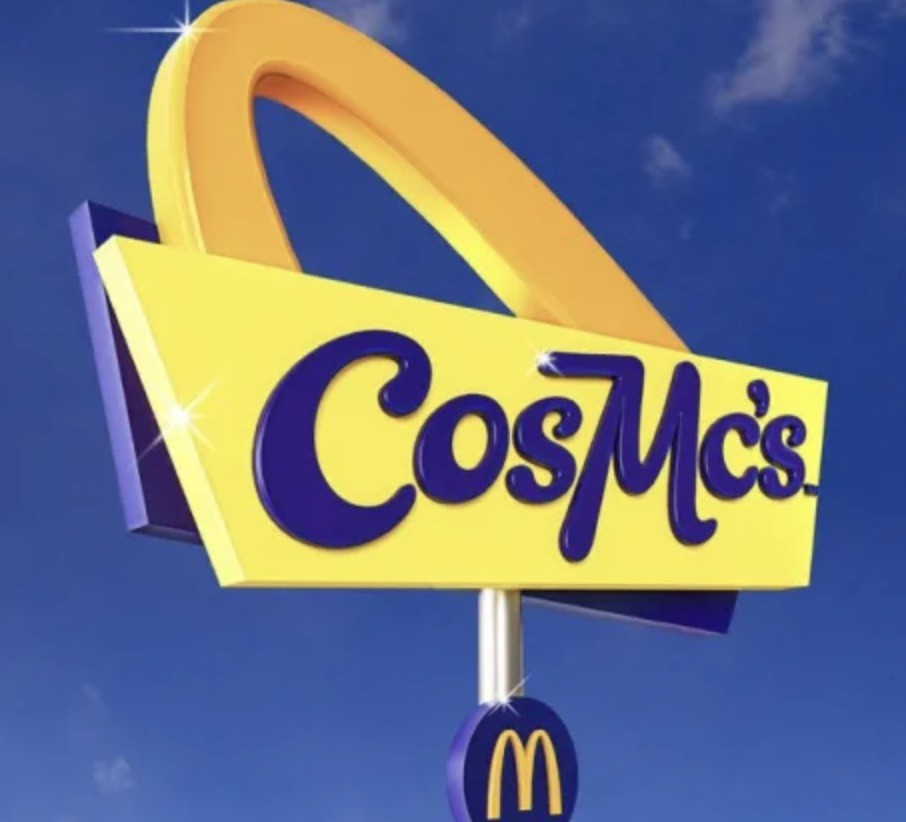

Title: A most fast-fooded holiday 
Date: 2023-12-08 00:01  
Category: Software  
Tags: sonic, mcdonalds, c#, avalonia, .net, lcd, game&watch, video games, simulator, sage, christmas
Slug: mcorigins-xmas
Authors: Difegue  
HeroImage: images/lcdonald/mcorigins_xmas_hero.jpg  
Summary: Happy Holidays from me, the McDonald's Corporation, Yuji Naka and Tony Hawk.

We're back with more McDonald's games at Christmas SAGE!  
It might not be the ones you wanted though...  
  

[As promised](./mcorigins-plus.html), I used up all my _"I got one more in me"_ energy to give McOrigins the true shitpost sendoff it deserved.  

### Tony Hawk's Sonic McOrigins Plus Christmas is now [available for download](https://sonicfangameshq.com/forums/showcase/tony-hawks-sonic-mcorigins-plus-christmas.1953/) at Christmas SAGE! Merry Skatemas!  
i'll update the itch.io builds later i swear...

Changes include:  

- The **ESPN Reskins** of the 2004 games, featuring everyone's favorite Sonic characters: _Tony Hawk, Vince Carter_, and more!  
     - The reskins are located as additional versions of the Sonic games they're based on.  
- Selecting a game will now randomly pick one of the variants when they're available  
- Small QoL improvements to the UI  
- A few more new manual scans  
- 32bit Android support in case you are stuck in 2010 my condolences  
- Added **Endless Mode** -- How long can you withstand the difficulty (or absolute boredom) of **_maximum speed McDonalds gameplay?_**  

Please enjoy the trailer below as well.  
<iframe width="560" height="315" src="https://www.youtube.com/embed/Um-btPpXhfU?si=6Er9rzi9Z4OULhO1" title="YouTube video player" frameborder="0" allow="accelerometer; autoplay; clipboard-write; encrypted-media; gyroscope; picture-in-picture; web-share" allowfullscreen></iframe>

# 

This is not a very large update, but I keep forgetting how time-consuming scanning those LCD games are...  
I had a lot of fun making the advertising assets though!  
  
I have a few ideas for one last "ultimate" update, but I don't think I'll get to it before 2025.  

Also entirely related but by looking at the #mcdonalds hashtag on social media when writing my promo posts, I found out they're making a [spinoff coffee chain](https://www.bbc.co.uk/news/business-67644926) with 80's branding?  
I never thought I'd see the day where McD's corporate design would stop being soulless...  
  
That, or 80s revival is so trendy now it has _become_ the soulless thing... But **look at those sparkles god damn**  