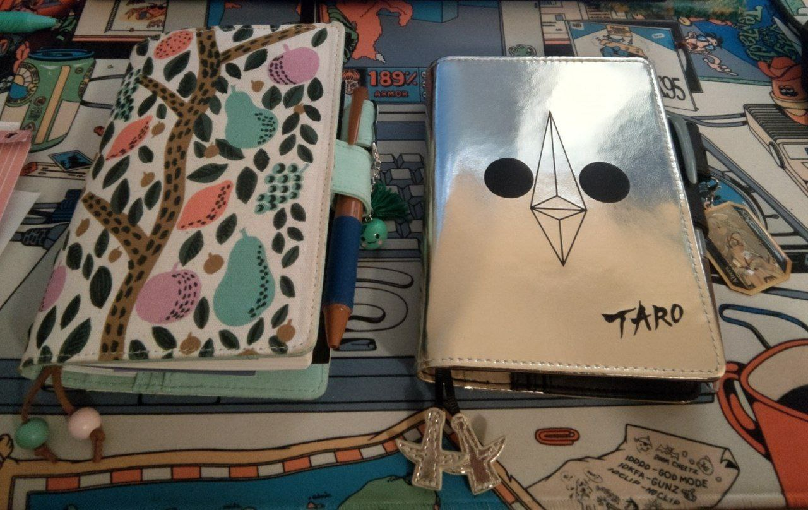

Title: My 2024 Hobonichi Techo picks
Date: 2023-12-20 00:00  
Category: Blogposting  
Tags: techo, hobonichi, stationery
Slug: 2024-techo
Authors: Difegue  
HeroImage: images/techo/2024.jpg 
Summary: Happy nothing special day! 

This wretched year has almost come to an end and I've done my yearly shopping spree on the [Hobonichi Store](https://www.1101.com/store/techo/en/).  
I grab a new planner and cover [each year](./2023-techo), alongside some goodies when the budget allows 🫠  

My cover pick for this year is... the Tower of the Sun-inspired _[Golden Mask](https://www.1101.com/store/techo/en/2024/pc/detail_cover/oc24_okamoto/)_ design!  
I wanted to get the [PAMM collab](https://www.1101.com/store/techo/en/2024/pc/detail_cover/oc24_pamm/) design first, but it was out of stock by the time I placed my order.  

I think I like _Golden Mask_ a bit more in the end though, it's rare to have a cover that flashy.  
Other designs of note this year are the mint-accented _[Gingham](https://www.1101.com/store/techo/en/2024/pc/detail_cover/oc24_checkbk)_ and the stickerbombed [yearly _MOTHER 2_](https://www.1101.com/store/techo/en/2024/pc/detail_cover/oc24_motherat/) cover.  

I grabbed a random FGO strap I got as a gift a while back to attach to the pen holder this year -- Mostly because the gold border matches the cover.  
  
One of the major differences this year is that there are **two** versions of the English Techo now; The usual one I've been using for a few years already now ([Planner](https://www.1101.com/store/techo/en/2024/all_about/planner/)), and a 1-to-1 translation of the classic Japanese planner ([Original](https://www.1101.com/store/techo/en/2024/all_about/original/)).  
It's a bit confusing saying it like that, but basically the only major difference is in the daily page layout...  

And a _550 Yen price difference_. Needless to say, I picked the Original this year.  
I actually quite like that its page layout has [premade checkmarks](https://www.1101.com/store/techo/2024/images/all_about/original_about04/zoom_04_2_of_2.jpg) for to-do lists; That's a thing I often do with my daily pages to try and keep my brain organized, so it's a welcome extra.

Stationery-wise, I wanted to try out the [stationery pouch](https://www.1101.com/store/techo/en/2024/pc/detail_toolstoys/tt_stappo_dc/) they released last year... I like it a lot! Sure beats the old plastic box I was using to store my washi tapes and stamps.  
I also grabbed those [transparent speech bubble stickers](https://www.1101.com/store/techo/en/2024/pc/detail_toolstoys/s_peta/). The adhesive feels super weak when you peel them off but it sticks surprisingly well to paper. Used a few of 'em for christmas cards!  
  
This year's [bonus item](https://www.1101.com/store/techo/en/2024/benefit/) is a mini-tote bag you can fit the techo in -- Design is randomly picked out of four and I'm very glad to have gotten the objectively best design out of all of them. 🥨🥨🥨  

I was tempted to get the bigass [One Piece onomatopeia stamp](https://www.1101.com/store/techo/en/2024/pc/detail_toolstoys/tt_stamp_opmdon/) since it's just fun to use huge stamps..  
But I've never actually watched or read OP. ¯\\\_(ツ)_/¯  
