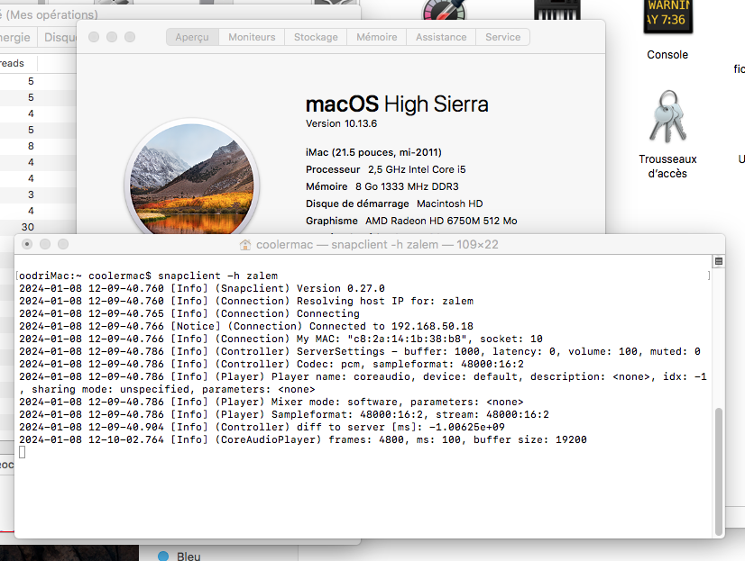

Title: Compiling snapcast on macOS High Sierra
Date: 2024-01-11 00:00  
Category: Software  
Tags: macos, snapcast, home automation, homebrew, reuse
Slug: snapcast-high-sierra
Authors: Difegue  
HeroImage: images/sierra-snapcast.png
Summary: feats of compiling only dreamt of by the utterly deranged

### Happy New Year!  
Here's a blogpost about fighting off bitrot so you can keep using those nice speakers your iMac ships with.  

I recently got into setting up [snapcast](https://community.home-assistant.io/t/perfect-and-free-synchronous-multiroom-audio-with-snapcast/386871/6) to play music from my NAS/MPD server across multiple rooms.  
While a part of the deranged setup is finding a way to put MPD clients<sup id="ref-1">[*](#note-1)</sup> in multiple rooms, I also need speakers that run snapclient to play the synchronized audio from.  

  

I have an old Intel iMac running [macOS High Sierra](https://en.wikipedia.org/wiki/MacOS_High_Sierra)<sup id="ref-2">[**](#note-2)</sup> , which is both not so old that compiling modern software on it is impossible... and old enough that it becomes kind of a pain. Let's suffer together!  

...Or don't, you can just grab precompiled binaries for snapcast 0.27 [here.](https://github.com/Difegue/Chaotic-Realm/blob/master/snapcast-highsierra/snapcast_highsierra.zip) It's on the house!  

# #include <filesystem\> aka the clangening 

Just running `brew install snapcast` on High Sierra will (currently) get you pretty far... but compiling the actual program will fail due to High Sierra's last official Apple C++ compiler [not supporting C++17's std::filesystem.](https://stackoverflow.com/questions/49577343/filesystem-with-c17-doesnt-work-on-my-mac-os-x-high-sierra)  

You could _seemingly_ make it work with `<experimental/filesystem>`, but I wasn't able to do it...  
So let's just **install a new compiler**! I went with clang/llvm, like what's used on base macOS;  
Just installing a newer version than the stock Apple one.  

`brew install llvm` will **fail**, but I've found that installing the previous version works, so do `brew install llvm@15`.  
Now, how do you tell Homebrew to use this compiler instead? _I actually don't fucking know!_  
  
[Apparently](https://stackoverflow.com/questions/9186033/using-homebrew-with-alternate-gcc) you can use `HOMEBREW_CC` and `HOMEBREW_CXX` to set C/C++ compilers...  
But setting those variables to a path doesn't work, and setting them to `clang`/`clang++` just makes Homebrew keep using the default Apple compiler. (`AppleClang 10.0.0.10001044`)    

I couldn't install `gcc` on High Sierra, so.. let's just start hacking at the [snapcast formula](https://raw.githubusercontent.com/Homebrew/homebrew-core/2e5a1cad52074ef53f1ae1b73c47dafa5e1f93ad/Formula/s/snapcast.rb) instead<sup id="ref-3">[***](#note-2)</sup> !  
You can [override compilers](https://stackoverflow.com/questions/60082066/how-do-i-get-cmake-to-use-my-homebrew-installation-of-llvm-exclusively) at the `cmake` level by using the properties `-DCMAKE_C_COMPILER` and `-DCMAKE_CXX_COMPILER`.  

# Atomic bullshit 

Modifying the formula's cmake call to be  
```
    system "cmake", "-S", ".", "-B", "build", *std_cmake_args, "-DCMAKE_C_COMPILER=/usr/local/opt/llvm@15/bin/clang", "-DCMAKE_CXX_COMPILER=/usr/local/opt/llvm@15/bin/clang++"  
```   
uses our new compiler correctly, but then a new error rises...  

>Host compiler appears to require libatomic, but cannot find it.  

That one is actually pretty easy and seems to just stem from llvm [_really_ wanting libatomic](https://stackoverflow.com/a/64112384/1418981), even though it's not needed for our _spectacular snapcast shenanigans_ at all.  
Soo, what's one more argument to the cmake line, right? `"-DHAVE_CXX_ATOMICS_WITHOUT_LIB=TRUE"` sidesteps this problem.  

Are we done? No!  
  
After all that, I was encountering some final missing headers for basic C++ libraries, like `<string.h>`.  
But I'd followed the brew instructions to set my lib/include paths properly...  
> To use the bundled libc++ please add the following LDFLAGS:  
  LDFLAGS="-L/usr/local/opt/llvm@15/lib/c++ -Wl,-rpath,/usr/local/opt/llvm@15/lib/c++"  
  For compilers to find llvm@15 you may need to set:  
  export CPPFLAGS="-I/usr/local/opt/llvm@15/include"  

Well, they're actually **incorrect**! Your include should be `"-I/usr/local/opt/llvm@15/include/c++/v1"` instead. Thanks for nothing. 

So with just a compiler swap and those three lines in your [snapcast formula](https://github.com/Difegue/Chaotic-Realm/blob/master/snapcast-highsierra/snapcast.rb):  
```
def install
    # Use brew llvm
    ENV["CXXFLAGS"]="-I/usr/local/opt/llvm@15/include/c++/v1"
    ENV["LDFLAGS"]="-L/usr/local/opt/llvm@15/lib/c++ -Wl,-rpath,/usr/local/opt/llvm@15/lib/c++"

    # Hijack compiler path directly in cmake call 
    system "cmake", "-S", ".", "-B", "build", *std_cmake_args, "-DHAVE_CXX_ATOMICS_WITHOUT_LIB=TRUE", "-DCMAKE_C_COMPILER=/usr/local/opt/llvm@15/bin/clang", "-DCMAKE_CXX_COMPILER=/usr/local/opt/llvm@15/bin/clang++"
    # Rest of the formula proceeds as usual
    system "cmake", "--build", "build"
```
You should be able to build snapcast on High Sierra.  
  
Nothing like some brew bullshit to start off the year.  
#

<sup id="note-1">[\*](#ref-1) I'm of course using [Stylophone](https://github.com/Difegue/Stylophone) by yours truly, but also [Persephone](https://persephone.fm/) for macOS, [MALP](https://gitlab.com/gateship-one/malp) for Android, and even a bit of [ncmpcpp](https://github.com/ncmpcpp/ncmpcpp)!</sup>  
<sup id="note-2">[\*\*](#ref-2) I can already hear the wails of _"whyyy aren't you putting linux on it it's just x86"_: I actually use the machine occasionally for 32bit mac software! Also, the [Brooklyn screensaver](https://github.com/pedrommcarrasco/Brooklyn) is really neat and I like having it in my living room.</sup>  
<sup id="note-3">[\*\*\*](#ref-3) I initially tried compiling snapcast 0.26, but that [doesn't work](https://github.com/badaix/snapcast/issues/1082) with the boost lib provided by brew, so make sure to use 0.27. </sup>  


