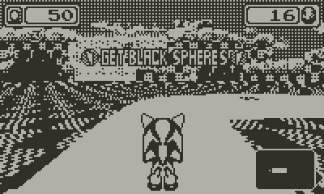
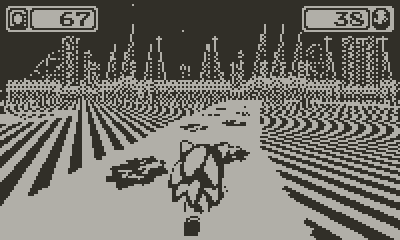
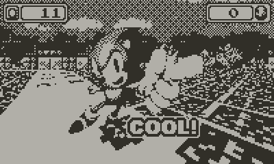

Title: I made a Playdate game in two days and it's ok™️
Date: 2024-02-17 00:00  
Category: Gamedev  
Tags: video games, gamedev, playdate, lua, rage, sage
Slug: sonic-drift-mania
Authors: Difegue  
HeroImage: images/playdate/playdate-20240216-164054.png
Summary: gotta crank it with sonic

I've used this year's [Really Amateur Games Expo](https://www.youtube.com/watch?v=noOeYcKlTsQ) as an excuse to finally look at the [Playdate SDK](https://sdk.play.date).  

Despite having two weeks to work on it, I only really spent two days... The advantage of a competition aimed towards making the **worst** fangame possible is that even if it's rushed and bad, that's the entire point so 👌👌🔥  
  
Yes it's blue spheres again the world will never be freed of blue spheres
### You can download the result .pdx file on itch at the link below. Works on real Playdates! 
<iframe frameborder="0" src="https://itch.io/embed/2532206" width="552" height="167"><a href="https://difegue.itch.io/sonic-drift-mania">Sonic Drift Mania by dfug</a></iframe>  

The only real design idea I had going into this was "you can use the crank to accelerate to _ridiculous_ speeds":  
Making a real platformer with the (self-)alloted time wouldve been difficult, so I settled for a Mode-7 racing game instead, as that's basically just using the builtin [`drawSampled`](https://sdk.play.date/inside-playdate/#m-graphics.image.drawSampled) function.  

Which is nice and all, but the Playdate core library only gives you this, and no other tools to uh, draw other sprites positioned within the mode-7 world...  

So the spheres are just painted on the track.  
  
...I actually **tried** to make them proper objects, okay?!  
It's [too much math](https://www.coranac.com/tonc/text/mode7.htm) for my dumb brain and there was [nothing](https://devforum.play.date/t/mode7-screen-coordinate-in-perspective/8751) to [copypaste](https://devforum.play.date/t/f-time-trial-demo/6989/11)...  
There's technically a [library](https://github.com/risolvipro/playdate-mode7) you can import to get full mode7 functionality on Playdate now, but I wanted to just play with the stock SDK here; We ain't making a **real** game or anything preposterous like that....  

Speaking of the SDK, very fun to use! It's quite intuitive and gives you a bunch of tools I wouldn't necessarily expect from a low-spec console, like built-in [JSON deserialization](https://sdk.play.date/2.3.1/#M-json) and [MP3 decoding](https://sdk.play.date/inside-playdate/#M-sound)...  
Which you should **not** use! It takes like 50% of the CPU on real hardware so you're better off converting to .wav.[*](#note-1)  

The 1-bit nature of the playdate screen makes it pretty easy to just grab a [bunch](https://www.spriters-resource.com/game_gear/sonicdrift/sheet/79145/) of [different](https://www.spriters-resource.com/game_com/sonicjam/sheet/79534/) [assets](https://www.textures-resource.com/pc_computer/sonicr/texture/11828/), slam them all into aseprite with default dithering[**](#note-2) and boom! **graphics**! As shrimple as that...  
  
#

[\*](#ref-1) wav files are actually converted to .pda by the playdate compiler, so when using the fileplayer you need to load filenames with the .pda extension for them to play... the sampleplayer doesn't have this problem so you can just throw .wav filenames at it for some reason   
[\*\*](#ref-2) Or [Atkinson dithering](https://gazs.github.io/canvas-atkinson-dither/) if you're a nerd (I forgot that was a possibility until writing this..)  