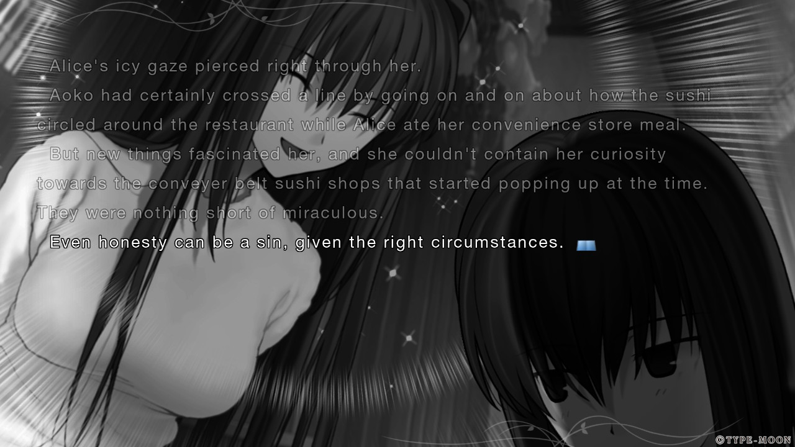
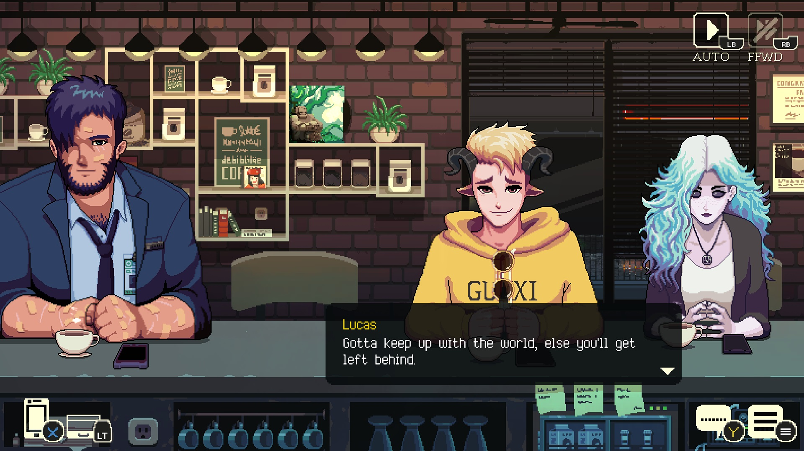
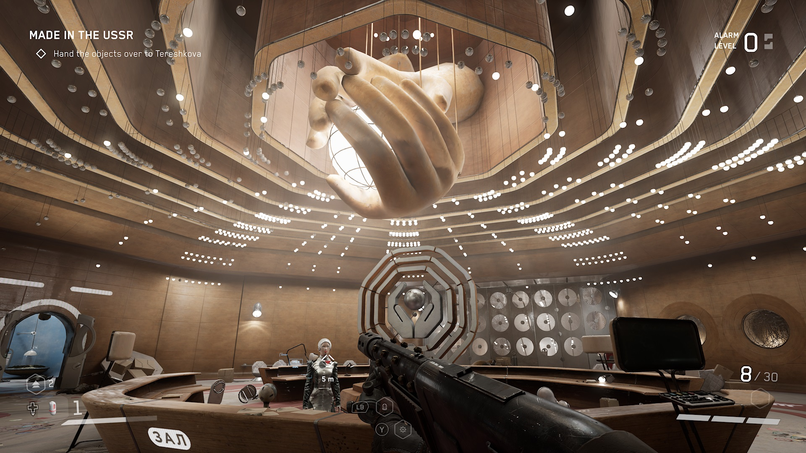
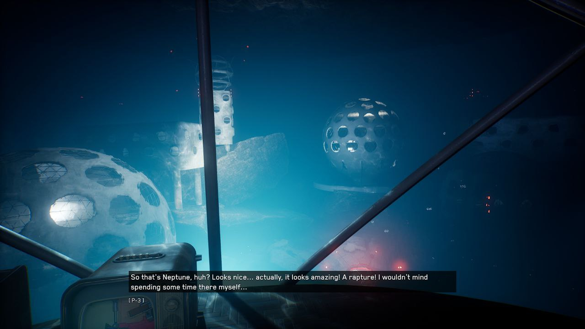
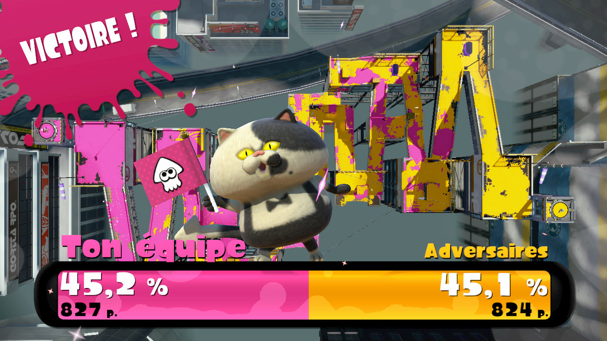
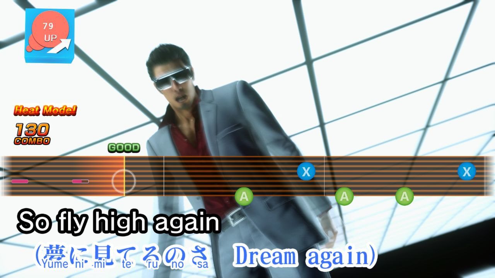
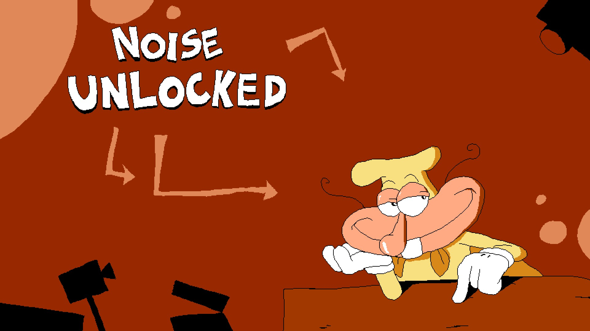
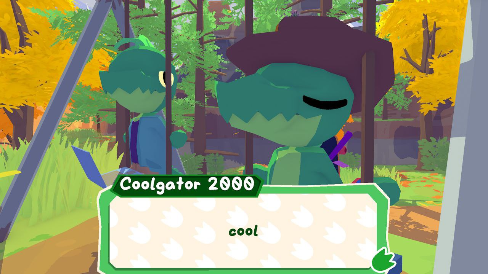

Title: Early Spring videogame grab bag
Date: 2024-05-01 00:00  
Category: Blogposting  
Tags: video games, game pass, mahoyo, splatoon, atomic heart, pizza tower, yakuza, soundtracks
Slug: games-spring
Authors: Difegue  
HeroImage: images/games/gator.jpg 
Summary: featuring coolgator 2000 and the noise

It's [International Workers' Day](https://en.wikipedia.org/wiki/International_Workers%27_Day)! What better time to uhh, look back at all the videogames I've been playing.  
Thinking of all the man-hours that went into making those is quite humbling.  

I actually played too many games since [the last time](./games-july.html) I wrote up mini-reviews like this... And I'm forgetting some that I don't really have much to write about.    

# Mahou Tsukai no Yoru

  
I actually played through this back in December, but since the FGO crossover event is happening [right now](https://www.youtube.com/watch?v=AFaSQ1fIPOo), I'm thinking about Mahoyo again.  
It'd been *years* since I last read a visual novel and even more since reading a Type-Moon one.. FGO doesn't count, it's all first-person and really doesn't flow as well.  

The production values on this are wild and it's especially better now that the latest releases are actually voiced; I give it a big rec if you're into magic in modern[*](#note-1) times and all that jazz.  

It's a great entrypoint into Type-Moon as well, no previous knowledge required!  
The story takes a small dip at the beginning because of boring school life stuff Nasu can't help himself write, but it only goes up after that.  

# Coffee Talk 2  

  

It's more Coffee Talk; Basically picks up right after the first game with a new batch of character stories.  
Great stuff if you like _bartender-type_ games. Yeah that's what I'm gonna call those now and there aren't enough of 'em  

The soundtrack is a lot of chill jams and I basically dropped all of it into my playlist, but I really like [this track](https://www.youtube.com/watch?v=jaqOgKrYihY) in particular.  

# Atomic Heart  

The pacing of this game is **thoroughly** fucked; The gunplay is nice and I had a lot of fun with it once you hit the overworld, but that's only after 5 hours..  
The initial prologue+tutorialized dungeon at the beginning is entirely too long and not very interesting, unfortunately.  
  
The visual design of the game is great, love me some soviet futurism -- There's a lot of heart put into stuff like the fake cartoons in the save rooms where the characters look like they could sell you a [Dendy](https://en.wikipedia.org/wiki/Dendy_(console)) or something similar.  
You can tell they kinda ran out of budget for the environmental detail though, a lot of optional parts of the game end up looking samey.  

Story is actually fairly engaging when you get into it; They're still making DLCs so I might get back into the game at some point.
The soundtrack is [pretty dope](https://www.youtube.com/watch?v=R1eyjhTmErw&t=998s), although I didn't like the Mick Gordon tracks as much as I was hoping.  
  

# Splatoon 1  

I picked Splat 1 at the local thrift store and thought I'd play it before the Wii U online servers went down for good[**](#note-2).  
  
I'd never gotten into Splatoon before despite the fact team arena FPSes are right in my strike zone; Really loved it! Turf war is an easy game mode to pick up and the game is designed so that playing the objective comes naturally even if you just want to frag nerds.    

The online was also still active despite the fact Splatoon 1 was massively outdated by that point -- maybe because it's the only game of the three that didn't require you to pay a subscription?  
Xbox Live and its copycats have had terrible consequences for the human race...     

It's also the only game that has the [Ika Musume](https://splatoonwiki.org/wiki/The_SQUID_GIRL) collab clothes! man I miss ika musume  

# Yakuza Kiwami 2  

I took a year-long break between playing 0/Kiwami 1 and this -- And I'm glad I did, because this game just feels like Kiwami 1 again with less content.  
It's still Yakuza so it's still fun, but I see why people would consider this to be one of the weakest entries.  
Most of the side content is ripped straight from Yakuza 6 too, so it's going to feel real weird when I get to that game..  

The OG [Yakuza 2 soundtrack](https://www.youtube.com/watch?v=BHWsYeVts0k) they use here is still pretty good though.  

There's one karaoke song where Kiryu puts on sunglasses and plays out a 2000s Evanescence music clip in the nolan batcave though and that goes so fucking hard look at this shit  
  

# Pizza Tower's Noise update  

   
[woag](https://www.youtube.com/watch?v=eMYTSESIsu8)  

Noise feels massively unwieldy to play at first compared to the italian pizza man due to no wallrun, but at some point it just clicks and you start absolutely **wrecking** the game -- Kinda like how it feels when you play Pizza Tower for the first time to begin with!  
Great NG+, you know you're doing something right when I'm just 100%ing it again.  

# Lil' Gator Game 

  
A short Breath of the Wild pastiche with lowpoly animals. It plays great and doesn't overstay its welcome, I'd recommend giving it a try through Game Pass or similar.  

Shield surfing is way more fun in this game than it ever was in BOTW!   

# Miscellaneous others  

## Sonic Superstars

**Atrocious** bosses, level design itself is fine if a bit uninspired except for some standouts (_Cyber Station_), Trip is pretty fun to play and I hope they bring her back in future 2D Sonic installments.    
People [shit on the soundtrack](https://www.youtube.com/watch?v=-z84TNg_POw) but I actually like it despite how [schizophrenic](https://www.youtube.com/watch?v=vRcOI4DbbDE) it feels.  

## Super Mario Wonder

The wonder effects were fun, but this isn't a 2D Mario I'd replay. The badges are sold as "_make your own difficulty_" but the base game is already easier than previous NSMBs..  
The final super expert level is straight up bad design and I never thought I'd say this of a Mario game, Nintendo officially went **too far**  

## Fortune Street Wii 

I've been on an Itadaki-binge lately and unlocked all the maps/characters in this; The game actually has a lot of depth and I'm glad this version is localized at least so it's easy to play with friends!  

Also there's a [modpack](https://www.youtube.com/watch?v=FBLjEDI3qWQ) and they put facingworlds in it with custom 3D models and everything it's awesome  

## Entropy : Zero 2

I was hunkering for some Half-Life a few months back and since I don't want to buy a VR headset for Alyx, I just played this [off Steam](https://store.steampowered.com/app/1583720/Entropy__Zero_2/); Great modded campaign, hard to not recommend it considering its unbeatable low price of **Free**.  

## Fatum Betula

This game is currently included in the [Palestinian relief bundle](https://itch.io/b/2321/palestinian-relief-bundle) on itch alongside a bunch of other stuff I've been wanting to play, but I got it on Switch a few months back for free with gold Nintendo coins.  
  
I really liked the main mechanic of "whatever you water the birch with determines your ending", you end up spending the entire game finding more and more convoluted water-based substances to keep in your bottle.  
Aesthetics are on point too if PS1 is your thing.  

#

[\*](#ref-1) Well it takes place in the 80s but that's still urban fantasy it counts i swear   
[\*\*](#ref-2) Sure you can still play it with Pretendo but let's be honest it's never going to be as active as on the official servers  