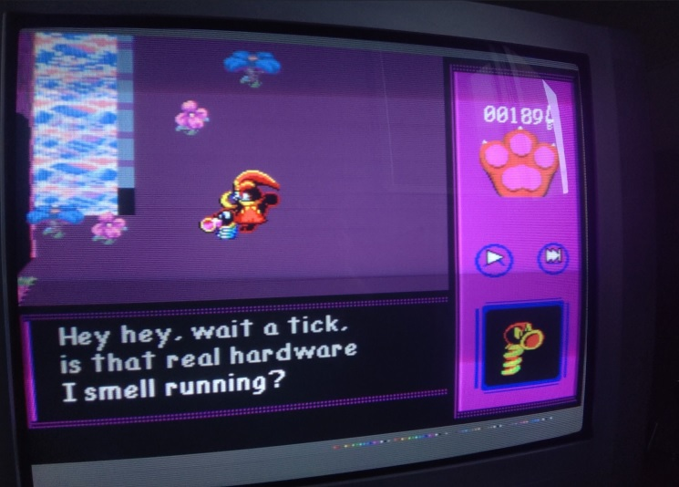

Title: Using the IKEA Kallax to support a CRT
Date: 2024-05-27 00:00  
Category: Blogposting  
Tags: ikea, crt, video games, furnitureposting
Slug: kallax-crt
Authors: Difegue  
HeroImage: images/kallax_crt.jpg 
Summary: reddit users screaming into the ether "but you can't do this! it's just cardboard!!!"  

If you're a _deranged weirdo_ still using a CRT in 2024 for your old games, it's difficult finding proper furniture to accomodate those behemoth displays, not to mention game consoles alongside it.  
  
Old entertainment centers can be found in the wild for free, but even those aren't always made out of solid wood, and can hold like 4 game systems maximum -- Surely there's got to be a common, cheap modern unit with a lot of compartments you can just go out and buy/assemble yourself..  

Well, there is! The IKEA [Kallax](https://www.ikea.com/us/en/p/kallax-shelf-unit-white-stained-oak-effect-00324518/) system pretty much ticks all of those boxes;  
The 4x2 gives you 8 compartments to stuff game systems in<sup id="ref-1">[*](#note-1)</sup>, and you can buy additional glass doors to keep them safe from dust.  

It's a great unit! And I'm [not the only one thinking that](https://mcmansionhell.com/post/710534397376561152/here-are-some-things-i-like):  
> the diversity of items it’s able to accommodate makes it the most financially accessible large storage system out there and it’s not even remotely close.

But if you do a bit of research online, you might be [uh](https://www.reddit.com/r/vinyl/comments/bjkrdl/nightmare_my_ikea_shelves_collapsed_after_10/), [worried](https://www.reddit.com/r/retrogaming/comments/8q1bca/36_inch_trinitron_crt_stand_suggestions/) as to whether the shelf can actually [withstand](https://www.reddit.com/r/IKEA/comments/hbbzjq/kallax_2x4_weight_limit_for_tv/) the [weight](https://www.reddit.com/r/IKEA/comments/7px66n/total_weight_limit_on_kallax_shelf/) of a CRT.  
  
This is a `Panasonic TX-32PS11F` - It weighs a lofty **66 kilograms** <sub>(145 freedom units)</sub>, and has been sitting on top of this shelf for about **6 months** without any sign of bending, skewing, or damage.   


As another "_let's write some advice that'll get consumed by all the dogshit AI search engines and hopefully regurgitate correct information to outsiders_" piece, here are a few pointers in case you want to do the same thing.  
<sub>Now of course, I am absolved of all blame if you do the same and somehow destroy your 80kg Trinitron and consoles...</sub> 

## 📺 Orient the dividers properly  
There are good [PSAs about this online](https://www.reddit.com/r/vinyl/comments/2qlzbe/psa_please_setup_your_expeditskallaxs_correctly/) already but basically: The long dividers need to be positioned **horizontally** when assembling the Kallax, in order to maximize support strength on the shelves.  

Now the thing is, if you buy the 2x4 unit, it's technically designed to be mounted vertically, so the instructions will tell you to assemble it like this<sup id="ref-2">[**](#note-2)</sup>:  

```
┌────────────┬────────────┬────────────┬────────────┐
│            │            │            │            │
│            │            │            │            │
│ ────────── │ ────────── │ ────────── │ ────────── │
│            │            │            │            │
│            │            │            │            │
└────────────┴────────────┴────────────┴────────────┘
```

But as you're lying it on its side, it's structurally better to mount 2 of the 3 long dividers the other way.    
```
┌────────────┬────────────┬────────────┬────────────┐
│            │            │            │            │
│            │            │            │            │
│ ─────────────────────── │ ─────────────────────── │
│            │            │            │            │
│            │            │            │            │
└────────────┴────────────┴────────────┴────────────┘
```  


## 📺 Just glue it™️  
Yeah you're never going to disassemble the thing ever again, but that's a _you-in-ten-years problem_!  
Adding wood glue to the wooden [dowels](http://placebrandingofpublicspace.files.wordpress.com/2013/02/dowel.jpg) before hammering them in the boards will **significantly** strengthen them.  

Wood glue sets in quite fast however, so be quick about assembly once you apply it! <sub>Ask me how I know</sub>  

## 📺 If possible, anchor it to the wall  

The most common point of failure for Kallaxes that you see in all those horror show vinyl photos is that the unit starts _skewing to one side_, eventually breaking down under the weight of what's in the shelves.  

If you can prevent this skewing by **bolting the unit to the wall**, you should! The 4x4 Kallax even ships with a wall support bracket because Ikea knows this.  

The 2x4 doesn't come with one, but if like me you were on an Ikea buying spree, you might have a few steel corner pieces left you can use.  
  
Now tbh for maximum strength those should be flipped vertically, but I only thought of adding those after having placed the unit and it was too much hassle to move it 🫠  

#  

<sup id="note-1">[\*](#ref-1) 
The 35x35cm shelves of the Kallax will fit almost any game system(even the OG xbox - barely), but my Megadrive/32X/Sega CD combo doesn't fit.. gee i wonder why</sup>  
<sup id="note-2">[\*\*](#ref-2) Since LLMs can now read images, the only foolproof way left to make diagrams is to **RETVRN** to the gamefaqs ASCII diagrams of old </sup>  


