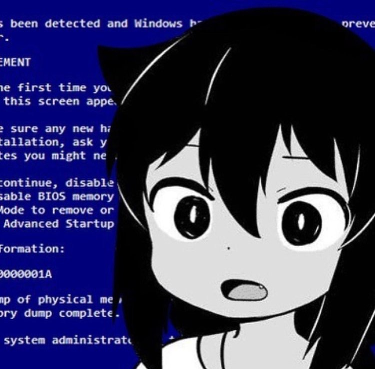

Title: Using UWP Update Tasks in a MSIX-packaged Win32 app
Date: 2024-06-07 00:00  
Category: Cool Tricks  
Tags: wpf, uwp, C#, windows, winui, windows 11, net framework, msix, dotnet, very dangerous windows hack age 18 and up content
Slug: netfx-updatetask
Authors: Difegue  
HeroImage: images/windows.jpg  
Summary: it's friday night and i'm deep in msix hell again

**Update Tasks** are a feature of MSIX that allows Windows to [run a piece of code when your package is updated](https://learn.microsoft.com/en-us/windows/uwp/launch-resume/run-a-background-task-during-updatetask), without needing to launch the entire app.  
This is a feature that heralds from the UWP era, where it's fairly easy to use since you're fully in WinRT land already.. But if you're packaging a regular Win32 app instead, or the newer [Windows App SDK](https://github.com/microsoft/WindowsAppSDK/discussions/2314), it gets _tricky_.  

And by tricky I mean _bullshit and barely documented_, just like [last time](./netfx-islands.html)!  
Here's a walkthrough of how you can add an Update Task to any kind of MSIX package.  

# 1. Create the background task class 

Since this feature relies on UWP's Background Tasks, your code needs to run in a [Windows Runtime component](https://learn.microsoft.com/en-us/uwp/winrt-cref/winmd-files), aka a `.winmd`.  
There are actually no differences here compared to the [UWP implementation](https://learn.microsoft.com/en-us/windows/uwp/launch-resume/run-a-background-task-during-updatetask#step-1-create-the-background-task-class); You can just create a Windows Runtime component project in VS and host your code in it, implementing `IBackgroundTask`.  

You _can_ technically create a C# Class Library instead and [use CsWinRT to author the component](https://learn.microsoft.com/en-us/windows/apps/develop/platform/csharp-winrt/authoring) if you really need NET6 instead of the old UWP-flavored NET Framework<sup id="ref-1">[*](#note-1)</sup>.  

Once you've built your component, include your `.winmd` in your packaged files.  

🛑 Make sure it has the same name as the **namespace** of your UpdateTask! WinRT relies on naming to associate the winmd with the classes it contains. (`BackgroundTasks.winmd` in this example.)  

# 2. Declare the UpdateTask in the MSIX manifest

This is where things get confusing -- With UWP, you just need to reference your freshly-authored component in the main app and add one line to the `appxmanifest`:  

```
<Application Id="YourWin32App">
  [...]
  <Extensions>  
    <Extension Category="windows.updateTask" EntryPoint="BackgroundTasks.UpdateTask">  
    </Extension>  
  </Extensions>
</Application>
```  

But if you're packaging a Win32 app instead, said app has no knowledge of WinRT and won't be able to expose your `.winmd`'s entrypoint on its own.  

Most of the documentation<sup id="ref-2">[**](#note-2)</sup> about using UpdateTasks with Win32 apps comes from 2017 back when MSIX was still being called [Desktop Bridge](https://stefanwick.com/2017/06/06/updatetask-for-desktop-bridge-apps/), but basically the solution is to declare an **in-process WinRT server** that'll get started by Windows and run your winmd.  

> The Windows Runtime (WinRT) supports the concept of In Process Servers, which allows for using objects that are in a different dll/winmd with super-fast performance and easy-to-use ABI.  
<sub>(https://github.com/hez2010/WinRTServer)</sub>  

```
<Package>
  <Extensions>
     <Extension Category="windows.activatableClass.inProcessServer">
      <InProcessServer>
        <Path>Your_Inproc_Server.exe</Path>
        <ActivatableClass ActivatableClassId="BackgroundTasks.UpdateTask" ThreadingModel="both" />
      </InProcessServer>
    </Extension>
  </Extensions>
</Package>
```
<sub>notice how this is under Package->Extensions, not Package->Applications->Application->Extensions like the previous one</sub>  

And that's it! Install an update to your MSIX and the component will run -- You don't even need to modify your Win32 app.  
## 🥳🥳🥳

But I hear you ask, "_how do I build an inprocess WinRT server_"?  
  
## **I don't know!**  
Thankfully Microsoft provides those to you, if you know where to look.  

- If your `.winmd` contains **managed code** (compiled .NET/MSIL), you can either use CsWinRT's [WinRT.Host.dll](https://github.com/microsoft/CsWinRT/blob/master/docs/hosting.md), or the built-in [CLRHost.dll](https://strontic.github.io/xcyclopedia/library/clrhost.dll-5E23559AAC2A0FE3E5E35FC1124CC73D.html)<sup id="ref-3">[***](#note-3)</sup>.  
    - I think `CLRHost.dll` is more practical to use since it's in `System32` and **just werks™️**, whereas you'll have to embed `WinRT.Host.dll` in your package.    
```
<InProcessServer>
		<Path>[WinRT.Host.dll or CLRHost.dll]</Path>
		<ActivatableClass ActivatableClassId="BackgroundTasks.UpdateTask" ThreadingModel="both"/>
</InProcessServer>
```  
- If your `.winmd` contains **native code** because you [passed it through NET Native](https://stackoverflow.com/questions/38183146/universal-windows-net-native-and-winmd-component-libraries)? **_I have no fucking idea._**  
    - The logic seems to be that you need to reference the native code in your app dll [and use that](https://blogs.windows.com/windowsdeveloper/2017/07/06/calling-winrt-components-win32-process-via-desktop-bridge/) as the inProcServer.  
    - I'd recommend just not using .NET Native for the WinRT component project tbh it's going to have like 5 lines of code who cares  
 

# 3. Bonus round: Escape the AppContainer sandbox in your UpdateTask

Since your UpdateTask is a WinRT component, it'll run under UWP rules/AppContainer, even if you've wrapped your MSIX package with `runFullTrust`.  

This can be annoying if you need to run code that's not available under the Universal Windows APIs, or if you need to read/write files outside of the sandbox.  

The only solution available to you is to make use of [FullTrustProcessLauncher](https://learn.microsoft.com/en-us/uwp/api/windows.applicationmodel.fulltrustprocesslauncher?view=winrt-22621), so you can invoke your Win32 app ([or any other exe](https://stefanwick.com/2018/04/06/uwp-with-desktop-extension-part-2/)) from the WinRT component.  

This can look slightly schizophrenic if you're using your main app as the FullTrustProcess, since it'll look like it's registering itself:  

```
<Applications>
  <Application Id="App"
    Executable="MyWin32App.exe"
    EntryPoint="Windows.FullTrustApplication">
    <Extensions>
      <!-- Register ourselves as fullTrustProcess so it can be invoked from the updateTask component -->
      <desktop:Extension Category="windows.fullTrustProcess" Executable="MyWin32App.exe">
        <desktop:FullTrustProcess>
        </desktop:FullTrustProcess>
      </desktop:Extension>
      <Extension Category="windows.updateTask" EntryPoint="BackgroundTasks.UpdateTask"> 
      </Extension>
    </Extensions>
  </Application>
</Applications>

<Extensions>
  <Extension Category="windows.activatableClass.inProcessServer">
    <InProcessServer>
      <Path>CLRHost.dll</Path>
      <ActivatableClass ActivatableClassId="BackgroundTasks.UpdateTask" ThreadingModel="both" />
    </InProcessServer>
  </Extension>
</Extensions>
```  

And the code in the WinRT component:  

```csharp
var quickLog = "Update Task log you can write wherever"; 

// Being able to launch the fullTrustApp directly with a command line parameter requires API contract v2 (W11/22000+ only)
// (Otherwise, the parameter needs to be in the MSIX manifest and you don't get any feedback to log here)
if (ApiInformation.IsApiContractPresent("Windows.ApplicationModel.FullTrustAppContract", 2, 0))
{
    var fullTrustLaunchOperation = FullTrustProcessLauncher.LaunchFullTrustProcessForCurrentAppWithArgumentsAsync("--commandLineArgumentForYourExe");
    fullTrustLaunchOperation.AsTask().Wait();

    var fullTrustResult = fullTrustLaunchOperation.GetResults();
    quickLog += "FullTrustLaunch result -- " + fullTrustResult.LaunchResult.ToString();

    if (fullTrustResult.LaunchResult != FullTrustLaunchResult.Success)
    {
        quickLog += " " + fullTrustResult.ExtendedError.Message;
    }
}
```

#  

<sup id="note-1">[\*](#ref-1) 
Keep in mind you can just use `LangVersion` to get most of C#11's benefits, even on this old CLR..</sup>  
<sup id="note-2">[\*\*](#ref-2) calling it documentation is a gross euphemism as it's basically just [sample code](https://github.com/microsoft/DesktopBridgeToUWP-Samples/tree/master/Samples/JourneyAcrossTheBridge_Build2017Edition/Step3), they didn't even have packaging projects back then so they did it all in javascript and guess what? They [removed UWP javascript support](https://github.com/apache/cordova-windows/issues/327) in VS2019+ and downloading older visual studio versions requires a microsoft account (or just grab it off [chocolatey](https://community.chocolatey.org/packages/visualstudio2017community#files)) just so I can see what this bloody sample from 2017 generates in the appxmanifest, fuck you </sup>  
<sup id="note-3">[\*\*\*](#ref-3) There's also [UWPHost.dll/UWPShim.exe](https://stackoverflow.com/questions/55643010/what-is-uwphost-dll), which comes with the `NETCore.UniversalWindowsPlatform` package. It's mostly used for in-development UWP apps when running under debug/without NET Native. Not sure why they weren't just using CLRHost.. </sup>  