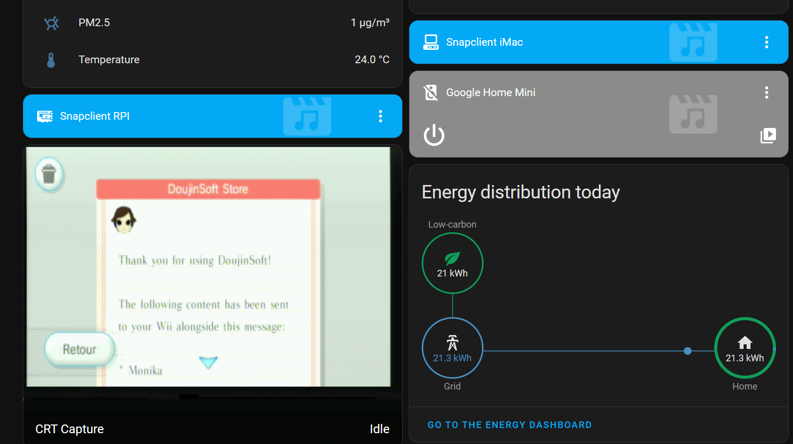

Title: Controlling an IKEA LED strip with video capture from game consoles 
Date: 2024-09-21 00:00  
Category: Cool Tricks  
Tags: home assistant, zigbee, ikea, led, dazzle, dvc100, video capture, gaming, jankfest philips hue facsimile
Slug: ha-led-dazzle
Authors: Difegue  
HeroImage: images/hass/hass_gaming.png 
Summary: Finally... Home Assistant gaming.

I have a nice LED strip lighting up my [gaming cabinet](./kallax-crt.html), but it's a bit clunky turning it on manually every time I'm gaming on the ole Wii.  
The strip I bought is an [IKEA Ormanas](https://www.ikea.com/gb/en/p/ormanaes-led-lighting-strip-smart-wireless-dimmable-colour-and-white-spectrum-90541329/), which is Zigbee compatible and can plug in just fine to a Home Assistant installation. It's even multicolor!   
  
So surely, we can make this strip light up on its own when the consoles are in use, right?  

The easiest way would obviously be a [smart plug](https://community.home-assistant.io/t/what-are-the-recommended-energy-monitoring-smart-plugs-for-ha/589681) hooked up to the CRT that detects when it's drawing power...  
But I had an old [Dazzle DVC100](https://en.wikipedia.org/wiki/Dazzle_(video_recorder)) capture card lying around, so why not try to use that instead?  

# TV/Dazzle connection setup

The Dazzle itself just takes standard composite video and stereo audio and feeds it to a computer over USB 2.0, so it's easy to just plug it to a splitter with the other bit going to your TV.  

I have to note here than plugging any sort of additional stuff to composite video can introduce significant **interference and video noise** -- Personally I recently splurged on an [automatic SCART switcher](https://aliexpress.com/item/1005004428449908.html)<sup id="ref-1">[*](#note-1)</sup> that isolates TV and capture outputs perfectly, but your mileage may vary.  

As for the computer doing the capture - I have a Raspberry Pi close to the TV that I already use as a [snapcast](https://github.com/badaix/snapcast/) client for music playback, so I just hooked the Dazzle to it.   
  
Configuring the DVC100 is substantially easier on Linux than it is on modern Windows - I just followed [this guide](https://github.com/danyfernandes/vhs-capture-pinnacle-linux) to get perfectly cromulent captures out of the card.  

The DVC100 just acts as a webcam once configured, so its video feed can be exposed to your network as a MJPEG stream by something like [`ustreamer`](https://github.com/pikvm/ustreamer).  
I've slapped together this service file for that:  
```
[Unit]
Description=ustreamer Dazzle
After=multi-user.target

[Service]
Type=simple
Restart=always
WorkingDirectory=/usr/local/bin
ExecStart=/usr/local/bin/ustreamer --host 0.0.0.0 -d /dev/video1 -r 720x576 -q 100 -a PAL -m RGB565 -p 8081

[Install]
WantedBy=multi-user.target
```  
I use `/dev/video1` here for the DVC100 since my Pi also has a normal webcam plugged in.  
Depending on what you capture, you might want to mention NTSC/480i instead of PAL/576i for the video standard<sup id="ref-2">[**](#note-2)</sup>.   

Since `ustreamer` outputs as a MJPEG stream, you can add your video feed to HA directly. It's technically not necessary... but it's fun! And I now have an easy way to take screenshots when I'm playing on the CRT.  
  

# The Home Assistant sauce

So now that we have a video feed in HA, surely it's easy to look at it and control the LED strip? Not quite 🫠  

We can use the [Color Extractor integration](https://www.home-assistant.io/integrations/color_extractor/) to pick the predominant color from the captured image and apply it to your lights - Except that this integration will always **turn on** the light, even if the current feed from the capture card is a black image.  

So we need an additional **sensor** in HA to detect whether there's actual video coming from the capture card or not -- I struggled a bit for this before ending up with the perfectly dumb solution of _looking at the size of a screenshot from the video feed every second_.  

```
command_line:
  - sensor:
      name: Size of CRT Stream snapshot
      scan_interval: 1
      command: 'curl -so /dev/null http://[ustreamer_server]:8081/snapshot -w ''%{size_download}'''
```

Horribly inefficient? Yes! But it works.  
    
The output capture from the Dazzle when nothing is outputting to it is about 100KBs<sup id="ref-3">[***](#note-3)</sup>, so I check for 150 to have some margin.  

And that gives us our final script:  
```
alias: Kallax LED Colorizer
sequence:
  - if:
      - condition: numeric_state
        entity_id: sensor.size_of_crt_stream_snapshot
        above: 150000
    then:
      - service: color_extractor.turn_on
        metadata: {}
        data:
          color_extract_url: http://[ustreamer_server]:8081/snapshot
          brightness: 200
          transition: 0.4
        target:
          entity_id: light.ikea_of_sweden_ormanas_led_strip_light
    else:
      - service: light.turn_off
        metadata: {}
        data: {}
        target:
          entity_id: light.ikea_of_sweden_ormanas_led_strip_light
description: ""
icon: mdi:format-color-fill
```  
Notice that as mentioned previously, this doesn't use the video feed registered in HA at all and just hits the `ustreamer` server directly. Which means you'll have to add its URL to `allowlist_external_urls` in your Home Assistant [configuration](https://developers.home-assistant.io/docs/dev_101_config/).


<video autoplay loop src="./images/hass/castlehue.mp4" title=""></video>  
One could argue that it'd use less electricity to just turn on the LED strip all the time than to do all of this...  
But would you get the Philips Hue™️ experience that way? Certainly not.  
#

<sup id="note-1">[\*](#ref-1) I'm aware of the irony of _"doesn't want to spend money on a smart plug but will dunk 100€ in a switcher so he doesn't have to push buttons manually to swap outputs"_</sup>  
<sup id="note-2">[\*\*](#ref-2) My SEGA Saturn is a Japanese model, so capturing it on PAL mode gives me a squished grayscale image - which is more than enough just to drive LED lights. </sup>  
<sup id="note-3">[\*\*\*](#ref-3) If you have an image on screen that is pure white it actually can be lower than that due to how jpg compression works - So sometimes when using the Wii Menu which is predominantly white, my LEDs will turn off...<br>Writing a customized version of ColorExtractor would probably be a bit better than this. I found [one](https://github.com/xplus2/homeassistant-ambient-extractor), but it didn't work for me.</sup>  
