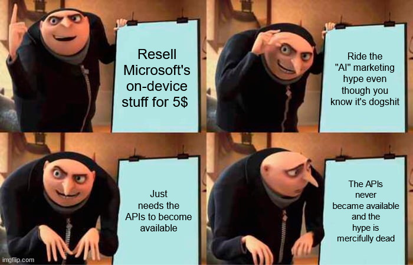
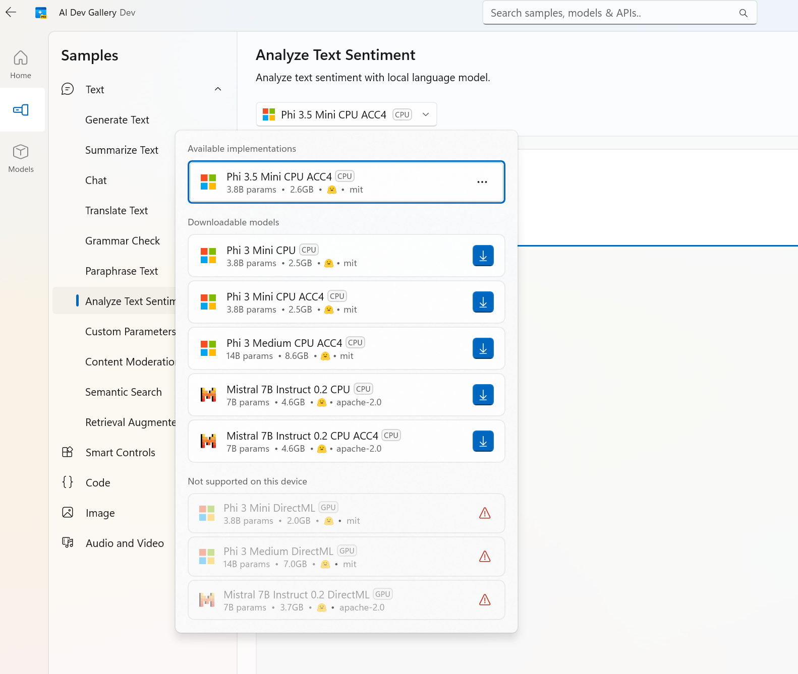

Title: DialogueForest is now on the Microsoft Store!
Date: 2024-12-21 00:00  
Category: Software 
Tags: dotnet, c#, gamedev, winui, windows, windows 11, winappsdk, llms, outliner, dialogueforest
Slug: dialogueforest-msstore
Authors: Difegue  
HeroImage: images/dialogueforest/ForestXmas.png 
Summary: This blogpost contains unsafe amounts of ranting against AI.

[A bit more than a year ago](./dialogueforest.html), I shipped DialogueForest, which had itself been in development for a year+...  
So the app is actually almost three years old now! Wow!  
  
I don't update it that much as it's really mostly for my personal use[*](#note-1), but as the Windows App SDK runtime keeps getting updates, it was getting a bit difficult to run the executable I shipped on [itch.io](https://difegue.itch.io/dialogueforest) back then.  

So I solved that and added a [few more features](https://github.com/Difegue/DialogueForest/releases/tag/v.1.0.4):  
DialogueForest is now on the **Microsoft Store** so you can 1-click install it, _entirely free_.  

Merry Christmas! Go write some dialogue for your games.  

... You're still here? I guess I did promise some ranting.  

So one of the reasons I'd held back MS Store publishing for this app back then was...  
that I was planning to add **AI** to it! 👻👻👻  
Not really because I believed in the technology (especially not for creative writing, miss me with that shit), but I wanted to 🧪experiment🧪 with something.  

Microsoft was promising those [shiny new WinAppSDK APIs](https://learn.microsoft.com/en-us/windows/ai/apis/phi-silica) in May to interact with language models that'd be bundled with Windows -- With those, it'd cost essentially _no effort or money_ to integrate text/dialogue generation in the app.  

So I would put the app on the store...  
Add in the AI integration as a **5$ paid in-app-purchase**...  
**Market the app** as being "_enhanced by the incredible power of AI!!1!1!_"...    
Get [featured on the store](https://blogs.windows.com/windowsdeveloper/2023/05/23/welcoming-ai-to-the-microsoft-store-on-windows/) by Microsoft who's desperate to sell that shit to everyone who has eyes...    
And **rack in the money** from the room-temperature-IQ Elon Musk fans who think a glorified autocomplete is the future of technology.  

The plan was, dare I say it, perfect; I just needed to wait for the APIs to become available... 
  
I honestly thought that since this was yet another of Microsoft's famous _"refocus the entire OS on a single bit of tech_" moments, this stuff would come out relatively early despite the fact Windows UI technology/WinAppSDK moves at a glacial pace...  
But nope, `Microsoft.Windows.AI.Generative` is still unavailable more than 6 months later.  

As a result, what's the current guidance from Microsoft if I want, as a Windows developer, to join the   
""""AI Revolution""""? Well, they made a whole app about it with examples, [look how nice it is](https://aka.ms/ai-dev-gallery-blog)!  
  
...And it basically boils down to "_Download some shit from huggingface, slap it into your app and run the model yourself on GPU -- want language processing? That'll be an extra 2 gigabytes thank you_"  
It's laughable, nobody's realistically going to do this??[**](#note-2)    

Even **Apple**, who did the _least_ possible amount of compliance so that their shareholders wouldn't crash the stock by fear of missing the AI hype train, added [some tools](https://developer.apple.com/documentation/imageplayground) for developers to use their built-in generative stuff.  

It's shit, _but at least you can use it_!  
Microsoft is one of the companies who went the hardest on dooming themselves with AI garbage,  
**and EVEN THEN THEY CAN'T FUCKING DO IT RIGHT!**  

 
   
 
 

... aight i got that out of my system we good now  
  
I imagine most of the preinstalled-AI-on-Windows stuff was severely delayed by the Recall [trash fire](https://doublepulsar.com/recall-stealing-everything-youve-ever-typed-or-viewed-on-your-own-windows-pc-is-now-possible-da3e12e9465e), which is how we got to this silly situation.  

I don't really blame[***](#note-3) the Windows devs, this shit comes down from management and they were absolutely right to redirect their limited resources into [actually useful stuff](https://blogs.windows.com/windowsdeveloper/2024/09/04/whats-new-in-windows-app-sdk-1-6/) instead of those APIs.  

But well, as for my _devilish AI plan_? The hype cycle is essentially dead by now. (if it was ever somewhat alive)  
When you look at OpenAI trying to stir hype with their ["12 days of shipmas"](https://www.theverge.com/24314146/openai-12-days-ship-mas-chatgpt-sora-o1-update) (terrible techbro ass name btw) and delivering **nothing of value**[#](#note-4), I don't see it picking back up.  

There's absolutely zero incentive from me to bundle any form of AI to DialogueForest now, so I thought I might as well just [put it up on the Store](https://apps.microsoft.com/detail/9P7MWMG1V6M6?cid=tvc-16&mode=full). And with AOT, it's now faster, so it was worth the wait? _Kinda?_  

#

[\*](#ref-1) I actually haven't been using it that much recently... game writing takes time and I don't have it because I'm here ranting about how capitalistic boom/bust cycles are ruining the computer experience for everyone  
[\*\*](#ref-2) I do think there's a lot of use for small bundled ML models (remember when we just called it ML? good times), but nobody is going to cram a bloody 2GB+ stable diffusion or llama model in a consumer app and call that good user experience, be realistic   
[\*\*\*](#ref-3) You know what I **do** blame them for? [You still can't make an x86/ARM msixbundle in one click using Visual Studio with WinAppSDK/WinUI3](https://github.com/microsoft/WindowsAppSDK/issues/1808), it's been fuckbusted for ages and there's no indication as to why it fails and you have to make separate per-architecture packages instead. [Phenomenal](https://www.youtube.com/watch?v=IBelvYeF440)   
[#](#ref-4) Sora does not count fuck you, they closed signups 10 minutes after launching it because their servers blew up, textbook definition of a paper launch   
