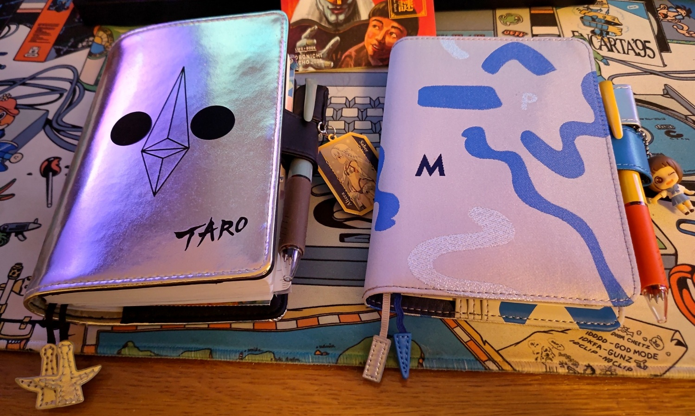
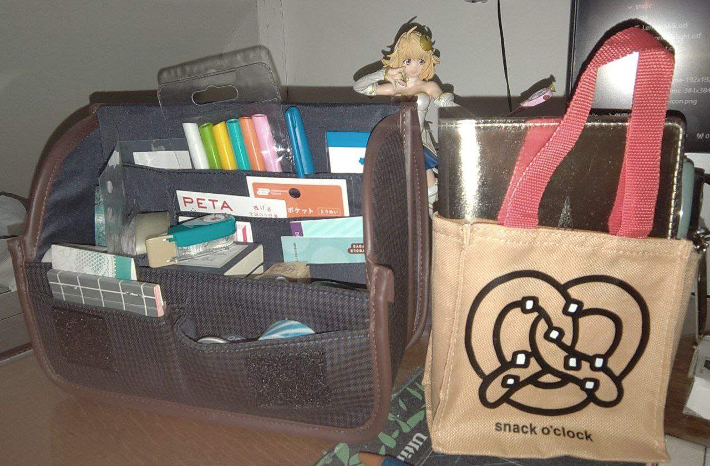
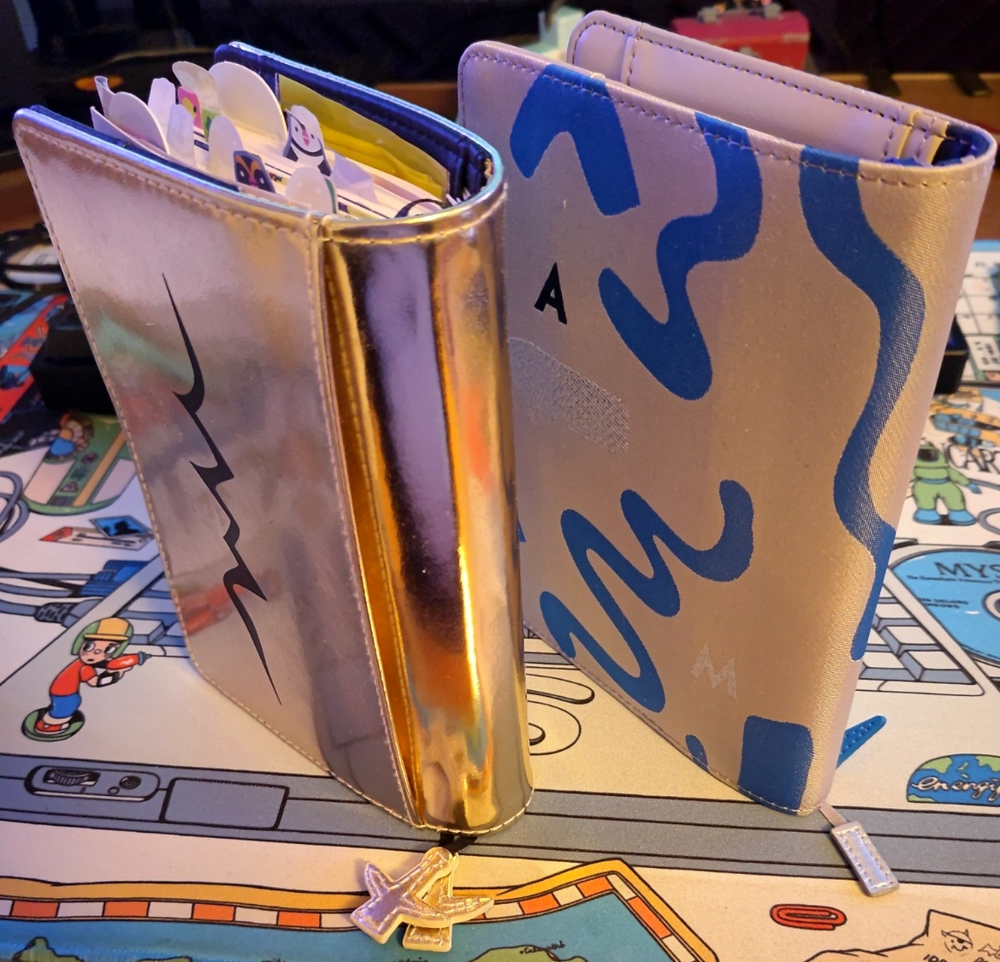

Title: My 2025 Hobonichi Techo picks
Date: 2024-12-31 00:00  
Category: Blogposting  
Tags: techo, hobonichi, stationery
Slug: 2025-techo
Authors: Difegue  
HeroImage: images/techo/2025.jpg 
Summary: time and cringe are social constructs and don't matter 

2024, huh.  
  
The usual thought is "_wow this year went by in a flash!_" but then I looked at a bunch of photos and went "_wait this was in 2024? I thought that was ages ago.._"  
All I'm saying is that time is bullshit and shouldn't really matter as much as it does.  

Since computers are getting [increasingly worse](./dialogueforest-msstore.html), I've been continuing to handwrite in my [Hobonichi Techo](https://www.1101.com/store/techo/en/) planner.  
So as usual, here's what I bought to keep doing that in 2025!  
With the current state of the Yen, I think it's pretty accessible at the moment.[*](#note-1)  

My cover pick for this year is the new [PAMM one](https://www.1101.com/store/techo/en/2025/pc/detail_cover/oc25_pamm/) - I missed out on the green one last year, but this new blue variant is a fine alternative. I like squiggly lines! That's [just the way it is](./stylophone-27.html).  

Although I have to say, it really doesn't fit with the color scheme they picked this year for the Jetstream pen -- What is this, [Hot Dog Stand](https://blog.codinghorror.com/a-tribute-to-the-windows-31-hot-dog-stand-color-scheme/)? I might just keep using my blue 2022 one and swap the ink cartridges or something.     
  
I picked the Original again instead of the English version - I didn't have any problem with it [last year](./053-2024-techo.html) and appreciated the different layout, so might as well keep saving those 500 yen.[**](#note-2)  

Other designs I considered this year are the really cool _[Cyanotype mountain photo](https://www.1101.com/store/techo/en/2025/pc/detail_cover/oc25_ishikawa/)_ and this Indian [fabric](https://www.1101.com/store/techo/en/2025/pc/detail_cover/oc25_phoolon/) cover.  
And wow, they finally ran out of [Mr. Saturn tiles](https://www.1101.com/store/techo/en/2025/pc/detail_cover/oc20_mothertile/)! I never bought this one in the end.  
  
I didn't really buy any extra stationery this year since I still have a batch I'm going through;  
I just bought some new [stick-on pockets](https://www.1101.com/store/techo/en/2025/pc/detail_toolstoys/tt_pocket/?recommend) for cards and a few [new stamps](https://www.1101.com/store/techo/en/2025/pc/detail_toolstoys/tt_stampset/).  

They have a [mini version](https://www.1101.com/store/techo/en/2025/pc/detail_toolstoys/tt_stappom_camib) of their stationery pouch now though!  
I still like my regular-sized one a year in, so you might be interested.  

# 

"_What do I even write in those planners_" you might ask? Usually it's basic food stuff, pasting in cards and tickets, and the occasional gamedev/other idea I have to put down to paper before it [vanishes away](https://artreview.com/daydreaming-is-so-important-to-me-how-david-lynch-fishes-for-ideas/).  

Sometimes I find it hard to put to paper things you daydream about because... **it's cringe**!  
Some of this stuff is dumb feel-good crap, has zero value and will probably never be read again, right?  
Even being aware that cringe is made up and doesn't matter, there's always that slight deterrent in the back of your mind.  

I was reading the [yearly Itoi interview](https://www.1101.com/store/techo/en/magazine/contents/y25_itoi/mnpkrp9nr.html) when making my purchases this year, and I found a pretty good answer to that:  
> It’s a little embarrassing, but then again, I can only feel that way because I wrote it down in the first place.  
It’s a feeling I encourage everyone to experience.  

Yeah, I think I'll strive to write even more cringe in 2025.  

I'm always slightly worried about all the semi-blank pages I'm leaving in each year since I'm anything but diligent..  
But when you compare the bulgy planner of the last year with the fresh one, I always end up thinking "_oh yeah this was a pretty packed year! I think I did good here_"  
  

Life goes on and it'll probably be alright.  
 
 
 
 
 
...Am I going to manage to work on my goddamn game this year???  

#

[\*](#ref-1) unless you live in Europe and have atrocious customs fees I guess.. There are also always those outrageously priced luxury covers. I'm shocked they made a [leather MOTHER 2](https://www.1101.com/store/techo/en/2025/pc/detail_cover/oc25_mothernbike/) one this year, they think Earthbound fans are all megarich socialites or something? I'm trying to envision the final collapse of Capitalism over here!  
[\*\*](#ref-2)I'm painfully aware the endgame is probably to raise the price of the original once the other english version gets killed off because low sales or some shit, but while it lasts? I'll take the savings ig  