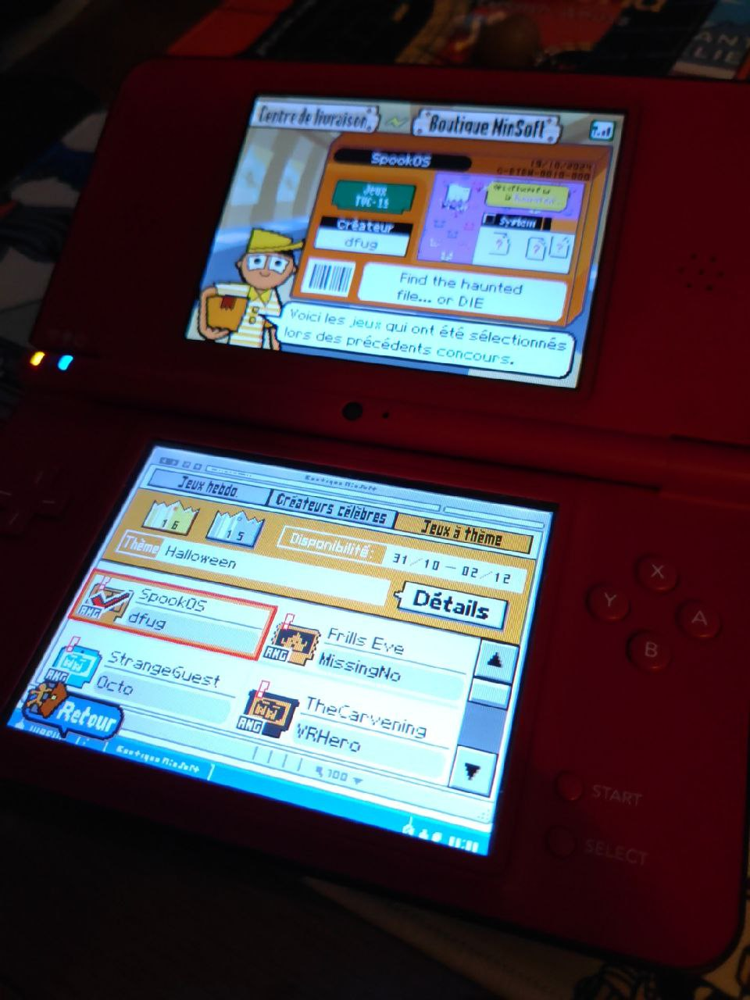
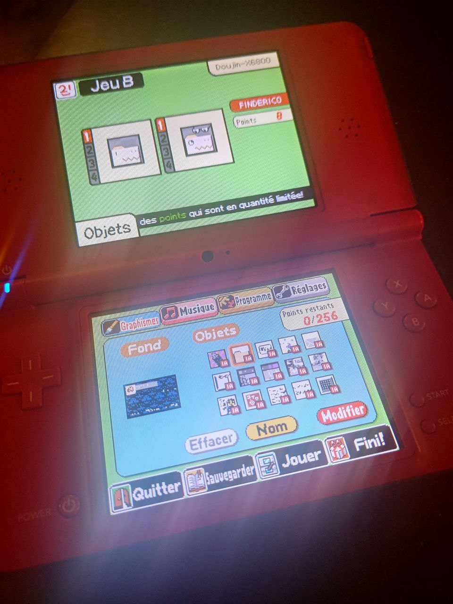
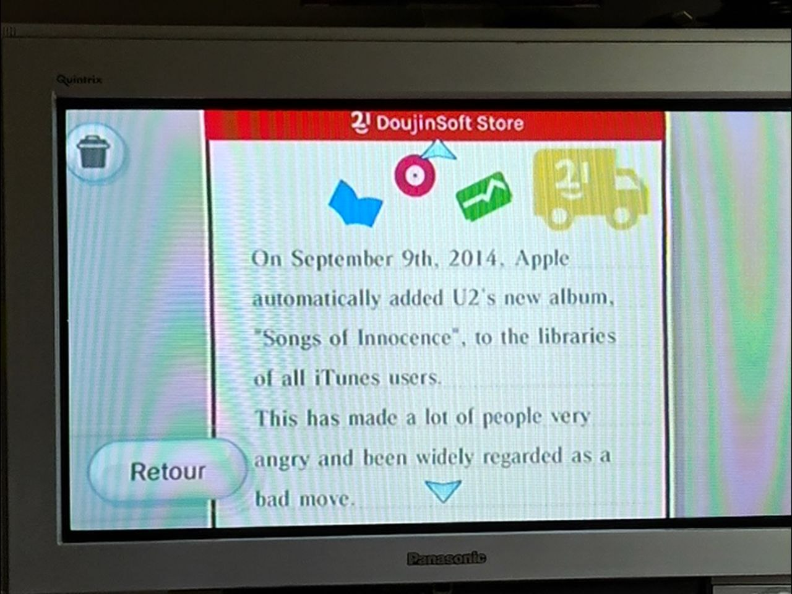

Title: Making new microgames in WarioWare DIY, 14 years later
Date: 2025-01-28 00:00
Category: Software
Tags: nintendo, wii, nintendo ds, riiconnect24, warioware, doujinsoft, mio, diy
Slug: diy-fi
Authors: Difegue
HeroImage: images/doujinsoft/x68k-2025.png
Summary: hahaha!!! i made a fake OS on the nintendo ds!!!

Despite running the largest [WarioWare DIY archive](https://diy.tvc-16.science/) for about eight years now[*](#note-1), I hadn't made any games with it since... [wow, 2011.](https://diy.tvc-16.science/games?id=66ff7257b3d7ea3361c3745ed36ed05e)  

DIY is of course very limiting as a game creation tool, but I'm quite grateful to it for being the one of the ways I released "proper" games online, after multiple attempts with Game Maker 7/8 in the late 2000s. (**Before** it got bought over by yoyo games! can you imagine?)  

While running those old GM games on modern hardware is a pain, the various efforts around DIY have made it surpisingly easy to pick up and use even nowadays. (I don't think you'd be getting [skibidi games](https://diy.tvc-16.science/games?id=2d92ffcc9d1ec20a024d37210a35f51d) otherwise..)  
There's the [built-in](./doujinsoft-3.html) players on DoujinSoft, of course, but also working online with [WiiLink](https://www.wiilink24.com/) and Wimmfi for the original games.  

..And the new kid on the block, [DIY-Fi](https://diy-fi.net/)!  
This one new service fully reimplements DIY's online store for the DS version of the game, bringing back weekly games[**](#note-1) to download and design contests.  
  
A design contest popped up for Halloween, so I thought, why not test myself a bit and see if I _could make a game without redoing any of the tutorials 14 years later_?  

<iframe/>
<pre>(DoujinSoft now supports `iframe` embeds as you can see here! Feel free to embed all your DIY microgames and comics on your own websites.)</pre>  

...OK, it was still pretty easy. The _Game MakerMatic_ creation tool within WarioWare DIY isn't massively complex!  
Due to having maintained DoujinSoft for all those years, I do have a leg up by never really having forgotten all the concepts and terminology though... I think the only thing I had to look back up after all this time was how to do randomness?  

# A review of the MakerMatic in 2025  
 
How does it stack up as a game-making tool though? I think it's alright!  
You're very constrained, obviously, but that also makes scope creep essentially **impossible**, which is very nice if all you want to do is bang out a game in a few days hunched over your Nintendo DS and call it a day.  

The palette is a bit low too around 32 or so colors, so you end up relying on dithering pretty fast if you're making detailed pixel art.  
While you might think the most limiting think in the MakerMatic is the "point" system that dictates how much of said pixel art you can cram into the 64 kilobytes of an individual microgame, I think the true thing that kneecaps you is the maximum of **6 AI statements** per object.  

In DIY, AI is not a capitalist buzzword for poorly functioning chatbots, but is essentially the equivalent of a `if/else` function in normal programming. So broadly speaking, you only have 6 `ifs` per object.  

You can imagine this gets limiting very fast - Imagine you want to do a `switch` statement for instance; By breaking that down into AI statements, you'll likely use up an entire object just to accomplish that...  
Combined with the fact each object can really hold only **one** boolean variable, any form of complex logic usually ends up eating through your entire _16 object_ limit.  
  
Now there are some tricks you can employ to maximize your object use -- Offscreen positions can be used as makeshift additional integer variables, you can also rely on the animation system, etc.. But it kinda all comes back to the fact **logic is the biggest limiter**.  

I also think not allowing the use of the NDS buttons or microphone is a bit of a missed opportunity - I can understand the mic if you wanted to keep interoperability with the Wii version (although they **could** have used waggle/motion controls on the Wii in place of the mic! It'd have been banger), but the buttons would've been a great way to mix things up without adding much complexity. 

There's also no real random function in DIY - The game itself teaches you to make use of one of its built-in "random placement" functions to act as your RNG by then doing a position check. It's clever! But also kind of hacky!!   

# What about... second game??? 

After SpookOS, I wanted to actually test those limits and see how much functionality you can cram in a WWDIY microgame.  
There are some pretty impressive DIY creations out there that do parallax or multi-room puzzles, but I wanted to try my hand at making a game that just crams a bunch of various stuff in.  
We're going **maximalist** baby! It's the [Ring Racers](https://www.kartkrew.org/) of WarioWare DIY!  

There are a lot of DIY microgames that replicate Windows or computer interfaces already... But most of these are pretty simple, and I love my toy operating systems!  

So I grabbed the boss template and made a tiny fake OS using graphics from [Funtography](./funtography.html), with multiple windows and embedded games/messages.  
I'd just traced the graphics as usual for SpookOS, but here I caved in and used [mioedit](https://www.romhacking.net/utilities/1011/) to import some bitmaps from the computer. This approach isn't perfect due to the palette limitations though, so I still had to do some redrawing.  
<iframe/>
Of course there's realistically not _that_ much you can do in DIY... But I had fun figuring out the balancing act between the various point, AI, and object limits.  
To make an object blink, you _can_ use a sprite animation... Or you could just rely on two variables to teleport it out of bounds and back in within the same AI statement. Stuff like that. 

I was pretty happy with the microgame, so I sent it to 150 registered Wiis through WiiLink with the yearly DoujinSoft newsletter.  
That's the harsh truth of marketing, baby...  

  

I do think there's a bit of a framework here for "zine-like" DIY games, that contain just tiny little bits of text, graphics and maybe showcasing some tricks you can do with the MakerMatic. 
Putting together text in the editor on the NDS is **maximum pain** though, so I don't think that'll happen!  

#

[\*](#ref-1) DoujinSoft has now been running for a longer time that the official Nintendo WFC service did for DIY on Nintendo DS... Also I was rewatching some older Game Center CX episodes and Arino was only 32 at the start of the show?? holy shit  
[\*\*](#ref-2) The weekly games are powered by a weekly snapshot of the latest additions to the DoujinSoft dataset! It's really cool to see the archive being used in that way.  