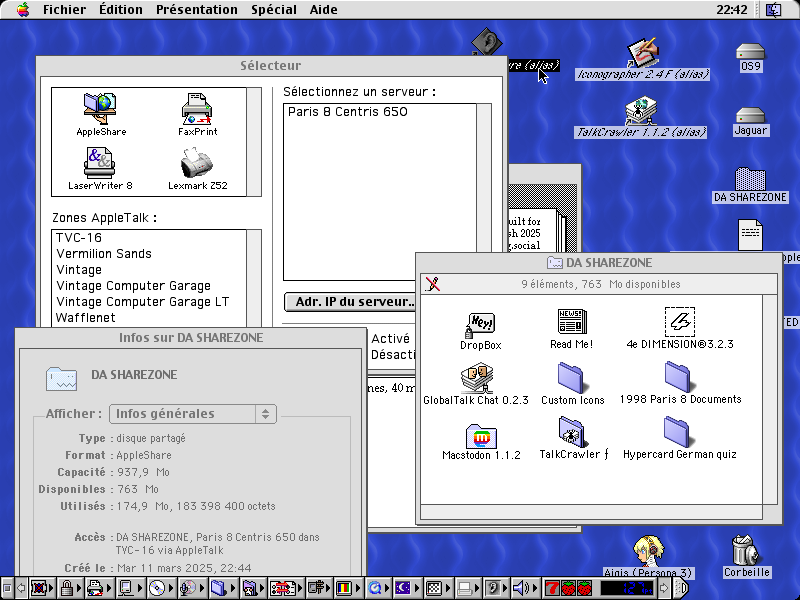
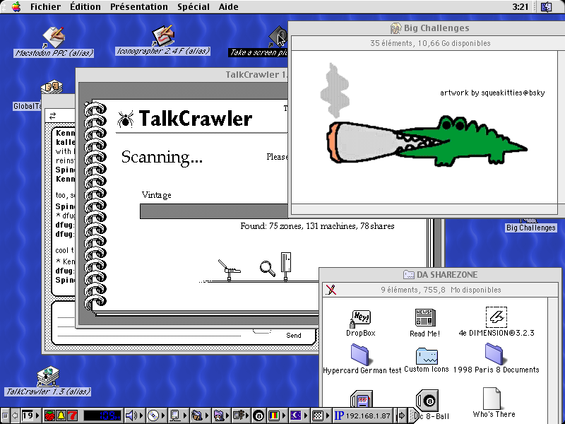
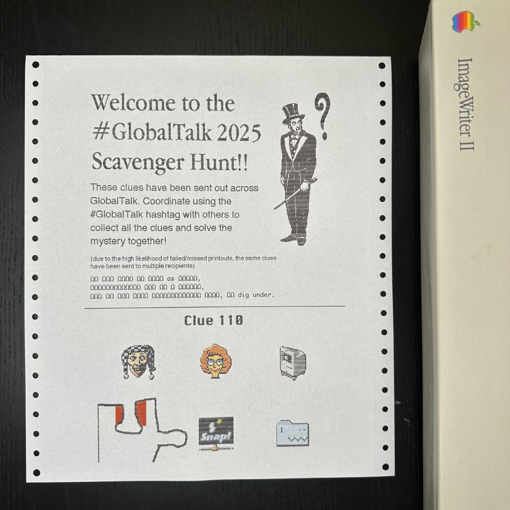

Title: The cozy alternate Internet of GlobalTalk
Date: 2025-03-22 00:00
Category: Blogposting
Tags: apple, macintosh, mac, macos, crt, diy, retrocomputing, marchintosh
Slug: globaltalk
Authors: Difegue
HeroImage: images/globaltalk/talkcrawler.png
BskyPost: at://difegue.tvc-16.science/app.bsky.feed.post/3lk54yua2ww2d
Summary: the lengths you have to go through to have fun on the computer these days, i tell you what

It's March! That means Spring is coming in, but also [MARCHintosh](https://www.marchintosh.com/), 
the month-long event dedicated to vintage Macs.  
And alongside it, so is the **GlobalTalk** network!  

GlobalTalk basically consists of using pre-Internet, vintage Apple networking **grossly beyond its initial spec** 
to connect dozens of old Macintosh computers[*](#note-1) together, 
[using the Internet as a bridge](https://biosrhythm.com/?p=2767).  

I missed out on the fun last year, but this time I got a few of my [trashpicked](./adbuino-ps2.html) [machines](./emac-lcd-mod.html) online.  
If we're still in March as you're reading this, you can just go and [connect to them right now!](https://bsky.app/profile/difegue.tvc-16.science/post/3lk54yua2ww2d)  

  
Now, what can you actually do when you're on GlobalTalk?  
Well... the networking standard in use, [AppleTalk](https://en.wikipedia.org/wiki/AppleTalk), doesn't really allow you to do much!  
From your _Zone_, you can share local folders from Macs on your network, alongside printers[**](#note-2).  

So GlobalTalk is _mostly_ just an interconnected net of shared folders, with printers you can print to remotely.  
It's as close to **"primordial Internet"** as you can get and feels a bit [Battle Network-esque](https://www.youtube.com/watch?v=afFOMVO3unM) in a way?  

You _jack in_ to a user's AppleTalk Zone, and get to look at the files and programs he's left there for you to look at.  
Maybe fuck around and send some memes to his printer, or drop a file into a folder he left write access on.  

The very [user-oriented interface](https://www.fastcompany.com/91044923/watching-susan-kare-explain-the-mac-ux-in-1984-is-the-most-relaxing-thing-ever) of the classic Mac OS accentuates this feeling a **lot** -- It's incredibly easy to customize the names, icons and positions of every single file in your Zone, so every user's tiny network ends up looking very personal.  

I mean, do you know of **any other network** where you can just fullscreen Big Challenges smoking the boof[***](#note-2) in the File Explorer as a set of 34 custom icons glued to one another??  
  
You can just spend **hours** looking through the Zone list, connecting to different oldass computers across the world named "_Glorbo's death star Performa 600_", where they're sharing a pack of Simpsons icons and a text file saying  
> hello! thank you for visiting computer  

that took you 30 seconds to open at 64k speed.  

It's...fun! There's a real sense of discovery here caused by the limitations and customizability of it all.    
You can **have fun _browsing through things on the computer_**, which is essentially impossible nowadays on real web browsers.  

And despite this being a relatively small network all things considered, the variety is still pretty impressive to me.  
There are lots of vintage programs, obviously, but also [music](https://anticapitalist.party/@ahihi/114206693858413006)! [art pieces](https://social.europlus.zone/@europlus/114125705720284399)!  
A bloody _scavenger hunt_ done through printers and files hidden in various zones?  
   
In the current age of the [Total Internet Hyperdeath](./total-internet-hyperdeath.html) caused by the slow coalescing of users onto a handful of massive corporately-owned social platforms that are all turning fascist in one way or another...  

GlobalTalk is **punk** as hell in comparison.  
Despite the Internet basically crumbling under its own rot, it's still possible to use it to build people-focused and people-driven communities, and I think that's pretty cool.  

Now, should we actually `RETVRN` to AppleTalk? No.... it's _really slow_.  
But I'd say it's worth [checking out](https://docs.google.com/document/d/1pXMjrAF5vC08TamkdSt2oFCrDFMP47i5dYcjshn9JzU/edit?usp=sharing) if you can. You don't necessarily have to use a vintage Mac either!  
Lots of people are using VMs and/or purpose-written software instead.  
  
     (visited.jpg, received in the Dropbox of the TVC-16 Zone on GlobalTalk)  
#

[\*](#ref-1) Or things that pretend to be Macintosh computers! There are QEMU emulated macs, Linux machines through `netatalk`, Windows 95 machines, [NeXTStep](https://mastodon.social/@oevl/114196246218250463)... even brand new routers written in Go.   
[\*\*](#ref-2) which might or might not be an actual physical 1990s printer they're keeping alive through sheer force of will? I have no idea how they do it, printers are hell... I should mention there are also some programs that actually support AppleTalk networking, so you can use a few games and [chat programs](https://bitbang.social/@kalleboo/114193676799421822).   
[\*\*\*](#ref-3) The OG big challenges boof artwork can be found [here](https://bsky.app/profile/squeakitties.bsky.social/post/3ljx7teytms2i). It brings me unbridled joy to look at, and [that's great](https://innerspiral.lol/Blog/comfort/comfort).    