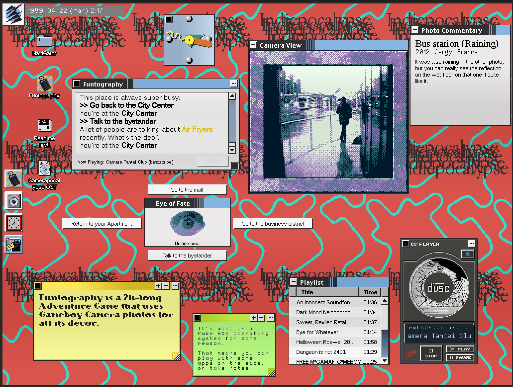

Title: Funtography is part of Indiepocalypse #65!
Date: 2025-06-10 00:00
Category: Gamedev  
Tags: video games, gamedev, unity, c#, .net, gameboy, gameboy camera, faux-OS, indiepocalypse
Slug: indiepocalypse
Authors: Difegue
HeroImage: images/funtography/ft_indiepocalypse.png
BskyPost: at://difegue.tvc-16.science/app.bsky.feed.post/3lr7sd2rku22w
Summary: Patch notes: The Grape assistant has turned into a Medjed

Woops, haven't written a blogpost in a few months..  
I've been busy playing video games[*](#note-1) and [memeing something up with the Playdate](https://bsky.app/profile/difegue.tvc-16.science/post/3lqo3v7c3cc2k).  
But in the meantime, my [silly gameboy camera VN](./funtography.html) has made it into Indiepocalypse Issue 65!  

[Indiepocalypse](https://pizzapranks.com/) is a curated monthly collection looking to highlight the very best of the alternative indie game scene.  
Please [give it a look](https://pizzapranks.itch.io/indiepocalypse-65), it's not even the only game in there with an operating system interface!  

I've remade a build of Funtography that includes a few QoL changes from the (slowly) ongoing larger fake OS project, so if you haven't played it yet, dare I say... there's never been a better time??  

  

I wrote a few extra words about the game for the included zine, feel free to read them below if you want some more Funtolore™️:  

> Hey! I hope you're enjoying the zine.
People often wonder what the hell the fake OS has to do with Funtography as a game and the reality of it is.... nothing! 

> I've been building this fake OS with super shaky foundations in Unity 2019 for 5 years by now to try and make a 80's BBS simulator game ala Digital, and Funtography is "just" a full playable game that I've built within that framework.

>The concept of "VN adventure game with Gameboy Camera pictures" was stuck in my head for nearly 15 years, so at some point I just thought fuck it, let's do it in here! It was quite cathartic to actually get this out in 2023.

>The story is pretty fun to look back at; It's silly and the ending is very rushed, but I enjoy writing alt-history stuff like this that grounds itself in real events and kinda just runs with it. 

>I'm actually still proud of the soundtrack for this - It's a hodgepodge of slowed-down chiptune horrors, but for someone who has negative music skills, I still think it's pretty good... 
I hope you'll be interested enough to read up to when "special stage" plays as the BGM. 

>In case the full fake OS game never comes out, at least this VN is something that actually shipped I can look back on. It's been hard to make time for gamedev recently, but I'm keeping at it! 
This dumb idea will probably kill me at some point if I don't actually get it out.

>This Indiepocalypse build has a few QOL updates from the old Itch version I've made since 2023, namely actualy functional UI scaling, a very dodgy scanline filter, and a 2X zoom option for the Camera view.

>If you clear the game, you'll unlock the sound test in the CD Player program! 

#

[\*](#ref-1) I haven't made a mini-review post in a hot minute but I enjoyed the hell out of "Get in the Car, Loser!" after finally playing it a month ago. also yeah deltarune ch3/4 i guess   