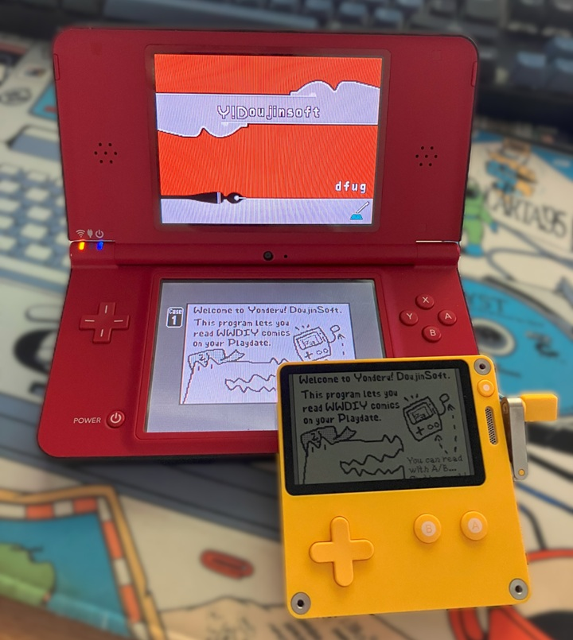
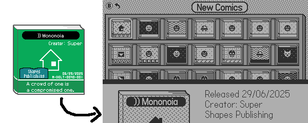
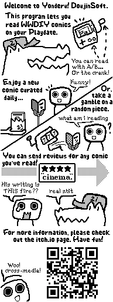

Title: Announcing Yonderu! DoujinSoft for the Playdate
Date: 2025-07-21 00:00
Category: Gamedev
Tags: nintendo, nintendo ds, warioware, doujinsoft, playdate, comics, gamedev
Slug: yonderu
Authors: Difegue
HeroImage: images/doujinsoft/yonderu.jpg
BskyPost: at://difegue.tvc-16.science/app.bsky.feed.post/3lgwb45tawk2o
Summary: it's officially the summer of wario

Happy "end of season 2" to all [Playdate](https://play.date/) owners! Did you enjoy the games?  
I actually haven't played most of them yet... since as soon as I heard the SDK now officially had _networking support_, I saw an opportunity to get some [brainworms](https://bsky.app/profile/difegue.tvc-16.science/post/3ljlqtygsek27)[*](#note-1) out of my skull.  

And now, two months later, I'm proud to present my [second ever](/sonic-drift-mania.html) Playdate release.  
<video autoplay loop src="./images/doujinsoft/yd_intro.mp4" muted=true title="Title screen for Yonderu! DoujinSoft"></video>  

**Yonderu! DoujinSoft** (approximately translates to "Let's read! DoujinSoft"[**](#note-2)) is a _comic reader_ for the Playdate which is directly hooked up to the [DoujinSoft Store](https://diy.tvc-16.science/), the largest content archive for 2010's[ WarioWare DIY](https://en.wikipedia.org/wiki/WarioWare_DIY).  
Comics in WWDIY are black-and-white 193 x 126 x 4-strip images, which makes them a nearly perfect fit for the Playdate screen!  

Ala _Garfield-in-the-newspaper_, the game will download a **new comic** every day from a curated selection for users to read, share, and rate.  
And if you want more, you can also download all the latest comics uploaded to the store by the DIY community... which is still pretty active! Here's [a comic with a Deltarune ch3 joke](https://diy.tvc-16.science/comics?id=4c527559b4f1bf1bded41e00ec456fb3), for example.  

...And of course, you can use the crank to scroll between pages.
  
### You can download the game on itch with the link below. 

<iframe src="https://itch.io/embed/3705003" width="552" height="167" frameborder="0"><a href="https://difegue.itch.io/yonderu-doujinsoft">Yonderu! DoujinSoft by dfug</a></iframe>

I always felt that comics are kind of the black sheep of DIY's offerings - The microgames are obviously the main draw, and the music maker gets a fair amount of love from the same folks who like to make absurdly complex compositions in Mario Paint...  
There's some real funny stuff in the _40000+_ comics uploaded to the archive though, and I'm hoping this Playdate outing will help shine a bit more light on them.  

This game is actually the **first time** you can submit [ratings](https://diy.tvc-16.science/surveys) for WWDIY content without using a Wii with DIY Showcase! It's pretty fun being able to stretch the lifetime of a game like this utterly beyond what it was designed to do.  
  
While the Playdate is a nice fit for this kind of pick-up-and-play (or is it pick-up-and-read?) content, I did have to rework a few bits of the experience for it to work on Panic's 1-bit console;  

The comic iconography has mostly been redrawn, and I used some MacPaint patterns to replace the colors that comic creators can use for their covers in the original game. It gives quite a different vibe from the original!   
  

The sound bites that play when you start/finish a comic have also been changed compared to the originals; I had fun digging through samples to make 10 new intro/outros, but that was at the point where I realized I might have spent way more time building this than I had anticipated...  

That time included picking up the _actual DIY comic creator_ again to make an in-game tutorial too.  
The text tools on the original NDS are still painful, and my drawing skills haven't really evolved since 2014[***](#note-3)...  

#

[\*](#ref-1) This technically doesn't follow the original vision™️ of putting DIY comics on the Pebble watch, but now that I made all the server tooling for it? Maybe for the next Rebble hackathon.  
[\*\*](#ref-2) Real connaisseurs will of course understand this is a reference to the Japanese name for WarioWare DIY Showcase, <i>"Asobu! Made in Ore"</i>... my naming sense is truly immaculate. Hire me Microsoft, i'll fix your dogshit names before you can even put me in your sixth round of layoffs   
[\*\*\*](#ref-3) before you ask yes the comic reading guy is literally just a knockoff servbot    