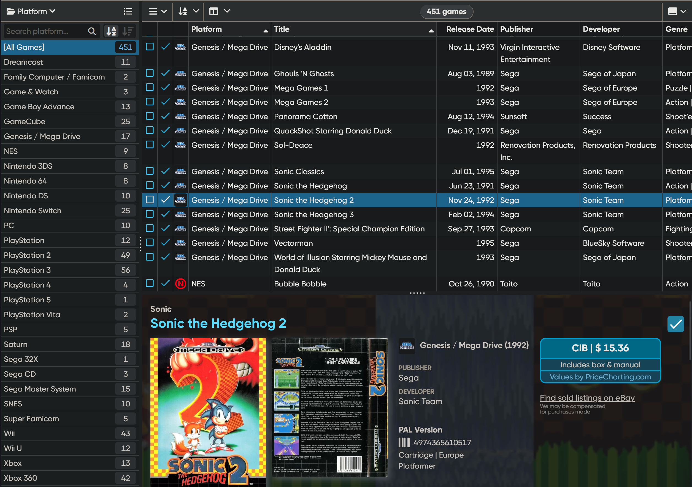
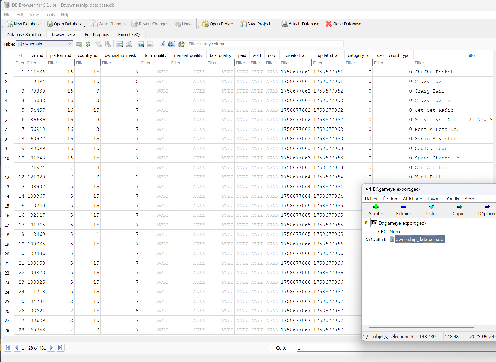
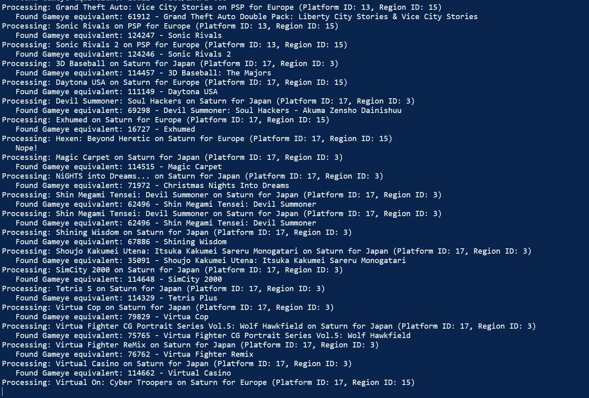
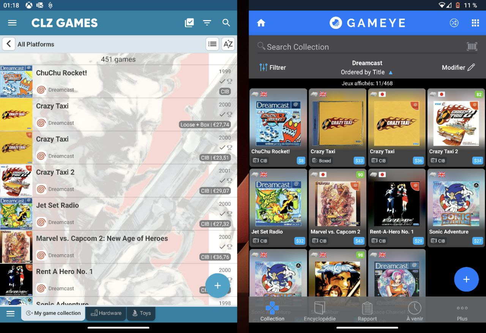

Title: Migrating a game collection database from CLZ Games to Gameye 
Date: 2025-09-27 00:00
Category: Physicality of Gaming
Tags: video games, collection, migration, clz, gameye, sqlite, powershell, scraping, subscription hell
Slug: clz-to-gameye
Authors: Difegue
HeroImage: images/games/gameye/collection.jpg
BskyPost: at://difegue.tvc-16.science/app.bsky.feed.post/3lzufkv3ou22y
Summary: ONE MORE SUBSCRIPTION REJECTED 

I own a relatively mid-sized [game collection](/kallax-crt.html), and it has recently gotten to the point I unfortunately can't always precisely remember everything I own when I'm hunting through garage sales.  
<sub>Mostly because I've gotten more into 360/ps3 where big AAA series became commonplace and no I can't fucking remember if I already bought uncharted 2 or 3 or asscreed 2 or 4</sub>  

So I got into logging all the stuff I own...  
And I would've run out of motivation _really fast_ if I had to manually type in every game name!  
I searched a bit and ended up using [CLZ Games](https://clz.com/games), which has a **fantastic** barcode scanner I threw my entire collection at like it was clearance on [Aisle 10](https://www.youtube.com/watch?v=wzM0t96x84A).  
  
I have to give a lot of props to the app overall - Their database is great and differentiates between collectors, platinum/players choice editions, and the barcode scanner found every single game I scanned through it, regardless of region.  

The UI is also quite nice and there's a web version... I'd happily keep using this!  
**Except it's subscription-based.**  
  
Luckily the app has an **export function**<sup id="ref-1">[*](#note-1)</sup>, which means with a little bit of scripting, I can get my scanned collection out and into something else that won't cost me 20€ a year<sup id="ref-2">[**](#note-2)</sup> to look at.  

# The competition  

Since the point is to have the collection on the go for cross-checking, I wanted to have it on **Android**.  
I could technically just have everything in a spreadsheet and use Excel on the go or something, but being able to filter by console and easily keep track of whether I own the box/manual for a given game are very nice to have.  

It also needs to have an **import function** of its own so I can pipe the data into it.  
So! As the title of the blogpost spoils, I ended up choosing [GAMEYE](https://www.gameye.app/) as the host for the export.  

I originally looked at Gameye for initially scanning my collection since it also has a barcode scanner... But their database is much worse than CLZ on that front and I was having a pretty low success rate<sup id="ref-3">[***](#note-3)</sup>.  

# The export/import formats 

CLZ Cloud's exports are pretty straightforward: You can either get an XML with all the info, or a custom CSV/TXT with fields of your choosing.  

For the rest of this blogpost, I went with a CSV that has the following columns:  
```
Title,Platform,Region,Box,Manual
"ChuChu Rocket!",Dreamcast,Europe,No,No
"Crazy Taxi",Dreamcast,Europe,Yes,No
"Crazy Taxi",Dreamcast,Japan,Yes,Yes
"Crazy Taxi 2",Dreamcast,Japan,Yes,Yes
```

Gameye's import/export functions are a bit less easy to work with, but relatively straightforward.  
Creating a "Restore Point" from the app gives you a **.ged file**, which is just a zipped SQLite database.  
  
I'll focus on the `ownership` table here, since that's the one that contains all the collection data.  

# The script  

I hate SQL about as much as I hate subscriptions, so I decided to just do csv-to-csv conversion, using [DB Browser](https://sqlitebrowser.org/) after the fact to insert the data in the Gameye DB.  

The meat of the complexity here is to find the **Gameye IDs** for each game -- Everything else (manual/box ownership, region and console IDs) was easy to figure out by just diffing a few exports.

Luckily, Gameye has a freely available online [search tool](https://www.gameye.app/encyclopedia)! And all of the IDs match what the mobile app uses, which means we will perform the illegal act of... **web automation.**  
  
So to recap, we need to do all the following:  

- CSV parsing to read the CLZ export  
- Web requests and JSON parsing to search for each game and grab the matching Gameye ID  
- Some way to generate GUIDs while rewriting the data so it matches what the Gameye DB expects  
- More CSV processing to export the final result  

**PowerShell** has built-in tools for all of this stuff, so that's what I rolled with.  
```powershell
param(
    [Parameter(Mandatory=$true)]
    [string]$inputCsv,
    [Parameter(Mandatory=$true)]
    [string]$outputCsv
)

# Import the input CSV
# CLZ export delimiter is , but if you preprocessed it thru Excel you'll want ;
$data = Import-Csv -Path $inputCsv -Delimiter ','

# Initialize an array to store the results
$results = @()
$notfound = @()
$id = 1


# Loop through each row in the CSV
foreach ($row in $data) {

    # Assume CLZ CSV has the following headers: Title,Platform,Region,Box,Manual
    $title = $row.Title
    $platform = $row.Platform
    $region = $row.Region
    $box = $row.Box
    $manual = $row.Manual

    # Calculate gameeye ownership mask
    $ownershipMask = 1 # loose
    if ($box -eq "Yes" -And $manual -eq "Yes") {
        $ownershipMask = 7 # complete
    } elseif ($box -eq "Yes" -And $manual -eq "No") {
        $ownershipMask = 5 # box no manual
    } elseif ($box -eq "No" -And $manual -eq "Yes") {
        $ownershipMask = 3 # manual no box
    }

    # Convert region/platform to gameeye IDs
    switch ($region) {
        "USA" { $regionId = 1 }
        "Europe" { $regionId = 15 } # UK
        "Japan" { $regionId = 3 }
        default { $regionId = 34 } # World
    }

    switch ($platform) {
        "Dreamcast" { $platformId = 16 }
        "Family Computer / Famicom" { $platformId = 7 } # Same as NES
        "Game & Watch" { $platformId = 76 }
        "Game Boy Advance" { $platformId = 5 }
        "GameCube" { $platformId = 2 }
        "Genesis / Mega Drive" { $platformId = 18 }
        "NES" { $platformId = 7 }
        "Nintendo 64" { $platformId = 3 }
        "Nintendo 3DS" { $platformId = 41 }
        "Nintendo DS" { $platformId = 8 }
        "Nintendo Switch" { $platformId = 97 }
        "PC" { $platformId = 1 }
        "PlayStation" { $platformId = 10 }
        "PlayStation 2" { $platformId = 11 }
        "PlayStation 3" { $platformId = 12 }
        "PlayStation 4" { $platformId = 46 }
        "PlayStation 5" { $platformId = 105 }
        "PSP" { $platformId = 13 }
        "PlayStation Vita" { $platformId = 37 }
        "Saturn" { $platformId = 17 }
        "Sega 32X" { $platformId = 32 }
        "Sega CD" { $platformId = 20 }
        "Sega Master System" { $platformId = 34 }
        "SNES" { $platformId = 6 }
        "Super Famicom" { $platformId = 6 } # Same as SNES
        "Wii" { $platformId = 9 }
        "Wii U" { $platformId = 36 }
        "Xbox" { $platformId = 14 }
        "Xbox 360" { $platformId = 15 }
        "Xbox One" { $platformId = 47 }
        "Xbox Series X" { $platformId = 106 }
        default { $platformId = 0 } # Unknown
    }

    Write-Output "Processing: $title on $platform for $region (Platform ID: $platformId, Region ID: $regionId)"

    # Perform the API request to find the gameye ID for the title
    try {
        $apiUrl = "https://www.gameye.app/api/deep_search?offset=0&limit=25&title=$title&platforms=$platformId&country=$regionId&order=0&asc=1&cat=0"
        $response = Invoke-RestMethod -Uri $apiUrl -Method Get -Body $body -ContentType "application/json"
        
        if ($response -and $response.records.Count -gt 0) {
            # If there are any results, take the first one
            $gameID = $response.records[0].id
            $gametitle = $response.records[0].title
            Write-Output "   Found Gameye equivalent: $gameID - $gametitle"
        } else {
            Write-Output "   Nope!"
            $notfound += "$title ($platform)" 
            continue
        }

        # Craft gameye DB entry
        # id,item_id,platform_id,country_id,ownership_mask,item_quality,manual_quality,box_quality,paid,sold,note,created_at,updated_at,category_id,user_record_type,title,uuid,generation_id,collection_id
        $results += [PSCustomObject]@{
            id = $id
            item_id = $gameID
            platform_id = $platformId
            country_id = $regionId
            ownership_mask = $ownershipMask
            item_quality = ""
            manual_quality = ""
            box_quality = ""
            paid = ""
            sold = ""
            note = ""
            # unix timestamp
            created_at = [int][double]::Parse((Get-Date -UFormat %s))
            updated_at = [int][double]::Parse((Get-Date -UFormat %s))
            category_id = 0
            user_record_type = 0
            title = $title
            uuid = [guid]::NewGuid().ToString()
            generation_id = 0
            collection_id = 1
        }
        $id++
    } catch {
        Write-Output "Error processing row: $($_.Exception.Message)"
    }
}

# Export the results to the output CSV
$results | Export-Csv -Path $outputCsv -NoTypeInformation

Write-Output "Processing complete. Results saved to $outputCsv"
if ($notfound.Count -gt 0) {
    Write-Output "The following titles were not found in Gameye:"
    $notfound | Sort-Object | Get-Unique | ForEach-Object { Write-Output " - $_" }
}
```  
The script keeps track of all the games it can't find and prints them at the end, so you know what you need to add manually after reimporting.  
  
All that's left is to copy the output csv into the DB, zip it up again, import into the Android app... And presto!  

# The results 
  
This is very much a quickly hacked thing and the search could certainly be improved...  
I got _Barbie Mystery Detective_ out of a search for _Myst_ on PS1 so I could have at least added some quotes.  

But out of 450 items, I ended up with like 30 false positives and 30 games I had to re-add manually?  
It certainly was worth it timewise.  

Gameye's database is subpar in comparison to CLZ <sub>(There's no proper PAL region, Famicom/NES and SFC/SNES are mixed together)</sub>, but for a free offering I consider it more than good enough.  
#

<sup id="note-1">[\*](#ref-1) The export is through the web/cloud instead of the app so it could theoretically be turned off at any point, but I gotta give props to the devs for having the option available! </sup>  
<sup id="note-2">[\*\*](#ref-2) I have to mention the app has a free 7-day trial, so I effectively paid **nothing** to scan my entire collection, export the data and fuck off somewhere else. The CLZ app really doesn't feel predatory and the subscription is probably there to fund server infrastructure, commercial barcode databases or something... I still don't want to pay it tho 😤 </sup>  
<sup id="note-3">[\*\*\*](#ref-3) Gameye however also has a **cartridge scanner**, which I used after all this database fudging to catalog my handheld games. It's...not very good either, but I got maybe a fourth of my Game Boy collection in through it? Better than nothing. </sup>    