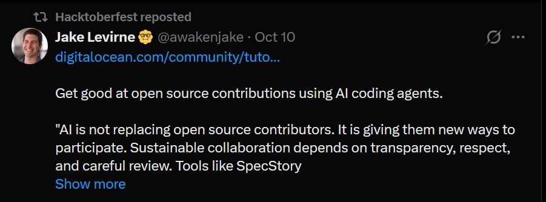
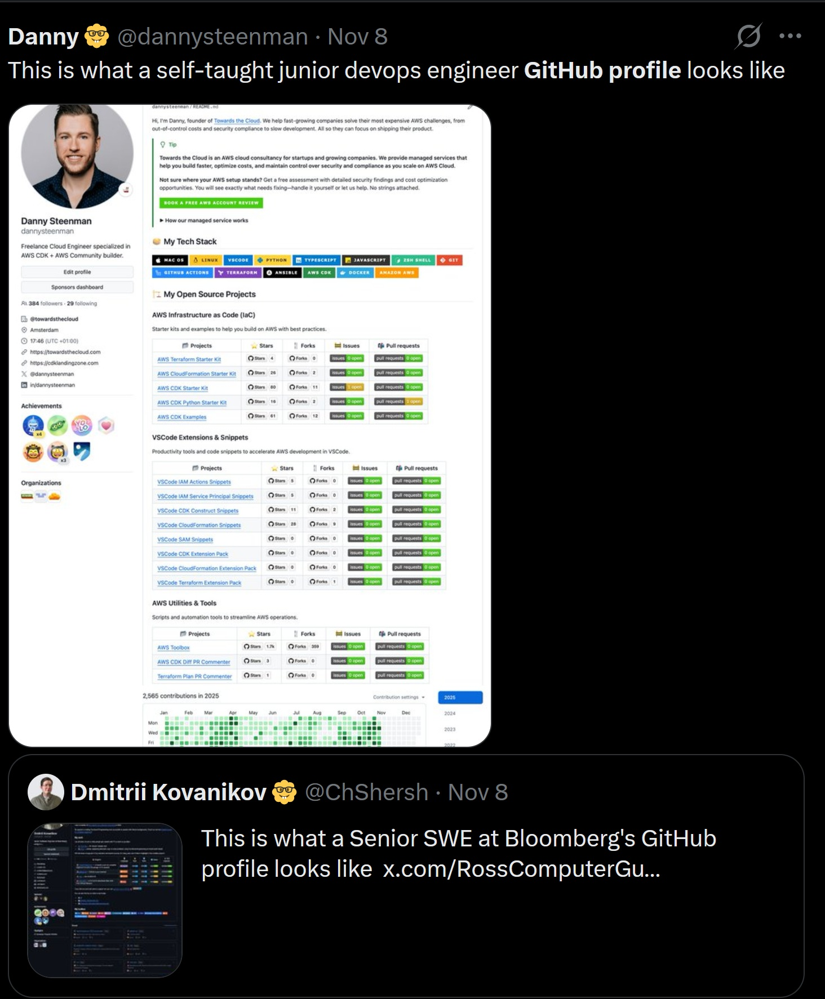
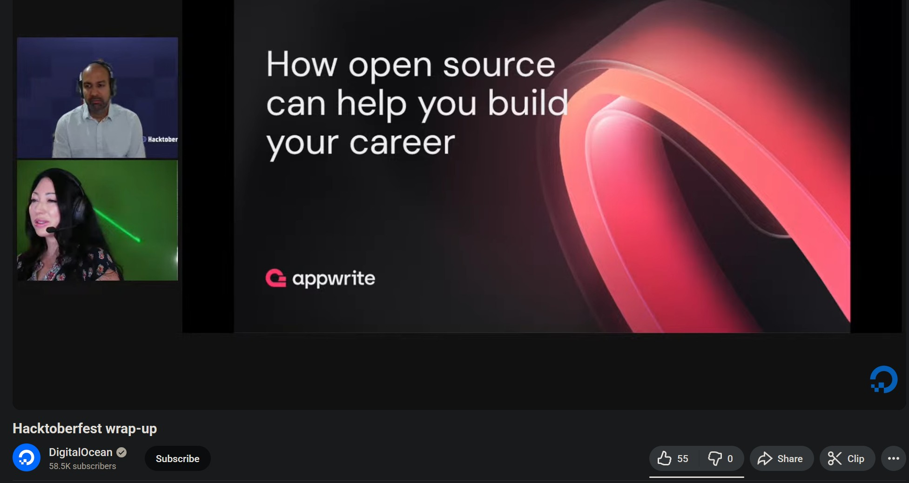
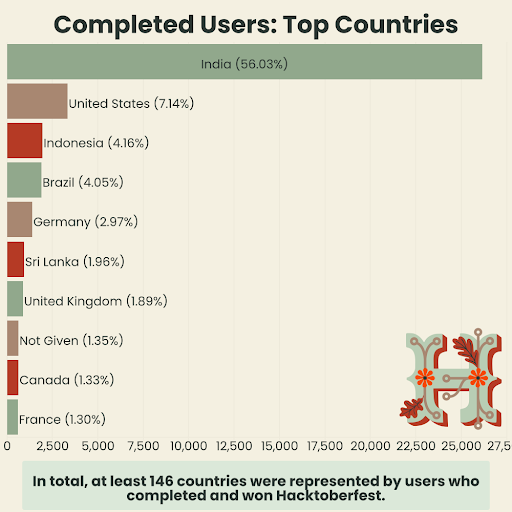
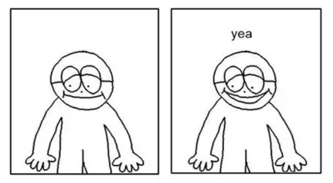

Title: Hacktoberfest is dying, and that's a good thing™️
Date: 2025-12-06 00:00
Category: Software
Tags: hacktoberfest, open-source, llms, github, copilot
Slug: rip-hacktoberfest
Authors: Difegue
HeroImage: images/holopin/hackposts.png
BskyPost: at://difegue.tvc-16.science/app.bsky.feed.post/3lzufkv3ou22y
Summary: i made an excel spreadsheet and everything so you know this has been researched

For the uninitiated, [Hacktoberfest](https://hacktoberfest.com/) is a yearly event ran by DigitalOcean, where they encourage new and seasoned software developers alike to <s>work for free</s> contribute to open-source projects throughout the month of October through various incentives.  

The most well-known of those incentives is the [free T-shirt](https://dev.to/fernandezbaptiste/last-10-years-of-hacktoberfest-merch-a-journey-through-time-8od) you can get if you make enough contributions/PRs during the month.  
  
Initially there was no required quality level for contributions, as the idea was obviously to bait as many people as possible into making PRs, with [multiple tutorials](https://www.freecodecamp.org/news/i-just-got-my-free-hacktoberfest-shirt-heres-a-quick-way-you-can-get-yours-fa78d6e24307/) showing how frictionless the process could be.  
(_"Look how easy this is! You can just help us edit our docs!"_)   

This led to people gaming the system with minimal effort/irrelevant PRs, which culminated in a [big spam wave in 2020](https://www.theregister.com/2020/10/01/digitalocean_hacktoberfest_pull_request_spam/).  
As the maintainer of a small-scale open-source project, I've interacted with Hacktoberfest a fair amount over the past [8 years](./hacktoberfest-lrr.html), and 2020 was... **pretty bad**! I'm relatively niche but got hit with a bit of spam regardless.   

So you can imagine that for larger projects like uhh, the fucking _HTML standard_?? It was [way worse](https://domenic.me/hacktoberfest/)!  
A dedicated [@shitoberfest](https://twitter.com/shitoberfest) Twitter account was made, which used to be a good indicator of when an issue was reaching collective consciousness.  

> “In reality, Hacktoberfest is a corporate-sponsored distributed denial of service attack against the open source maintainer community.
So far today, on a single repository(`whatwg/html`), myself and fellow maintainers have closed 11 spam pull requests.”  
(["DigitalOcean's Hacktoberfest is Hurting Open Source"](https://domenic.me/hacktoberfest/)) 

> “It was creating a lot of negative press for us. The very people that we were trying to help were really upset with us. We needed a quick solution. It was an emergency crisis situation.”  
(["Overcoming spam during Hacktoberfest"](https://developerrelations.com/case-studies/overcoming-hacktoberfest-spam/))  

DigitalOcean reined in the spam by making the entire event opt-in, and the shirt reward was eventually [removed in 2023](https://www.digitalocean.com/blog/ten-years-hacktoberfest#new-in-2023-moving-away-from-t-shirt-rewards).  
Hacktoberfest's participation numbers cratered afterwards -- DO posts [a recap blog](https://www.digitalocean.com/blog/hacktoberfest-2025-wrapup) each year with a bunch of stats, and they didn't even post one for 2024.  

So for the big 2025... [they brought the shirts back???](https://www.digitalocean.com/blog/hacktoberfest-2025) And boy was I **worried**!  
With AI/vibe coding tools being more prevalent than ever in the developer ecosystem this year, you can see it's already straining OSS maintainers in a few places:  

<blockquote class="mastodon-embed" data-embed-url="https://social.coop/@jsbarretto/115624517760498357/embed" style="background: #FCF8FF; border-radius: 8px; border: 1px solid #C9C4DA; margin: 0; max-width: 540px; min-width: 270px; overflow: hidden; padding: 0;"> <a href="https://social.coop/@jsbarretto/115624517760498357" target="_blank" style="align-items: center; color: #1C1A25; display: flex; flex-direction: column; font-family: system-ui, -apple-system, BlinkMacSystemFont, 'Segoe UI', Oxygen, Ubuntu, Cantarell, 'Fira Sans', 'Droid Sans', 'Helvetica Neue', Roboto, sans-serif; font-size: 14px; justify-content: center; letter-spacing: 0.25px; line-height: 20px; padding: 24px; text-decoration: none;"> <svg xmlns="http://www.w3.org/2000/svg" xmlns:xlink="http://www.w3.org/1999/xlink" width="32" height="32" viewBox="0 0 79 75"><path d="M63 45.3v-20c0-4.1-1-7.3-3.2-9.7-2.1-2.4-5-3.7-8.5-3.7-4.1 0-7.2 1.6-9.3 4.7l-2 3.3-2-3.3c-2-3.1-5.1-4.7-9.2-4.7-3.5 0-6.4 1.3-8.6 3.7-2.1 2.4-3.1 5.6-3.1 9.7v20h8V25.9c0-4.1 1.7-6.2 5.2-6.2 3.8 0 5.8 2.5 5.8 7.4V37.7H44V27.1c0-4.9 1.9-7.4 5.8-7.4 3.5 0 5.2 2.1 5.2 6.2V45.3h8ZM74.7 16.6c.6 6 .1 15.7.1 17.3 0 .5-.1 4.8-.1 5.3-.7 11.5-8 16-15.6 17.5-.1 0-.2 0-.3 0-4.9 1-10 1.2-14.9 1.4-1.2 0-2.4 0-3.6 0-4.8 0-9.7-.6-14.4-1.7-.1 0-.1 0-.1 0s-.1 0-.1 0 0 .1 0 .1 0 0 0 0c.1 1.6.4 3.1 1 4.5.6 1.7 2.9 5.7 11.4 5.7 5 0 9.9-.6 14.8-1.7 0 0 0 0 0 0 .1 0 .1 0 .1 0 0 .1 0 .1 0 .1.1 0 .1 0 .1.1v5.6s0 .1-.1.1c0 0 0 0 0 .1-1.6 1.1-3.7 1.7-5.6 2.3-.8.3-1.6.5-2.4.7-7.5 1.7-15.4 1.3-22.7-1.2-6.8-2.4-13.8-8.2-15.5-15.2-.9-3.8-1.6-7.6-1.9-11.5-.6-5.8-.6-11.7-.8-17.5C3.9 24.5 4 20 4.9 16 6.7 7.9 14.1 2.2 22.3 1c1.4-.2 4.1-1 16.5-1h.1C51.4 0 56.7.8 58.1 1c8.4 1.2 15.5 7.5 16.6 15.6Z" fill="currentColor"/></svg> 
Post by @jsbarretto@social.coop
 
View on Mastodon
 </a> </blockquote> 

So despite the more stringent limitations this year (6 PRs instead of 4, capped to 10,000 shirts), how can there **not** be a new wave of spam? Especially as Hacktoberfest itself seemed to be incentivizing AI, by retweeting posts [like this](https://twitter.com/awakenjake/status/1976759095588749691?s=20):  
   
Even the guy that made the `@shitoberfest` account 5 years ago is now saying [code is commoditized](https://twitter.com/GeoffreyHuntley/status/1985860953905492188) and that you should get on AI agents **NOW** before the bubble pops and you can't learn them for free anymore.  

Surely everyone is going to take advantage of poor old DigitalOcean once again and swarm maintainers with endless slop PRs! 
So I steeled myself and my little GitHub repo during October and....  

  

# Nothing.  

Wait what the fuck this isn't right, where **is** the AI? Why isn't the Copilot/Claude/Cursor triumvirat bombing my email box?  

Looking at one of the first repositories that pops up when you search for the `hacktoberfest` label, the Windows Terminal, they only got [~7 spam PRs](https://github.com/microsoft/terminal/pulls?q=is%3Apr+is%3Aclosed+is%3Aunmerged+created%3A%3E2025-10-01+updated%3A%3C2025-11-05+) during the month, which is less than what `whatwg/html` got in a single day back in 2020.  

I also looked at [Home Assistant](https://github.com/home-assistant/core/pulls?q=is%3Apr+is%3Aclosed+is%3Aunmerged+created%3A%3E2025-10-01+updated%3A%3C2025-11-20+-label%3Aby-code-owner), and that did get a **lot** more activity; But most of the PRs seem to be from folks _actually_ working with specific smart device platforms, and not the kind of generic `refactored everything to make it more beautiful` changes you'd see from someone spamming PRs with the vibe coding printer.  
There certainly is [some](https://github.com/home-assistant/core/pull/154403) [slop](https://github.com/home-assistant/core/pull/154298) [in there](https://github.com/home-assistant/core/pulls?q=is%3Apr+is%3Aclosed+is%3Aunmerged+created%3A%3E2025-10-01+updated%3A%3C2025-11-20+-label%3Aby-code-owner+label%3Aspam), though.  

So that all got me curious, _how many people actually participated this year, and how does it compare to 2020_?  
I based myself on the DO recap blogposts, so I don't have a number for the amount of PRs in 2024[*](#note-1), and the participants are an estimate from the [2025 announcement](https://www.digitalocean.com/blog/hacktoberfest-2025)... which is literally just a copypaste of [the 2024 one](https://www.digitalocean.com/blog/hacktoberfest-2024) with a few word changes btw:  
  
What is this, a Team Fortress 2 update? Anyway, the numbers:   

> 
| Year                 | 2019       | 2020       | 2021       | 2022       | 2023       | 2024    | 2025      |
|----------------------|------------|------------|------------|------------|------------|---------|-----------|
| _Participants_       | 131841     | 169886     | 141000     | 146981     | 98855      | 90000(?)| 56768     |
| _Shirts awarded_     | 61871      | 66798      | 46676      | 40000      | N/A        | N/A     | < 10000   |
| _Total eligible PRs_ | 483127     | 387052     | 294451     | 335000     | 118469     | Unknown | 87929     |
| _PRs / participant_  | 3,66446705 | 2,27830427 | 2,08830496 | 2,27920616 | 1,19841182 | Unknown | 1,5489184 | 

Wow, it's worse than I thought! You might be wondering where I'm pulling that `< 10000` number for the 2025 shirts.  

It's pretty easy for me to clear Hacktoberfest each year[**](#note-2), so this year I timed it so that my final PRs would be completed in November, after the official end of the event.  
I thought that surely by that point, the 10,000 shirt cap would have been passed and I wouldn't be eligible for one, right?   
  
`ayy lmao`  

To me this confirms that **less than 10,000 people even bothered** going for the shirt grind this year.  
It's a far cry from 2020-2022, and the total PR count is still less than the no-shirt era of 2023 because the participant count just... _fell off a fucking cliff_??  

DigitalOcean counts everyone who registers as a participant, even if they don't make any contributions, so the number is slightly inflated... And yet it's barely over half of 2023's?  
Even with the return of **the** T-shirt[***](#note-3) that caused all this spam 5 years ago?  

This leads me to believe that the shirt was a silly facade all along and that the spam wave of 2020 was pretty much coincidental -- So it brings the question, **what** actually got people to register for Hacktoberfest, and **why** is that dying?  

As Domenic mentioned, Hacktoberfest is **corporate-sponsored**, so that means that it's primarily about <u>**benefiting tech companies**</u>. Some of that is obviously covered by getting free labor on projects that have been open-sourced, like the [Windows Terminal](https://github.com/microsoft/terminal)... But in case you can't get free labor... Surely you can get _very cheap_ labor instead?  

That's right! I'm going to be talking about:   

# The junior Software Engineering rat-race  

If you've ever touched GitHub in any shape you've probably seen shit like this:  
  
Open source has gradually gotten _LinkedIn-ified_ over years, as the expectation came in that a good software engineer should have a portfolio of open-source contributions to match.  

It's a ghoulish transmogrification of the evergreen ["does working on personal projects make me a better developer?"](https://news.ycombinator.com/item?id=2664243) debate - Good developers tend to work on personal/OSS on the side, so **obviously** it became a requirement to HR firms.  

And both Hacktoberfest and their corporate sponsors absolutely play into this whole concept! They're not even fucking hiding it, there are [entire slideshows](https://youtu.be/_5EN8hHVRvQ?t=2326) about how "OSS contributions increase chances of getting a job in tech"!   
  
(Isn't it _slightly tonedeaf_ to do this even as big tech is [firing thousands of workers](https://arstechnica.com/information-technology/2025/11/hp-plans-to-save-millions-by-laying-off-thousands-ramping-up-ai-use) in the hope that all their AI somehow picks up and starts making money?)  

DigitalOcean is effectively selling the "American dream of software", which is a win-win-win for tech companies:  

- Younger devs are trained by OSS maintainers, _for free_  
- With a bit of luck, they'll contribute to your own open-sourced projects, _for free_  
- You'll have access to a wide pool of developers continuously comparing and optimizing their portfolios on a Git repo-turned-social-media... **_for free_**  

It's also the reason why most of the recorded Hacktoberfest contributors don't come from first-world countries.  
  
(Sourced from the [2021 recap](https://www.digitalocean.com/blog/hacktoberfest-2021-recap#participants) - Also see the [2020 top countries](https://www.digitalocean.com/blog/hacktoberfest-recap2020#participant-stats). They stopped reporting those afterwards...)   

Except that much like the real American dream, this has essentially **dried up**.  
Now that the job market is in the toilet ([not even because of AI](https://www.forbes.com/sites/hessiejones/2025/11/24/ai-is-not-killing-entry-level-jobs/) outside of big tech, although it's being used as an excuse), the facade doesn't hold up anymore! People aren't going to bother if they **know** they can't get a job in tech in 2025!  

I believe that's the core reason as to why Hacktoberfest is dying -- As with every economic shock, junior hiring has crashed down, so there's no incentive to feed the machine anymore.  

# why is it a good thing tho  

[🎵 BGM - You Must Learn All Night Long, Fantastic Plastic Machine](https://youtu.be/7TQGAVfHmNk?t=1721)   

There's a reoccuring theme with software developers that one must always stay on top of the latest trends in software stacks[#](#note-4) and tooling lest they become (gasp) "obsolete".  

Whether or not that's true is a different debate(although I think it kinda ties with the whole "personal project" debate that's led to the social mediafication of GitHub), but to me it's pretty obvious that this concept is being abused by big tech trying **very hard** to make AI as indispensable as all the marketing is making it up to be.  

I'm gonna quote the `@shitoberfest` guy [one last time](https://twitter.com/GeoffreyHuntley/status/1992067558951047442):  
> the ethics, climate and energy topics should not be on your mind as a swe - your job is to get good with the tools.  

Isn't that kinda fucked up?  
_"Don't worry about how ghoulish this all is bro just get good at prompting you can't fall behind"_   

The argument being that no matter what, companies will cheap out on trying to make good software if they can use AI for it, so you **must** know/use AI to remain relevant.  
But if you're a junior developer, the whole industry is seemingly telling you to go fuck yourself already -- So _why even try_ at this point, right?  
  
**I reject this viewpoint.**  

I don't believe that companies will be able to keep using coding assistants[##](#note-5) once their [very unsustainable funding runs out](https://www.wheresyoured.at/costs/), so the threats just ring hollow to me.  

It **would** be a threat if big tech's push for AI adoption actually succeeded - But as this Hacktoberfest is showing, I'm **not** seeing a tidal wave of AI-generated open source contributions.  

You're trying to sell me this shit as a world-changing productivity improvement, and yet people who would be most likely to interact with it (would-be junior devs and OSS contributors)  _aren't jumping on it_? How can that even work?  

Once junior developers (inevitably) become desirable to hire again, I don't think whether you're `le epic 10x prompt engineer` or not will be a key differentiator. [Hold out! Programmer!](https://youtu.be/uGtUuciQHRA?t=106)  

I do think that you can use your Github profile as a resume, but (hot take) I don't think the tools matter _that much_ if you've managed to make cool things and share them with the wider world as free software!  
[LANraragi](https://github.com/Difegue/LANraragi) started life as a collection of Perl CGI scripts and uses Redis for data persistence to this very day even though using a relational database would be "the proper way of doing it"...  

# Closing words  

This is probably the largest blogpost I ever wrote (and I cut a bunch out!) and I'm hoping I got all the AI rambling out of my system for the foreseeable future.  

Even though Hacktoberfest might be dying, free software certainly isn't -- If we look back at Home Assistant, that is positively **thriving**. I think it's notable that one of the most popular projects on Github is the one that's specifically designed to free control of your smart home from capital.  

In a fairer world, Microsoft, Google and co. should be held accountable for how they've cannibalized free software time and time again, from outsourcing R&D[###](#note-5) and [bugfixes](https://thenewstack.io/ffmpeg-to-google-fund-us-or-stop-sending-bugs/), to outright pilfering decades of code to train their AIs.  

Once the bubble pops and they come back begging, don't forget how hard they tried to burn it all down!  
Keep making cool shit and don't let yourself be exploited by companies trying to profit off your desire to learn.  

I wonder what the WHATWG guy is thinking about all thi--oh, [he retired](https://domenic.me/retirement/).  

  

wow i wish i had google money too!  
#

[\*](#ref-1) You could potentially scrape GH to see all the PRs made in October 2024 on Hacktoberfest-enabled repos, but the number would potentially still be imprecise, as I don't think there's a way to know if a repo would have the hacktoberfest label back in 2024 instead of just now.   
[\*\*](#ref-2) Since I'm just working on my OSS projects as usual -- There's been a new [LANraragi release](https://github.com/Difegue/LANraragi/releases/tag/v.0.9.60) and I spent some time on a custom version of my McDonald's LCD simulator for [Burger Bard](https://bsky.app/profile/difegue.tvc-16.science/post/3m3ps45mr6s2q). There's also a Stylophone update pending but I haven't wrapped up Liquid Glass for iOS yet...  
[\*\*\*](#ref-3) Back then the shirt wasn't the only incentive too; DO also used to offer free credits for their VPS hosting service as part of the event, and it was fairly common back in 2019 for other large OSS entities to offer their own swag packs for PRs outside of Hacktoberfest -- [I did it too!](./hacktoberfest-lrr-2.html)  
Nowadays, all you really get are [Holopin badges](https://blog.holopin.io/posts/hacktoberfest-2025) which are just the software equivalent of Xbox 360 achievements.  
(And who also play somewhat into the whole gamification/resume building thing, although it seems quite inconsequential in comparison)     
[#](#ref-4) Have you learned your [Charm stack with Bubble Tea v2 and Lipgloss in Go](https://github.com/Gaurav-Gosain/tuios) yet bro? (No shade being thrown, I just find the names very funny)  
[##](#ref-5) Lower-cost models that just do code autocomplete and _maybe_ the chat ones will probably stick around and run on-device, but those aren't in same ballpark as the whole agent shit that's being sold now. And those will get outdated in time if there's no more funding to train new ones so....   
[###](#ref-6) Now that WinUI 3 is [fully open-source](https://github.com/microsoft/microsoft-ui-xaml/discussions/10700#discussioncomment-15154004), everyone's hoping people will fix (for free) what Microsoft has failed to fix ever since Windows 8 and I think that's hilarious

  