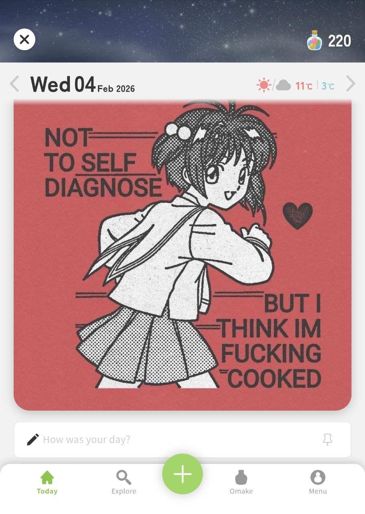
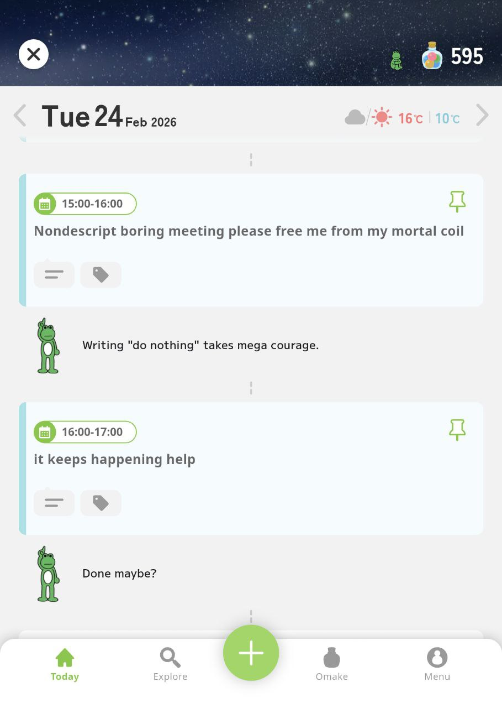
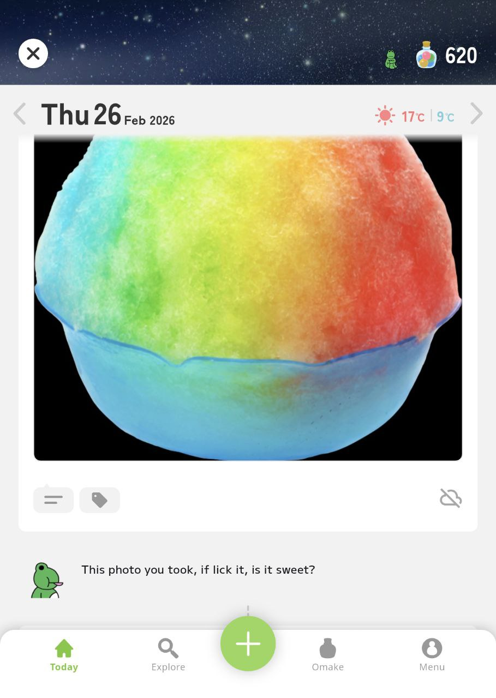
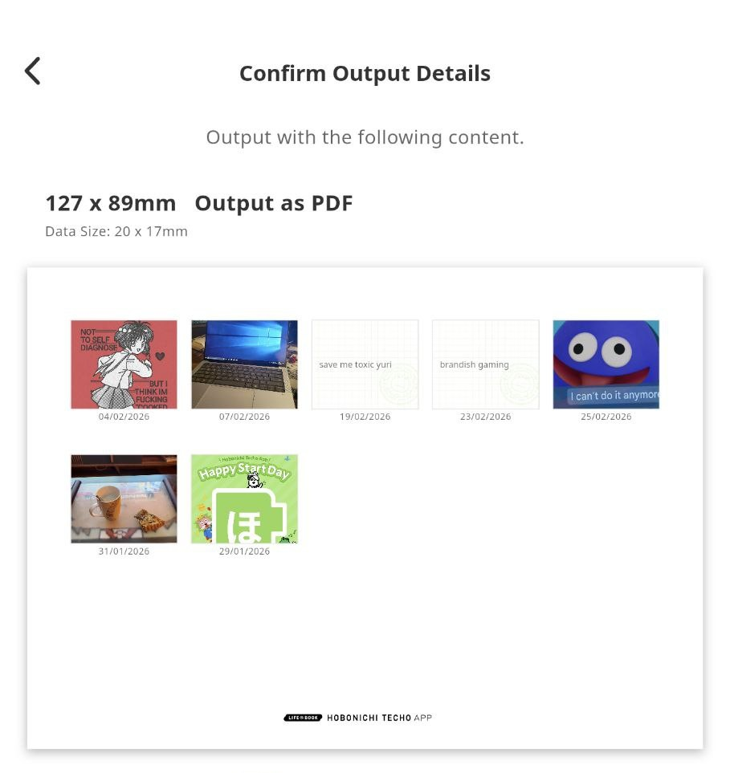
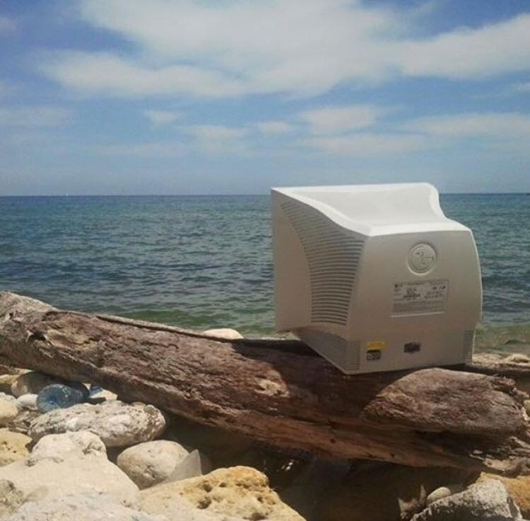

Title: A quick review of the Hobonichi Techo App
Date: 2026-03-02 00:00  
Category: Techoposting  
Tags: techo, hobonichi, stationery, phone, app
Slug: techo-app-review
Authors: Difegue  
HeroImage: images/techo/app.jpg 
BskyPost: at://difegue.tvc-16.science/app.bsky.feed.post/3m7ddvteiqc2i
Summary: tl;dr it's pretty good but what even is their business model

The [Hobonichi Techo app](https://techoapp.1101.com/en/) is finally available in English on both iOS and Android! Wow!  
This app is basically a digital version of their popular ["Life Book"](https://www.1101.com/store/techo/en/magazine/2026/y26/) planner, although its approach to journaling is more guided than just giving you a blank page every day.  

This was announced back in August of last year and I was [pretty curious about it](./2026-techo.html) when I was buying my planner for the year -- And upon receiving said planner Hobonichi  threw in a code to use some premium plan features for free, so I went in and gave it a try!  

# The Journaling (pretty good)  

Similarly to Apple's [Journal](https://www.apple.com/newsroom/2023/12/apple-launches-journal-app-a-new-app-for-reflecting-on-everyday-moments/), the Techo app can pull data from your phone to help you in your reflection endeavors.  
With permission, it can fetch:  

  - the day's weather  
  - photos from your library  
  - your calendar  
  - your GPS location during the day  
  - health/sleep data.   

That makes it so that every day's entry will likely be pretty filled up already if you enable everything!  
If you don't fancy enabling automatic sync, you can add any of those elements manually at any time, alongside manual written notes.

You can add **tags** to any item in the timeline so you can search for them later, as well as **pin** one of those items to be "_Today's Cover_", AKA the main thing that happened on a given day.  
  
I find that this makes for a very **low-friction** approach to journaling: It's super easy to just pick a random photo you took or a meme you saved, pin it, and write like 5 words about your day.  

I mostly use my physical Techo as an [idea book](https://artreview.com/daydreaming-is-so-important-to-me-how-david-lynch-fishes-for-ideas/), with a few sprinklings of TODO-listing and "_paste random physical shit_" whenever I have concert tickets or other stuff.  
I don't tend to do much actual journaling with it since... reflecting back on your day is _kinda hard_ sometimes?  

It might just be because I have terminal ADHD brain, but it's sometimes surprisingly hard to write about the actual things that happened on a given day, either because too much shit happened... or too little.  
I've been finding the phone app surprisingly useful for this, as the pre-filled entries have made me go "_oh yeah **that** happened today_" on a few occasions already.  

Also... it **is** easier at times for me to type a quick blurb with a phone keyboard than it is to do some handwriting.  
That's a fact I'm not necessarily comfortable having figured out... BUT at least it's eaten into the doomscrolling time a bit.  

There's some small gamification on top of it all with the "Omake" currency that increments every time you write, and the daily reminder notification is also pretty useful -- It matches the _Senpai_ you've selected, which makes it kinda fun to look forward to each day.  

# The Senpai feature (its ok)    

When you start using the app, you're asked to choose a kind of virtual assistant from a selection of three avatars.  
I picked "Froggo" the frog since I liked the cut of his jib, but there's also a Dog and a King available.  
  
The Senpai were initially marketed as "Thought Intelligence", which immediately rang the AI slop warning bells in my mind at full volume. But!  
As a matter of fact there is **no genAI** bullshit in this app: The Senpai's comments are all [prewritten stuff](https://help.1101.com/hc/en-us/articles/5130179892766-How-are-Senpai-s-comments-created).  
They're basically just _nice, wholesome journaling Clippy_ without the horrors.  

The app does do some small image recognition on the photos you import into it; I've seen specialized comments on photos of cars, food, and written text.  
I initially thought this would **run on your device**, since basic object detection can be done with small ML[*](#note-1) models and modern phones can 100% do this stuff!  It's cheaper and makes sense!  
I couldn't find any hints of that in the app's open-source library list[**](#note-2) though.    
  
(shoutout to [this blogpost](https://sethmlarson.dev/food-jpegs-in-super-smash-bros-and-kirby-air-riders) for giving me sakurai food pngs to test out - also it's a fun read)  

And well, the app **doesn't actually run without an Internet connection**, so I guess they're uploading your photos to a server just to run object detection for funny comments, then deleting them.  

I didn't have the motivation to go in and crack open the app to see what data it sends so this is just conjecture 🤷  
The app does offer **free cloud storage** for your journal, but is capped to one photo per day.  

## Wait, cloud storage? Does this app just copy all the data on my phone or something?  

Well..._yes_! Anything you add to the app (either manually or through autosync) gets **saved to the cloud** and tied to your Hobonichi ID account in case you switch devices.  
The terms of service do mention that your data is [encrypted and isn't shared with third-parties](https://help.1101.com/hc/en-us/articles/4848987432094-About-Data-Security-Measures), but I think you should still be aware that you're technically putting something as _deeply personal_ as a journal on a remote server.  

I kinda wish you could disable the cloud mirroring, but that'd imply being able to run the app offline to begin with...  
What you **can** do is have the app backup all your photos instead of one per day if you pay for the Premium plan, which is the _opposite_ of what I want!  

# The Premium plan (i would never pay for this)

The [Premium plan](https://techoapp.1101.com/en/premium/) is a **55€/year** subscription which is a terrible value for money as the app currently stands -- Even if you don't [hate subscriptions](./clz-to-gameye.html) like I do.  

As mentioned above, the sub allows you to upload all your photos (and videos) to Hobonichi's cloud, which is something Google can do for you at half the price[***](#note-3).  
The app will also downscale your photos when uploading them even on the paid plan, so it's not even really good as a backup..  

Other features include deeper image recognition by allowing you to search for keywords in your photos on top of your manually-added tags, a "_Memory Print_" feature that works with the "real" physical Hobonichi Techo, and... [JSON export](https://help.1101.com/hc/en-us/articles/4842400268574-Exporting-Data).  

## what the fuck, exporting your data is paid?  

I think it's nice that the app actually **allows** you to exfiltrate your data, and the functionality seems solid (JSON + a zip for your photos/videos), but it kinda feels like you're being held at ransom if you ever want to put your data somewhere else.  

Then again, subscriptions always have a trial period now, so nothing will really stop you from getting the free month, doing your export and then cancelling. But still, this stuff should be basic functionality!  

## Memory Print 

The [remaining premium feature](https://help.1101.com/hc/en-us/articles/4842459006750-Printing-Memories-Memory-Print) feels like a modern version of the [Wii Digicam Print Channel](https://www.youtube.com/watch?v=7_cfpJPDXSQ) -- It essentially allows you to print your Hobonichi App timeline's items into little vignettes suitable for pasting into your physical Hobonichi Techo.  
  
In a way, it's also data export... except way more analog.  

This feature is "_better in Japan_"™️as they've implemented direct compatibility with the print shop systems that are available in convenience stores, and it sounds kinda cute to get your stuff printed that way on sticker paper -- But realistically this is only generating a PDF.  

If you want to print stuff from the app to paste, this is barely more convenient than just taking screen captures on your phone and printing those? It certainly doesn't feel worth the subscription price as it is.  

# tl;dr  

I really like the mood of the app!  
A lot of effort was put in to make it fun to use, between the Senpai assistants and the little gamification bits.  
The SFX that plays when you earn _Omake_ is pretty satisfying  
The Senpai unfortunately do seem to have a limited set of lines so you'll see repeats relatively quickly, but in 2026 it's a breath of fresh air not having it be AI slop.  

Now, whether or not the app's approach to journaling works? I think that depends on you!  
I can totally see the value in automatically aggregating all the data on your phone to help with self-reflection, and even if you feel like you can't commit to writing every day, having all those prefilled bits you can pin makes it very easy to build a habit of always having _something_ in there.  

And as a result, when you look back on a month or a year, even if it was "low-effort", you'll still have a bird's eye view of all the... _life things_ that happened, and I think that has a lot of value.  
Especially nowadays when it feels easier than ever to only remember the awful shit that's going on seemingly at all times.  

So even if you think journaling is too difficult, I'd recommend trying it out!  
  
Now from a tech perspective, I do have qualms about how the app effectively locks you in unless you pay to export your data, and the mandatory online connection and cloud synchronization doesn't really sit well with me considering this app **by nature** processes a lot of your personal information.  
Although considering this is a closed-source app[#](#note-4) I think I should give up on the whole personal information part anyway...  

There's also no telling whether the app will remain like this... Updates could make it better, or **worse**!  
The business model seems to be praying that enough people pay for the premium plan to subsidize the free users, but considering how bad the value is on the subscription I have my doubts this will prove viable.  

As things stand, I'm going to stick with Hobonichi's app for a bit longer as I think it works quite well as a companion to my physical planner; I can't leave my buddy Froggo alone........  

#

[\*](#ref-1) i'm not fucking calling machine learning AI even if everyone does so -- I wouldve expected to see something like [https://huggingface.co/microsoft/resnet-50](https://huggingface.co/microsoft/resnet-50), which is Apache2 and weighs like 50 megs. I'm not a ML expert tho so there's likely some better state of the art at this point  
[\*\*](#ref-2) And boy was it a longass list.. I didn't see anything really interesting in there, the app uses Flutter for cross-platform UI on iOS and Android, with a SQLite database on top.   
[\*\*\*](#ref-3) Not that I'm suggesting you put your stuff on Google Photos instead -- Cloud hosting is all about trusting the company with your data, so I wouldn't blame you if you trusted a random Japanese company more than "_do no evil_" silicon valley behemoth Google.    
[#](#ref-4) I got curious and looked at FOSS alternatives -- [StoryPad](https://storypad.me/) looks pretty good, although it doesn't do any of the phone data collection stuff that makes the Techo app's journaling special.   
 