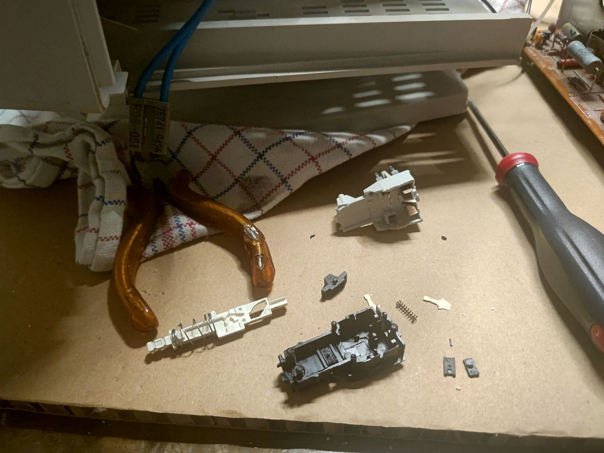
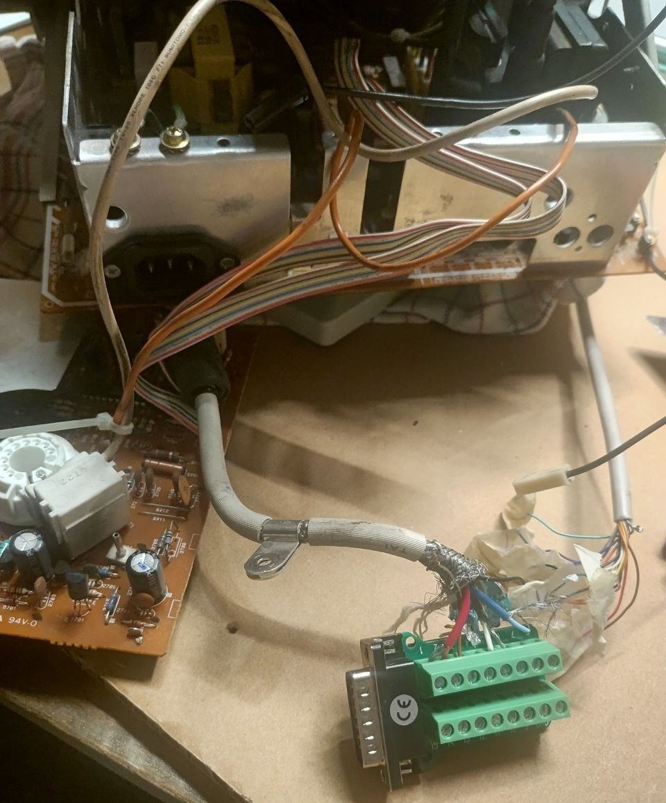
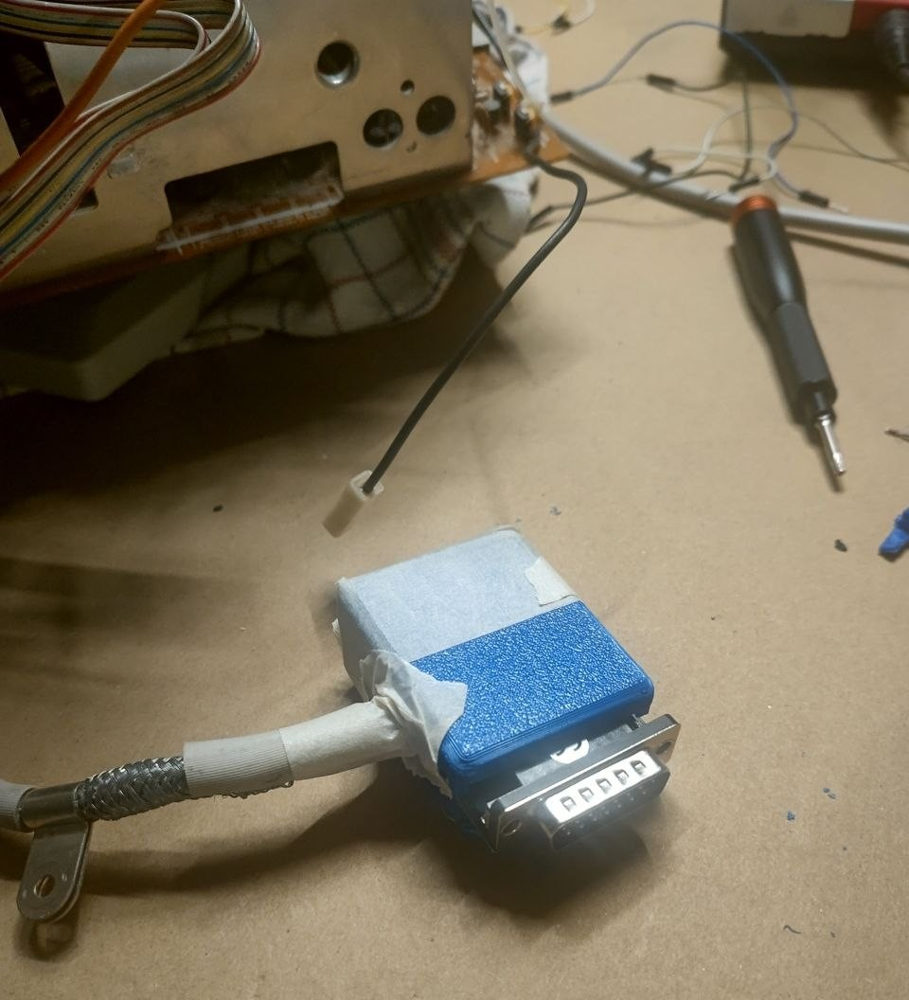
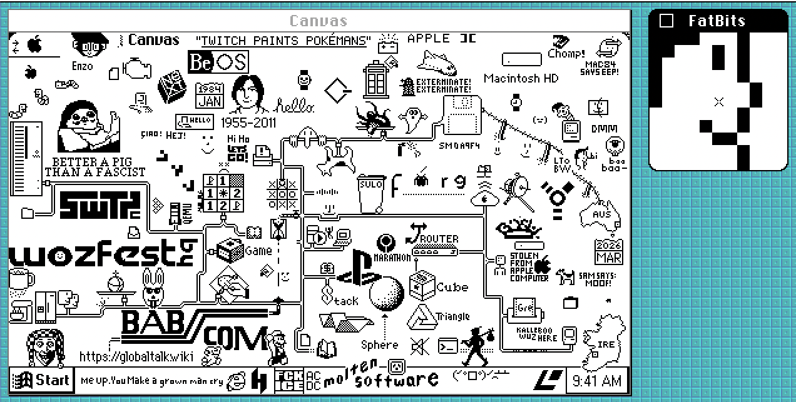
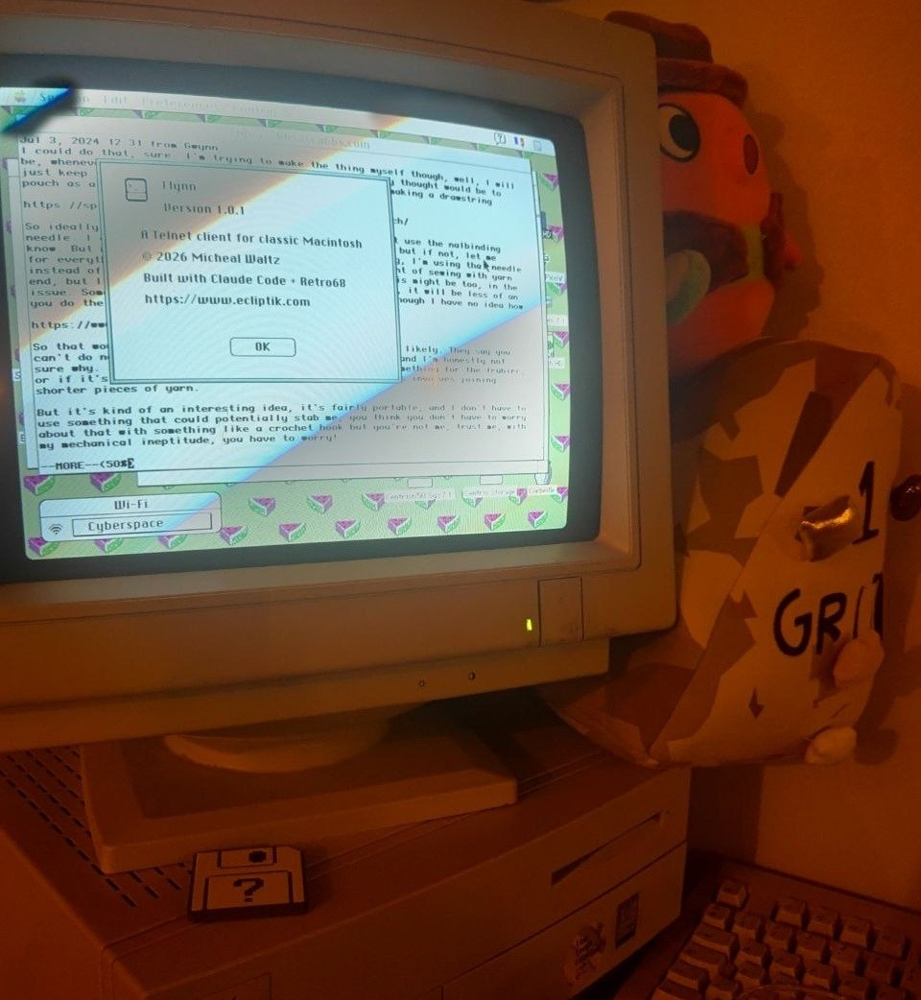

Title: A MARCHintosh 2026 summary
Date: 2026-03-31 00:00
Category: Blogposting
Tags: apple, macintosh, mac, macos, crt, diy, retrocomputing, marchintosh
Slug: globaltalk-2026
Authors: Difegue
HeroImage: images/globaltalk/flynn.jpg
BskyPost: at://difegue.tvc-16.science/app.bsky.feed.post/3lkyfnq7fbv26
Summary: i am once again jacking in to the dunelab through ethertalk 

Wow, we're a quarter through the year already! That means it's [MARCHintosh](https://marchintosh.com/) time!  
It's still March 31st in _some parts of the world_ as I'm posting this, so it's all kosher and legit and cool.  

Last year towards the end of the month, the power switch on my [Apple Performa Plus Display](./performa-plus-display.html) stopped working properly and required the help of tape to remain powered on...  
So I spent most of my March 2026 _quality Mac time_ repairing that CRT instead of actually interacting with [GlobalTalk](./globaltalk.html).  

It's not my fault though! ok maybe a little bit I didn't think those switches were that bad!  

# ME5A switches fucking suck holy shit  

The power switch of the Performa Plus (and many CRTs of that vintage) is a **PREH ME5A** -- This is a locking switch whose entire "locking" part relies on a _small plastic nub that's subject to wear._  

So at some point, the plastic is entirely sanded off and the switch doesnt pass power unless you keep it held manually.  
I'm aware this is 90s tech and they likely didn't have anything better.. but those switches truly are a disaster to work with.  
Being a cheapskate, I did attempt to repair my existing switch once I desoldered it off the board, as you can replace the plastic nub with [3D-printed parts](https://youtube.com/watch?v=TLYulBG5lG8).  
  
Except... putting the switch back together is also a nightmare since the entire design relies on small metal contacts that will fly off at the first chance they get.  

After two evenings spent trying to put the fucking thing back without a lot of resource online as to how the design works... I gave up and just bought a new old stock switch off the internet.  
  
Those things are expensive too... I might just start hunting for CRT corpses just to harvest the power buttons from them[*](#note-1).  
 
While the monitor was torn down though, I also finally replaced the hackjob video cable I made for it 6 years ago.  
  
This CRT came with hardwired video out of the factory, so adding an actual DB15 socket there is an actual upgrade!  
There's no space to put it in the monitor chassis itself, so you need a little breakout box that protrudes out.  

I grabbed a failed 3D printed box I had to house the socket and wires; I could've made a better scaled box for this, but I already had this print laying around that wasn't doing anything 🤷  
  
I already spent money on the accursed switch and the DB15 socket, so **you better believe** I'm going to save on 0.006 cents' worth of PLA to compensate.  

It's still a hackjob, but less so! The box has some screws to hold the socket in place so it's actually pretty sturdy, and I don't need to wiggle the video cable anymore to get stable color[**](#note-2).      

# A quick tour of GlobalTalk  

With the CRT functional again, I booted up the Centris 650 and restored the [TVC-16 AppleTalk Zone](https://bsky.app/profile/difegue.tvc-16.science/post/3lk54yua2ww2d).  
You can have a browse right now! I'll probably leave it open for a few days after the end of March to compensate for uh, not being here most of the month.  

There are a bunch of new Zones[***](#note-3) to browse through this year as well, which is the most fun part of this to me -- Although having to do it through the Centris' slow network is always a bit annoying, that's part of the charm.  
My [thoughts from last year](./globaltalk.html) on the _cool factor_ of this network still stand, and there's newer things being done with it every year that makes it even more fun to browse.   

This year, you could have an [After Dark screensaver](https://bitbang.social/@kalleboo/116267934997465916) styled after _fsn_ the file manager not the visual novel that shows you all the Zones in the network, alongside the usual chat programs and online games.  

There's even a little [wplace-like](https://bitbang.social/@kalleboo/116302182454732958) you can use this year -- It closes in about 12 hours from this blog's posting so you still have time to go make a silly doodle if you want!  
  
 
Someone also made a new Telnet client for classic Macs for your BBSing needs.    
It's always fun seeing terminal emulators in an OS that absolutely did not have any support for these out of the gate.  
  
and...oh it's fucking claude code. oh thats gore in my comfort retrocomputing environment i cant escape this bloody thing no matter where i go this is software hell and we're all living in it happily wearing our badges of shame as we grow dependent on a heavily subsidized slot machine 

#

[\*](#ref-1) Realistically it shouldn't be that hard to design a replacement for those switches that uses a modern locking switch under the hood (at the expense of losing that clicky feeling a bit i suppose), so maybe I'll look into that whenever this replacement switch inevitably dies too.   
[\*\*](#ref-2) 6 years lifespan for the previous tape-fueled cable is a pretty good time though, so never let anyone tell you your temporary solution sucks xoxo   
[\*\*\*](#ref-3) A few cool zone names from this year's selection: Cyberelf Space Zone, MilleniumMacs, EnbyNET, Dunelab.    
 