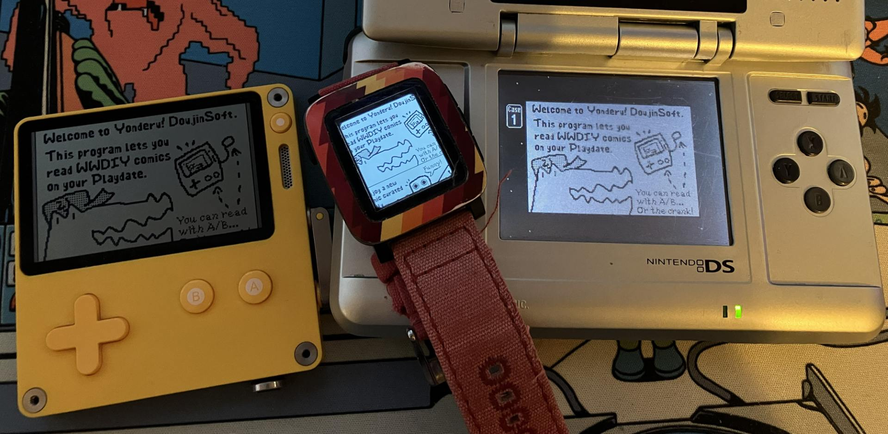
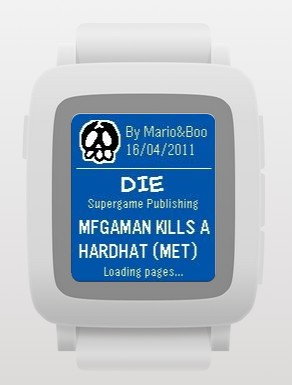

Title: Announcing Yonderu! DoujinSoft for the Pebble smartwatch
Date: 2026-05-01 00:00
Category: Software
Tags: nintendo, nintendo ds, warioware, doujinsoft, pebble, smartwatch, comics
Slug: yonderu-pebble
Authors: Difegue
HeroImage: images/doujinsoft/pebble.jpg
BskyPost: at://difegue.tvc-16.science/app.bsky.feed.post/3lugupqum4c2z
Summary: it's officially the spring of wario

If you've read the [original Yonderu](./yonderu.html) announcement you've probably seen this coming, so uh yeah! It's Wario comix on your wrist! **Cool!**  

This is a much lighter version of the concept than the Playdate app due to being, well, _on a watch_, but the core elements are all there:  

  - Daily WWDIY comic pulled from the [DoujinSoft](https://diy.tvc-16.science/) selection  
  - Ability to submit [ratings](https://diy.tvc-16.science/surveys) for comics  
  - Pull random comics from the entire archive   

I thought I'd wait until the next Rebble hackathon to have an excuse to do this, but the [Spring 2026 Pebble Contest](https://repebble.com/blog/spring-2026-pebble-app-contest) was an even better incentive. i didnt win shit tho  
  
You can now download the DoujinSoft app for your Pebble watch of choice... at your app store of choice.  

 - [Pebble App Store link](https://apps.repebble.com/2adaea94d1d0494fb015b4e8)
 - [Rebble App Store link](https://apps.rebble.io/en_US/application/69f40c1e65bd7b0008bd17e6)  
 - [Source code](https://github.com/Difegue/Yonderu-pebble)  

Well unless you're on an OG 2015 Pebble or a Time Round, in which case you don't have a choice! :^)  
The memory constraints on Aplite made it impossible[*](#note-1) to load all 4 comic panels simultaenously, so I dropped that.  

And as for the PTR, the screen is just entirely too small on those... The entire [brainworm](https://bsky.app/profile/difegue.tvc-16.science/post/3ljlqtygsek27) behind the Yonderu apps was that the [Pebble Time 2](https://repebble.com/blog/pebble-time-2-is-in-mass-production)'s 200x228 screen is large enough to fit DIY comic pages.  

_"But the photo above shows an OG Pebble Time? **Doushite?**"_ you might ask.  

I haven't received my Time 2 yet (grumble), and most of the userbase is still on the older[**](#note-2) 144x168 watches at this point, so I had to figure out some solution; That ended up being _gyro horizontal scrolling_, making use of the built-in accelerometer.  

<video autoplay loop src="./images/doujinsoft/pebble-tilt.mp4" title=""></video>  
I'm using tilt controls!  
It actually works surprisingly well despite what the video might suggest!  
I tuned the responsiveness a fair amount but was too lazy to shoot a second video. 🤷  

  
Unlike the Playdate app, there's not a lot of room on a watch for playful, Sakurai-esque UX, so I settled for the basics by just reusing the doodles I'd made for the icons and importing the WarioWare font[***](#note-3). You do get the cover colors tho!  
There's some small animations when you rate a comic too, but I just reused existing PebbleOS ones here because [custom PDC animations are pain](https://developer.repebble.com/tutorials/advanced/vector-animations/#creating-compatible-files).  

One of the perks of the Pebble ecosystem is that you have a complete networking stack due to being tethered to a smartphone, so even though the UX is a bit less comfortable, it **is faster** at fetching comics and reading through them in succession. Definitely easier to use as a quick timewaster 😤  

It was pretty fun picking up the Pebble SDK again -- I couldn't try out the [newer JS](https://developer.repebble.com/tutorials/alloy-watchface-tutorial/part1/) one since it does not support the older watches, so it was all good C fun with segfaults and manual heap management.  
I do want to try said JS SDK at some point though since it seems much easier to work with; The Pebble Time 2 does include a [touchscreen](https://youtu.be/JAvHibORZ50?t=754), so a [Mio-micro](https://github.com/yeahross0/Mio-Micro) port for **actual** wario gaming might not be out of the question. 👀  
It'd certainly be a bigger lift than this silly comic app though.   

#

[\*](#ref-1) It'd likely have been doable by only keeping one page in memory at all times and heavily swapping with the phone, but the experience wouldve probably been kinda miserable.  
The ideal way would be to actually send the raw 8KB .mio comic file to the watch and do the same decompression the NDS does in full C, which would still gatekeep you to one page bitmap in memory but wouldn't require constant phone data exchanges.  
In hindsight I'm not sure if it was really easier to use the same server-side bitmaps as the Playdate app, since transferring those to the watch was also kinda annoying...  
[\*\*](#ref-2) and not even necessarily older if you bought a 2025 Pebble 2 Duo  
[\*\*\*](#ref-3) Which also has the perk of actually containing Japanese characters which is a solid 60% of the comic archive -- The default Pebble fonts just kinda bork themselves and show the good old Unicode squares.    