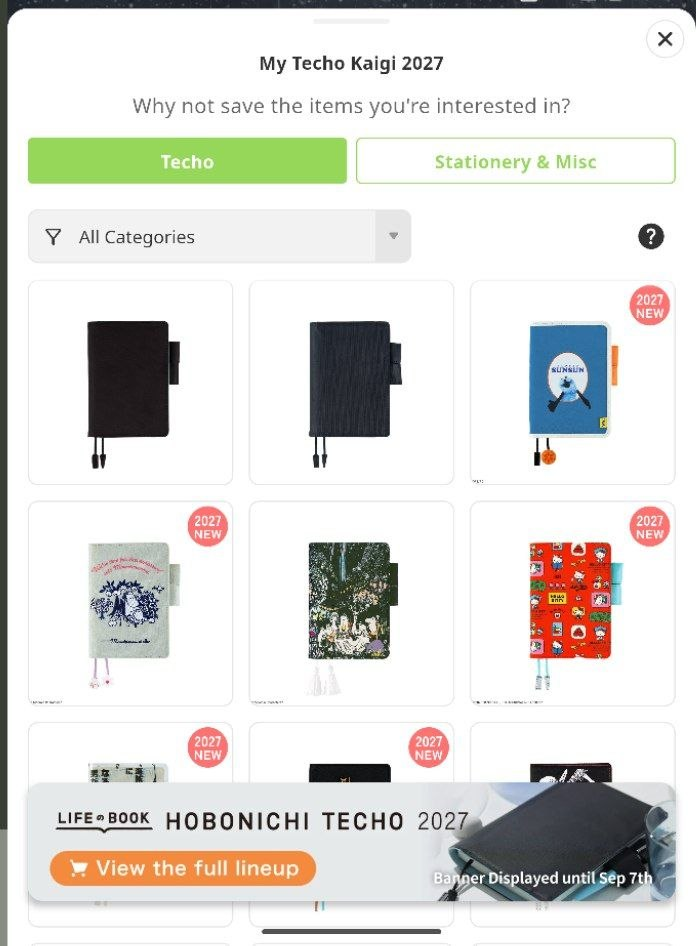
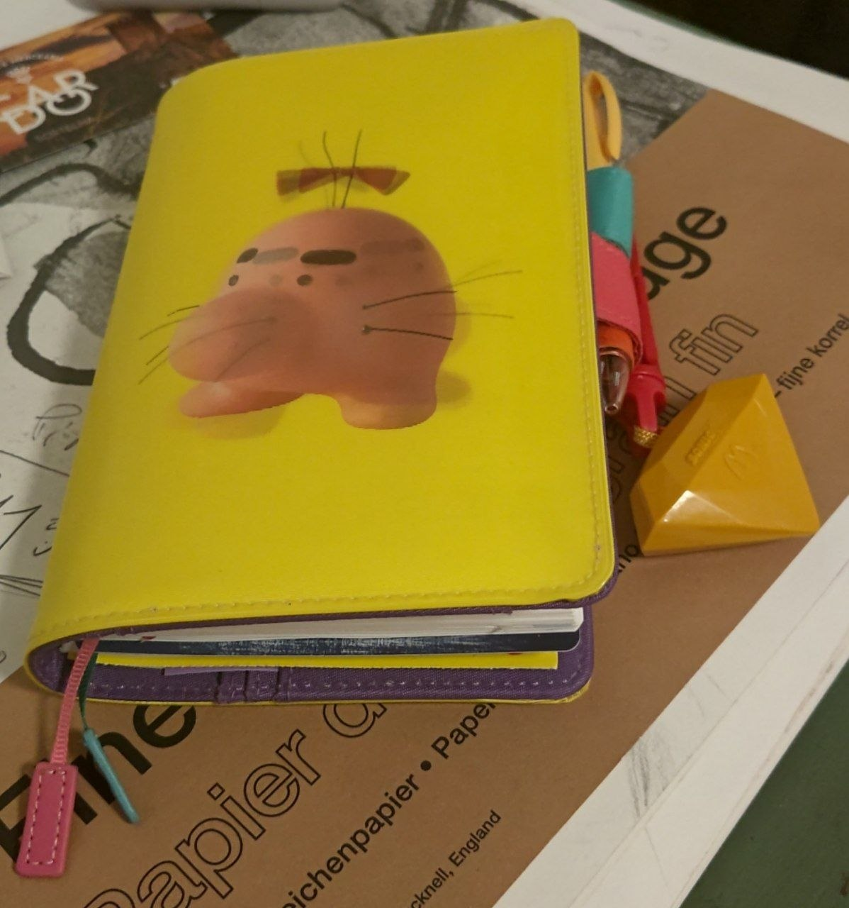

Title: My 2027 Hobonichi Techo lineup picks
Date: 2026-08-26 00:00  
Category: Techoposting  
Tags: techo, hobonichi, stationery, journaling
Slug: 2027-techo
Authors: Difegue  
HeroImage: images/techo/2026.jpg 
BskyPost: at://difegue.tvc-16.science/app.bsky.feed.post/3mtx5hgkcuk2u 
Summary: This year has a lot of bangers in the collab department unless you don't live in Japan, in which case you can probably go to hell. They have Moomin in hell though so it's not all that bad   

It's that time again... [Hobonichi Techo preview season](https://www.1101.com/store/techo/en/magazine/2027/y27/).  

Usually, Techo preview season means refreshing the website every day to see the newly announced planner/stationery designs as they get unveiled. It's basically the Smash Bros. Dojo for 30+ year-olds[*](#note-1). 

But we live in the future now, so we also have ✨phones✨.  
  
In a very "_I know what you are_" move, the Hobonichi Techo app (review [here](./techo-app-review.html)) introduced a feature for the entire month where upon writing your journal entry for the day, they'd also show you today's announcements and allow you to pin the designs you like to your timeline.  

I'd usually frown about being advertised to **that openly**, but I won't deny it was quite convenient, so it's an objectively good™️ feature. That's just the way it is! Hate the game not the player!   

Also, I forgot to post it so here's what I ended up picking out of the [2026 lineup](./2026-techo.html):  
  
I try to avoid getting a MOTHER/EB themed cover every year, but the lenticular Mr.Saturn was too cool not to pass.  
It means this year, I'll certainly have to pick something else... foreshadowing  

This year's charm was an old McDonald's Sonic X keychain toy I had laying around. The color is a nice match and it's certainly [personally relevant](./mcorigins-xmas.html).  

Anyway, on to my fave designs for this year! Like last time, make sure you have third-party images allowed in your browser.  

# Techo/Planner Covers  

### [Hello Kitty: Techo and Friends](https://www.1101.com/store/techo/en/2027/pc/detail_cover/oc27_kitty/)
  
It's not [Big Challenges](https://hellokittyislandadventure.wiki.gg/wiki/Big_Challenges), but I always appreciate "just put the thing we're advertising on Hello Kitty's head while she's doing the eternal sitting pose" type shit.  

I'm putting this Japan-exclusive cover in the blogpost mainly so I can also rant about how there's a whole fucking **Suica penguin** collab and it's Tokyo Station Store exclusive.  
  
Richer people than than me would probably book plane tickets over this stuff.  
I imagine you could probably also get them off Yahoo Auctions Japan with a proxy and stuff... but with the Suica penguin getting retired in Spring 2027 it might actually be too heartbreaking to keep him around for the entire year.  

I'm still mad though.  

### [beautiful people: Nothing to Hide (Green)](https://www.1101.com/store/techo/en/2027/pc/detail_cover/oc27_bpeople/)
  
Holy shit, it's the **actual** Big Challenges cover! 🐊🐊🐊  
I was dead set on getting this until the price dropped. It's _over 130€!_ The curse of fashion brands...  
It's also a bit less practical than the classic covers, since there's no bookmarks or butterfly stoppers.  

Please do look at the [promo shots](https://www.1101.com/store/techo/en/magazine/contents/y27_beautifulpeople/2rkyvmhlr.html) regardless though, the lineup gives off massive "funtastic plastic" vibes.  
I hope there'll be more PVC-based covers in the future that don't cost an arm - The [Alettone](https://www.1101.com/store/techo/en/2027/pc/detail_cover/oc27_aileronsweets/) covers are technically that, but their designs tend to be a bit too boring.  

### [Moomin: My Yard (Pale Mint)](https://www.1101.com/store/techo/en/2027/pc/detail_cover/oc27_moomin/)  
  
hell yeah moomin is back  
Unlike last year's [cover design](https://www.1101.com/store/techo/en/2026/pc/detail_cover/oc26_moomin/), I actually quite like this one! The embroidery and colors are really nice.    

I also certainly fuck with "don't do today what you can do tomorrow" as a lifestyle choice.  

### [Natal Design: Lucky Swallow (Weeks)](https://www.1101.com/store/techo/en/2027/pc/detail_cover/wb27_natal/)
  
I usually don't look at the _Weeks_ format too much since they have less pages than the classic planners.  
_But_ there are multiple times in the year where I don't write enough to fill 7 pages per week, so I've been considering trying one out.  

This is also an apparel brand collab and yet it doesn't cost a stupid price! The _Weeks_ has a bit of a different appeal as the smaller size makes it easier to carry around everywhere, and the birds + gold embossing certainly make it fashionable.  

### [Mr. Saturn Pattern (Weeks)](https://www.1101.com/store/techo/en/2027/pc/detail_cover/wb27_mother/)
  
oh no  
bro I said no earthbound covers two years in a row  

the necktie texture and the apricot hue... 
it even comes with a free _bonus notebook_. 
  

There's also a [Dungeon Man](https://www.1101.com/store/techo/en/2027/pc/detail_cover/cc27_mother/) A6 cover this year, but I find it kinda boring. It's just embroidered sprites.   
Get the lenticular Mr. Saturn covers from last year if you want to MOTHER it up, they're still available.  

# Stationery  

The theme this year is "_unbelievably silly_".   

### [Hobonichi Techo Mini Keychain](https://www.1101.com/store/techo/en/2027/pc/detail_toolstoys/tt_techokeychain/)  
  
This is exactly what you think it is.  
I have to give them credit for going **the entire way** and actually making the keychain itself a mini-notebook you can write into.  

I considered buying one for the sole purpose of using it as a prop with my anime figures, but it's actually a bit too large for that.    

### [Masterpiece Memo Block](https://www.1101.com/store/techo/en/2027/pc/detail_toolstoys/tt_memo_mitiru/)
  
...Does this even **count** as stationery? I find the concept very funny though.  
This is basically a box of small square paper sheets you can lay out to create a Minecraft version of a famous painting, then use as memo pads once you're done admiring it.  

If it was cheaper this would probably make for a cool novelty gift, but it's a bit steep for colored paper.  

### [Washi Tape (Daikon Radish / Churro / Keyboard Shortcuts)](https://www.1101.com/store/techo/en/2027/pc/detail_toolstoys/tt_maste_mitiru/)  
  
Am I putting these in here just for the tryhard hacker text in the promo shot? **Absolutely.**  
You should go watch the 2026 Ghost in the Shell anime if you're not already doing so.  

The daikon/churro rolls are pretty fun and simple though, I might snag those.  

### [TSUKI no IRO: Mini Ink Bottle Set](https://www.1101.com/store/techo/en/2027/pc/detail_toolstoys/tt_inkset_tsuki/)
  
Another year, another piece of kit from the Tsuki no Iro series.  
You might be asking "_but how is this silly?_" Well the **price is!**  

I've been looking at getting a fountain pen for the first time in years after being influenced by social media so I had my eye on those, but you need to buy two sets to get the full 12 colors for the year and it becomes quite pricy.  

There's a matching [fountain pen](https://www.1101.com/store/techo/en/2027/pc/detail_toolstoys/tt_frostpen_tsuki/) being sold if you've been thinking something similar - I've never used a fountain pen with a converter system so it'd certainly be novel.  

### [TSUKI no IRO: Bookmark-Style Foil-Pressed Stickers](https://www.1101.com/store/techo/en/2027/pc/detail_toolstoys/tt_foilpsticker_tsuki/)
  
Alright this one isn't silly at all, I just appreciate it.  
It's (relatively) cheap and being able to use the monthly sticker page as a bookmark is a nice touch.  

### [Moomin: Index Sticky Notes](https://www.1101.com/store/techo/en/2027/pc/detail_toolstoys/tt_fusen_moominfriends/)
  
I'm a heavy user of index sticky notes as I tend to use my Techo to jot down ideas, so it's convenient to be able to bookmark a lot of specific pages for reference.  

Also consider the [Moomin sticky notes roll](https://www.1101.com/store/techo/en/2027/pc/detail_toolstoys/tt_rollfusen_moomin/). Def a winner for gift labels.   

# The actual pick

I'm personally inching towards either the Moomin cover or the Natal Weeks - The free notebook isn't enough to get me to go with a MOTHER cover two years in a row. (hopefully it's still in stock next year...)  

Besides the usual restock of [Add-on Pockets](https://www.1101.com/store/techo/en/2027/pc/detail_toolstoys/tt_pocket/), there's not much that year stationery-wise I'm interested in getting.  
I might actually splurge for the ink set solely out of not having anything else to spend the yearly Techo budget on...  

What about you if you read this far down? Will it be a _Mr. Saturn_ year? A _Moomin_ year? Mayhaps even a _"Not buying anything at all and just use the phone app"_ year??  

# 

[\*](#ref-1) The smash bros. dojo is for 30 year-olds by default given brawl's age but I thought the comparison was funny! I'm not just hyped about scrimblos nowadays, also stationery!   